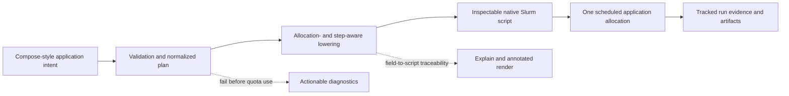

# ICPE 2027 Meta-Level Research-Paper Draft

Status: pre-experimental working draft, 2026-08-09

Venue basis: the ICPE 2027 call is not available yet. This draft therefore uses the [ICPE 2026 Research Paper Track](https://icpe2026.spec.org/tracks-and-submissions/research-paper-track/), [Call for Contributions](https://icpe2026.spec.org/call-for-contributions/), and [Artifact Evaluation Track](https://icpe2026.spec.org/tracks-and-submissions/artifact-evaluation-track/) as provisional guidance. Requirements must be checked again when the ICPE 2027 call appears.

Evidence status: this document distinguishes implemented mechanisms, research claims to test, and proposed evaluation. It contains no experimental results.

## Submission-Type Decision

The recommended target is an **ICPE regular research-track systems paper about a software artifact**, followed by a companion artifact submission if the paper is accepted. It should not be framed as the standalone artifact-track tool-paper category. The research-track argument must therefore be about a technically distinct model, mechanism, and performance-engineering consequence—not merely that the software is available or useful. If the eventual evidence is mainly a real-world deployment experience or case study rather than a comparative systems evaluation, the Research Track’s EERCS subtype is the more defensible fallback.

ICPE 2026 asks research papers to contribute original research, demonstrate relevance to performance engineering, maintain technical and scientific soundness, and eventually provide a compelling evaluation. The current draft can be incomplete experimentally, but it must already make its claims falsifiable and its evaluation discriminating.

## Decision at a Glance

Recommended thesis:

> **hpc-compose is an inspectable, allocation-scoped application compiler for Slurm: it lowers a deliberately constrained Compose-style multi-service specification into native Slurm allocation and job-step semantics, while preserving a traceable path from effective input to generated script and run evidence—without a resident orchestration control plane.**

The paper should lead with compilation and allocation semantics. Evidence tracking and progressive assurance strengthen the ICPE story. Runtime portability, monitoring, agent safety, and the broad CLI surface should remain supporting material unless later experiments justify promoting one of them.

## Candidate Contribution Stories

The scores below are hypotheses, not established novelty claims. They must be revised after the structured literature review and empirical study.

Scale: 1 = weak, 3 = plausible, 5 = unusually strong.

| Candidate story | Novelty | Impact | ICPE fit | Main risk | Recommended role |
| --- | ---: | ---: | ---: | --- | --- |
| **A. Compile, do not emulate:** constrained Compose-style applications become inspectable native Slurm allocations and steps | 4 | 5 | 5 | Dismissed as “YAML to shell” unless semantics and invariants are central | Primary paper spine |
| **B. The allocation is the application boundary:** readiness-coupled services share one scheduled lifetime without a daemon | 3.5 | 5 | 5 | Confused with workflow DAGs, pilot runtimes, or generic co-scheduling | Central mechanism inside A |
| **C. Specification-to-evidence continuity:** effective configuration, generated script, scheduler identity, metrics, and artifacts remain connected | 3.5 | 5 | 5 | Overclaiming full reproducibility or general provenance | Secondary contribution |
| **D. Progressive assurance before expensive execution:** static checks, script inspection, active probes, and finite smokes form a risk-ordered ladder | 3 | 4 | 4 | Reads as operational guidance rather than research | Evaluation/design lens |
| **E. Service-level observability inside a multi-service allocation** | 4 | 4 | 5 | High empirical burden; GPU and cross-backend attribution are not yet broadly validated | Optional secondary angle |
| **F. One authoring model across Pyxis/Enroot, Apptainer/Singularity, and host execution** | 2.5 | 4 | 4 | Runtime portability is crowded and site-dependent | Supporting validation |
| **G. Agent-safe HPC authoring through inspectability and explicit command effects** | 3.5 | 3 | 3 | Timely but insufficiently central to ICPE without a dedicated study | Future work or bounded consequence |

### Persona-Angle Stress Test

| Reader angle | What makes the story credible | What would cause rejection |
| --- | --- | --- |
| ICPE performance-engineering reviewer | The paper connects invalid allocations, launch behavior, topology, measurement attribution, and resource decisions to testable outcomes | Convenience and usability claims replace performance mechanisms and measurements |
| Slurm/runtime architect | Allocation-level and service-step resources, readiness, placement, shared filesystems, failure, and runtime backends are modeled explicitly | The paper implies Docker networking, arbitrary heterogeneous placement, or site-independent behavior |
| Workflow/DSL researcher | The language subset, normalization, lowering rules, invariants, rejection behavior, and generated artifact form a coherent compiler contribution | The paper lists commands without explaining semantics or differs from a wrapper only syntactically |
| Reproducibility/artifact evaluator | A third party can relate a pinned input to the effective config, exact generated script, run identity, logs, metrics, and bundle limitations | “Reproducible” is used as a blanket adjective despite mutable images, partial telemetry, or omitted payloads |
| HPC/ML practitioner | A motivating server-plus-client, database-plus-worker, or training-plus-checkpoint scenario explains why one shared allocation is useful | The manuscript requires knowledge of the CLI manual and never explains why separate scheduled jobs are inadequate |
| Novelty skeptic | Direct neighbors are compared on execution unit, service readiness, control plane, inspectability, portability, and evidence | The draft claims “first” or “unique” without a systematic search and direct comparison |

## Selected Paper Proposition

### Primary mechanism

hpc-compose compiles a constrained application model into one native Slurm application allocation. Allocation-wide requirements become `#SBATCH` directives; service requirements and placement become `srun` step semantics. Dependencies, readiness, failure behavior, and distributed execution are resolved within this bounded scheduling unit.

### Distinguishing design choice

The tool does not recreate a long-running container-orchestration control plane on the cluster. It makes the generated scheduler artifact visible and attributable to its source fields. Unsupported semantics are rejected rather than silently approximated.

### ICPE-facing consequence to test

For the targeted workload class, the approach should preserve launch and coordination intent while making invalid or site-incompatible configurations detectable before costly execution, keeping runtime overhead close to equivalent native Slurm scripts, and improving the traceability of performance runs.

### Safe novelty formulation

The novelty claim should be about the **combination and explicit contract** of:

1. allocation-scoped concurrent-service semantics;
2. inspectable lowering to native Slurm allocations and steps; and
3. continuity from effective specification and generated script to run evidence.

The paper should not claim that YAML authoring, Compose syntax, container execution, Slurm wrappers, workflow engines, provenance, or monitoring are individually new. Avoid “first,” “only,” and “unique” until the literature review has tried to falsify them.

## Working Titles

Recommended:

> **hpc-compose: Compiling Compose-Style Multi-Service Applications into Inspectable Slurm Allocations**

More argumentative:

> **Compile, Do Not Emulate: Inspectable Multi-Service Applications as Native Slurm Jobs**

Evidence-forward alternative:

> **From Specification to Run Evidence: Allocation-Scoped Multi-Service Applications on Slurm**

The first title is the safest because it names the system, input model, mechanism, and execution boundary without implying measured outcomes.

## Draft Abstract

Performance studies increasingly combine several cooperating components—for example, a simulation with an inference service, a trainer with a checkpoint or data service, or a benchmark driver with the system under test. Container and Compose-style specifications provide a familiar way to describe such applications, but their orchestration assumptions do not map directly to batch-scheduled high-performance computing systems. On Slurm, allocation-wide resources, per-service job steps, placement, readiness, shared storage, runtime preparation, and failure propagation must be made explicit. Handwritten batch scripts retain this control but make validation, reuse, and run-to-run traceability largely ad hoc.

This paper presents **hpc-compose**, an inspectable compiler for a deliberately constrained class of multi-service applications on Slurm. Each expanded application instance is lowered into one allocation and a set of native `srun` steps, with explicit rules for dependency, readiness, placement, failure, and container-runtime execution. The compilation pipeline exposes normalized plans and annotated generated scripts rather than hiding scheduler behavior behind a resident control plane. It also connects the effective input and generated script to tracked execution evidence, while representing missing or degraded evidence explicitly.

We describe the application model, lowering pipeline, assurance stages, and evidence boundaries. We propose an evaluation of semantic conformance, rejection quality, compilation and runtime overhead, portability across runtime backends and sites, and recovery and evidence behavior under failures. The study is designed to determine where allocation-scoped composition provides a useful abstraction and where direct Slurm authoring or broader workflow systems remain more appropriate.

## Introduction Draft

Modern HPC applications are not always single executables. A performance experiment may require a server and load generator, a simulation and online analysis process, a trainer and checkpoint exporter, or several tightly coordinated containers. These components must start in a valid order, discover one another, remain alive for compatible durations, share files or accelerator resources, and produce evidence that can be tied back to the configuration that launched them.

Docker Compose offers a familiar vocabulary for services and dependencies, but its execution assumptions are a poor fit for a batch scheduler. Slurm grants resources to an allocation and launches work as job steps; it does not provide Docker overlay networks, unrestricted restart policies, or a continuously running application controller. The submission host and compute nodes may expose different runtimes and filesystem views. Allocation-level resources must also be distinguished from resources assigned to an individual service step. Treating these mismatches as incidental implementation details creates configurations that appear portable while failing at submission or, worse, after consuming an allocation.

The common alternative is a handwritten `sbatch` script. This preserves native scheduler control but embeds service coordination, readiness polling, placement, cleanup, and evidence capture in application-specific shell code. Such scripts are difficult to validate before submission, difficult to compare across runs, and easy to detach from the configuration and image identities that produced a result. General workflow engines solve a broader problem—usually DAGs of tasks or jobs—but do not necessarily model a set of concurrent, readiness-coupled services as one inspectable Slurm application boundary.

hpc-compose explores a narrower design point. It accepts a strict Compose-style subset, normalizes it into an explicit application plan, and lowers each ordinary application instance or expanded trial into one Slurm allocation containing native job steps. The generated batch script is a first-class artifact: users can inspect the normalized plan, view an annotated rendering, and map generated regions back to source fields. The runtime remains Slurm-native and does not depend on a resident orchestration daemon. Tracked execution then links the effective configuration and generated script to scheduler state, logs, metrics, checkpoints, and collected artifacts, with explicit degraded states where evidence is unavailable.

The research question is not whether declarative syntax is more pleasant than shell. It is whether a bounded, inspectable compilation model can preserve the semantics needed by multi-service performance workloads, reject incompatible intent before quota-consuming execution, add acceptably small overhead relative to equivalent native scripts, and improve the traceability of experimental runs without requiring a new cluster control plane.

This paper makes three proposed contributions:

1. **An allocation-scoped application model for Slurm.** It defines supported semantics for services, dependencies, readiness, placement, failure, and distributed launch, and makes unsupported Compose assumptions explicit.
2. **An inspectable compilation pipeline.** It separates parsing, normalization, runtime derivation, preparation, and Slurm lowering; exposes the normalized plan and generated batch script; and preserves field-to-script traceability.
3. **A bounded specification-to-evidence lifecycle.** It relates the effective input and generated script to tracked execution state and collected evidence, while documenting site dependencies, legacy degradation, and incomplete telemetry rather than presenting them as certainty.

The eventual evaluation will test these contributions against direct implementation neighbors, equivalent handwritten Slurm scripts, and representative workflow patterns. At this stage, these are research claims and evaluation commitments, not results.

## Scope and System Model

### Target workload class

The core abstraction is a finite application whose components benefit from co-scheduling and a shared lifetime inside one Slurm allocation. Representative cases include:

- server and client or load generator;
- database or model service and worker;
- trainer with checkpoint, export, or resume components;
- one distributed service plus supporting single-node services;
- performance system under test plus coordinated measurement driver.

Each ordinary application instance—or each expanded sweep trial—maps to one allocation. Services map to native job steps. This is not a claim that every input file globally yields one allocation: sweeps and arrays may expand the input into several independent application instances.

### Explicit non-goals

hpc-compose is not:

- a dynamic cluster scheduler or bin-packer;
- an implementation of arbitrary heterogeneous Slurm jobs;
- a Kubernetes or Docker networking layer;
- a long-running cluster administration service;
- a replacement for broad scientific workflow DAG engines;
- a guarantee that one specification runs unchanged at every site;
- a general-purpose experiment database or complete provenance system.

These exclusions are part of the research design. They let the paper state and evaluate a smaller semantic contract.

## Requirements Derived from the Problem

| Requirement | Goal | Paper-level acceptance condition |
| --- | --- | --- |
| R1. Native scheduling semantics | Preserve Slurm’s allocation and job-step model | Every supported resource field has an unambiguous allocation- or step-level meaning |
| R2. Bounded service coordination | Express startup order, readiness, lifetime, and failure within one allocation | The paper defines state transitions and failure propagation for supported dependency modes |
| R3. Inspectability | Keep generated execution behavior auditable | A reader can trace important source fields through the normalized plan to script regions |
| R4. Early discrimination | Detect unsupported or site-incompatible intent before expensive execution when possible | Static and active checks clearly state what they prove, what they mutate, and what remains unknown |
| R5. Runtime portability with honest boundaries | Separate common authoring intent from backend- and site-specific lowering | Common guarantees and Pyxis/Enroot-, Apptainer/Singularity-, host-, storage-, and fabric-specific assumptions are distinct |
| R6. Evidence continuity | Connect a run to its effective input and generated execution artifact | Run identity, scheduler identity, configuration, script, and collected outputs have a documented relationship |
| R7. Failure honesty | Avoid inventing certainty under missing state or partial telemetry | Unknown, degraded, legacy, and best-effort states are represented explicitly |

## Design Draft

### Declarative application model

The input deliberately resembles Compose where the analogy is useful: named services, commands, environments, volumes, dependencies, and extensions. The accepted subset is smaller than Docker Compose because the target semantics are different. Unsupported keys are validation errors rather than silently ignored hints. Slurm-specific extensions state allocation requirements, service resources, placement, runtime preparation, and cluster context explicitly.

The most important distinction is between allocation-level and service-level resources. Allocation requirements determine the outer `sbatch` request. Service requirements determine the `srun` steps launched within that allocation. The paper should specify this mapping as a compact semantic table, not as a list of CLI flags.

### Compilation and lowering

The documented implementation follows a staged pipeline:

1. parse the source, resolve authoring extensions, interpolate values, and validate;
2. normalize dependencies, commands, paths, placement, and preparation into a plan;
3. derive deterministic runtime and cache paths;
4. apply the resolved cluster context and advisory site facts;
5. execute preflight checks and runtime preparation where requested;
6. render one batch script for the application instance;
7. submit and track the resulting job and evidence.

The paper should state the invariants between these stages. At minimum, normalization should eliminate authoring-only constructs; lowering should operate on explicit service and allocation requirements; rendering should be deterministic for equal effective inputs and context; and no unsupported semantics should survive into an apparently valid script.

### Service coordination inside the allocation

Dependencies must distinguish process start from readiness. Placement must distinguish same-node coordination from distributed rendezvous. Failure behavior must specify which step terminates the application and which cleanup actions remain possible. The manuscript should include one small running example and a corresponding timeline or state machine. It should avoid implying arbitrary multi-service distributed scheduling beyond the documented topology.

### Inspectability and progressive assurance

The tool exposes several stages because each answers a different question:

- validation and linting test the source contract;
- planning and normalized inspection expose resolved intent;
- annotated rendering and explanation expose generated scheduler behavior;
- strict preflight checks test environment assumptions;
- active filesystem probes test compute-node visibility and atomicity properties;
- finite smoke runs test a bounded scheduler-backed execution path;
- production submission consumes the intended allocation and creates tracked runtime evidence.

An exact script preview is not a full runtime rehearsal: it does not prove preflight, preparation, SSH, scheduler admission, container launch, networking, or workload success. The paper should preserve these proof boundaries.

### Run evidence

The evidence design is local-first and additive. New runs may record an immutable manifest and input lock, a logically append-only event history, and a rebuildable current view. The paper must distinguish logical history immutability from physical full-file replacement, persistent local account state from archival durability, and collected payloads from explicitly exported bundles.

The safe claim is traceability and recoverability within documented boundaries—not complete reproducibility by construction. Mutable image tags, unavailable source state, legacy records, best-effort collectors, and payloads omitted from a bundle must remain visible limitations.

## Planned Evaluation Contract

The evaluation must test the thesis, not celebrate the feature count. Results are intentionally absent from this draft.

| RQ | Claim under test | Baselines or controls | Measures | Minimum evidence needed later |
| --- | --- | --- | --- | --- |
| RQ1. Semantic conformance | Supported input semantics are lowered correctly and unsupported intent is rejected before submission | Handwritten reference scripts; declarative semantic oracle; negative corpus | Dependency/readiness traces, placement/resource mappings, failure propagation, rejection class and source location | Complete conformance matrix over the stated language subset, including negative and fault-injected cases |
| RQ2. Cost of abstraction | Compilation and coordination do not materially distort target workloads relative to native Slurm | Equivalent expert-authored `sbatch`/`srun` scripts | Local plan/render time, script size, submission-to-readiness time, steady-state runtime, CPU/memory overhead | Repeated measurements with uncertainty and a predeclared practical non-inferiority margin |
| RQ3. Expressiveness and boundary quality | The model covers representative allocation-scoped application patterns and rejects out-of-scope ones clearly | Public Compose pattern corpus; curated HPC scenarios; direct neighboring tools | Pattern coverage, required adaptations, unsupported constructs, diagnostic actionability | Public classified corpus and reproducible coding protocol; no claim of universal Compose compatibility |
| RQ4. Portability | Common intent can be lowered across supported runtime backends and more than one site with bounded site deltas | Pyxis/Enroot, Apptainer/Singularity, and host paths; at least two materially different clusters if feasible | Spec changes, context/profile changes, launch success, semantic deviations, timing overhead | Site and backend matrix with documented prerequisites and failures; no extrapolation from local Slurm alone |
| RQ5. Evidence and recovery | Run identity and evidence remain interpretable under interruption, concurrency, missing state, and scheduler-ID reuse | Fault injection; legacy records; rebuild from immutable inputs/events | Completeness, hash consistency, deterministic rebuild, lock behavior, degraded-state accuracy | Failure matrix demonstrating both successful recovery and explicit non-recoverable cases |
| RQ6. Progressive assurance | Earlier stages discriminate failures before larger quota commitments | Direct submission workflow; injected authoring, environment, scheduler, and runtime faults | Detection stage, false positives/negatives, allocation time consumed before diagnosis, diagnosis actions | Controlled fault study; productivity claims require a task/user study rather than anecdotes |
| Optional RQ7. Service attribution | Metrics can be assigned to services when scheduler/cgroup evidence permits and degrade honestly otherwise | Instrumented ground truth workload across supported backends | Attribution accuracy, unknown rate, collector coverage, overhead | Cross-backend/site evidence before claiming backend-independent equivalence |

### Evaluation safeguards

- Choose practical margins, repetitions, workloads, and analysis procedures before inspecting outcomes.
- Separate correctness, performance overhead, usability, and reproducibility claims; one study cannot establish all four.
- Report absolute timings and resource use as well as ratios.
- Include failure and unsupported cases, not only successful demos.
- Treat the local real-Slurm harness as controlled scheduler evidence, not proof of real GPU, fabric, container-runtime, or multi-node portability.
- Make equivalent native scripts available and explain how semantic equivalence was established.
- Do not claim reduced wasted allocation time, improved productivity, or improved reproducibility unless the corresponding study actually measures it.

## Section-by-Section Manuscript Plan

| Section | Purpose and key message | Required evidence or figure | Avoid |
| --- | --- | --- | --- |
| 1. Introduction | Establish allocation-scoped multi-service applications as a performance-engineering problem and state three contributions | One motivating scenario and concise thesis | Product history and command inventory |
| 2. Background and problem | Explain Slurm allocation/step semantics, runtime/storage boundaries, and why Compose assumptions do not transfer | Side-by-side semantic mismatch table | Teaching all of Slurm or Docker |
| 3. Requirements and scope | Derive requirements and state non-goals early | Requirements-to-design map | Hiding limitations until threats |
| 4. System overview | Show the end-to-end compiler and evidence path | Architecture figure from source to evidence | Module-by-module code tour |
| 5. Application model | Define supported services, dependencies, readiness, resources, placement, and failure | Compact formal or semi-formal mapping table | Treating YAML syntax as the novelty |
| 6. Slurm lowering | Explain normalization, invariants, backend lowering, script generation, and traceability | Running example: input → plan → annotated script | Large generated-script listing |
| 7. Assurance and execution | Explain proof boundaries from static checks through scheduler-backed tests and submission | Assurance ladder with effects and remaining unknowns | Calling dry-run a full runtime preview |
| 8. Evidence and observability | Relate configuration and script identity to job/run state, metrics, artifacts, and degraded cases | Run/job/trial identity and storage diagram | Blanket “fully reproducible” claims |
| 9. Implementation and artifact | Give implementation scale, stable interfaces, tests, release pinning, and artifact entry points | Reproduction workflow and coverage inventory | Turning the section into a CLI reference |
| 10. Evaluation | Answer the RQs with baselines, methods, results, uncertainty, and threats | Tables/plots selected after the study design is frozen | Retrofitting RQs to favorable results |
| 11. Related work | Compare direct neighbors and adjacent system classes on explicit axes | Novelty-threat matrix | Laundry-list citations |
| 12. Limitations and threats | Bound topology, site behavior, evidence, and external validity | Threat → mitigation → residual risk table | Claiming engineering maturity removes validity threats |
| 13. Artifact guide | Explain how reviewers build, inspect, run bounded cases, and reproduce each reported result | Claim-to-command/data map | Requiring privileged or undocumented infrastructure for all checks |
| 14. Conclusion | Restate the bounded contribution and supported outcome | Same three contributions as introduction | New claims |

## Why the Paper Could Be Accepted

1. **Recognizable and increasingly relevant problem.** Performance and AI/HPC workloads often contain cooperating services whose shared lifetime and readiness are awkward in ad hoc batch scripts.
2. **A precise systems boundary.** One application instance becomes one allocation with native steps; unsupported orchestration semantics are explicit.
3. **An inspectable mechanism.** The normalized plan and generated script make the compiler claim falsifiable and reviewer-auditable.
4. **Direct ICPE relevance.** The design touches resource requests, service launch behavior, topology, measurement attribution, experiment traceability, and the cost of invalid allocations.
5. **A substantial evaluation substrate.** The repository already contains extensive documentation, examples, fake-tool integration tests, a local real-Slurm harness, stable machine-readable interfaces, and fault/recovery hooks. These are not paper results, but they reduce artifact risk.
6. **Honest limits.** The design does not need to pretend to be a scheduler, workflow engine, or cluster control plane to be useful.

## Primary Rejection Risks and Mitigations

| Risk | Why a reviewer may object | Required mitigation |
| --- | --- | --- |
| “This is YAML to `sbatch`.” | Surface syntax and script generation are not research contributions alone | Specify semantic mappings, invariants, rejection behavior, and allocation-scoped state transitions; evaluate conformance |
| Weak ICPE connection | Operational convenience is not performance engineering | Tie each claim to allocation use, launch/coordination overhead, performance evidence, attribution, or resource decisions |
| Crowded related work | Workflow engines, pilot systems, Compose adapters, and Slurm wrappers overlap | Compare direct neighbors on execution unit, concurrency/readiness, control plane, inspectability, portability, and evidence |
| Scope sprawl | The CLI contains many features | Keep compilation, allocation semantics, and evidence continuity central; move other capabilities to artifact/supporting material |
| Reproducibility overclaim | Evidence can be incomplete and sites differ | Use qualified claims and report mutable inputs, omitted payloads, legacy degradation, and collector coverage |
| Local testbed overgeneralization | A local controller cannot establish production-cluster portability | Evaluate real backends, GPUs/fabrics, and multi-node behavior externally or narrow the claims |
| Self-selected examples | Shipped examples may mirror the implementation | Add public pattern corpora, independently authored workloads, negative cases, and blinded coding where feasible |

## Current Evidence Hooks and Claim Guardrails

| Topic | Defensible present statement | Statement to avoid until evaluated |
| --- | --- | --- |
| Compilation | The implementation exposes a staged parse/normalize/derive/preflight/prepare/render/track pipeline | The compiler is formally semantics-preserving |
| Execution unit | Each ordinary instance or expanded trial targets one Slurm allocation with service steps | Every specification always produces exactly one allocation |
| Strictness | Documented unsupported keys are rejected rather than silently approximated | All invalid or site-incompatible jobs are caught before submission |
| Inspectability | Plans, annotated renderings, and explanations expose generated behavior | Inspectability has been shown to reduce debugging time |
| Runtime portability | A common model has backend-specific lowering paths | Backends behave identically or every site accepts the same spec unchanged |
| Evidence | New tracked runs can carry immutable inputs, logical events, a rebuildable view, and bundles | Every run is fully reproducible or every bundle is self-contained |
| Telemetry | Attribution can use Slurm-step/cgroup evidence and represent unknown/degraded states | GPU/service attribution is equally accurate on every backend |
| Safety | Command effects and sensitive-output concerns are documented | Generated scripts or local state are automatically secret-free |
| Dry run | It provides an exact submission-script preview for the resolved input | It proves the full runtime path |
| Local scheduler harness | It exercises real Slurm control paths under controlled conditions | It proves production GPU, fabric, container, or multi-node correctness |

## Related-Work Seed Map

This is a starting set, not the final literature review. Each entry must be rechecked against the primary paper and compared in prose before submission.

### Direct composition and declarative experiment neighbors

- Vanessa Sochat, **“Singularity Compose: Orchestration for Singularity Instances,”** JOSS 4(40), 2019, [doi:10.21105/joss.01578](https://doi.org/10.21105/joss.01578). A direct multi-container, Compose-style neighbor; compare scheduler model, allocation semantics, and script inspectability.
- **DockSing**, [project metadata on PyPI](https://pypi.org/project/docksing/). A direct implementation comparator that translates a Compose-inspired configuration toward Singularity/Slurm execution; treat it as software rather than peer-reviewed evidence unless a paper is found.
- **benchkit: A Declarative Framework for Composable Performance Evaluation of System Software**, ICPE 2026, [doi:10.1145/3777884.3796997](https://doi.org/10.1145/3777884.3796997). Important same-venue neighbor for declarative, composable, reproducible performance experiments; distinguish generic benchmark orchestration from one-allocation concurrent-service semantics.
- **dagster-slurm: reproducible research on HPC**, JOSS, 2026, [doi:10.21105/joss.09795](https://doi.org/10.21105/joss.09795). Compare workflow integration and job submission with the allocation-scoped application boundary.
- **Maestro Workflow Conductor**, [official documentation](https://maestrowf.readthedocs.io/en/latest/Maestro/index.html). Compare YAML-described parameterized studies and multi-job DAG execution with concurrent services inside one allocation.

### Allocation-internal scheduling and workflow systems

- Dong H. Ahn et al., **“Flux: Overcoming scheduling challenges for exascale workflows,”** Future Generation Computer Systems 110, 2020, [doi:10.1016/j.future.2020.04.006](https://doi.org/10.1016/j.future.2020.04.006). Contrast hierarchical/dynamic scheduling with deliberately bounded static lowering.
- **“HyperQueue: Efficient and ergonomic task graphs on HPC clusters,”** SoftwareX 27, 2024, [doi:10.1016/j.softx.2024.101814](https://doi.org/10.1016/j.softx.2024.101814). Compare task-graph execution inside allocations with concurrent-service semantics and generated-script visibility.
- Bartosz Bosak et al., **“Verification, Validation and Uncertainty Quantification of Large-Scale Applications with QCG-PilotJob,”** ICCS 2021, [doi:10.1007/978-3-030-77977-1_39](https://doi.org/10.1007/978-3-030-77977-1_39). Compare a second-level pilot resource manager with static lowering to native Slurm steps.
- **SmartSim**, Journal of Computational Science 62, 2022, [doi:10.1016/j.jocs.2022.101707](https://doi.org/10.1016/j.jocs.2022.101707). A relevant specialized case of launching data/ML services alongside simulations.
- J. Luc Peterson et al., **“Enabling Machine Learning-Ready HPC Ensembles with Merlin,”** Future Generation Computer Systems 131, 2022, [doi:10.1016/j.future.2022.01.024](https://doi.org/10.1016/j.future.2022.01.024). Compare large dynamic/persistent ensemble execution through Maestro, Celery, and optional Flux with a bounded static application topology.
- **SAIA: a seamless Slurm-native solution for HPC-based services**, The Journal of Supercomputing, 2026, [doi:10.1007/s11227-026-08508-3](https://doi.org/10.1007/s11227-026-08508-3). Compare persistent Slurm-backed services and proxy/control infrastructure with finite application-scoped composition.
- Jan Janssen et al., **“Executorlib—Up-scaling Python Workflows for Hierarchical Heterogenous High-Performance Computing,”** JOSS 10(108), 2025, [doi:10.21105/joss.07782](https://doi.org/10.21105/joss.07782). Compare function/task execution and hierarchical scaling with a multi-service application model and standalone batch artifact.
- **ExaWorks SDK**, Frontiers in High Performance Computing, 2024, [doi:10.3389/fhpcp.2024.1394615](https://doi.org/10.3389/fhpcp.2024.1394615). Use as a current map of interoperable HPC workflow components.
- Mihael Hategan-Marandiuc et al., **“PSI/J: A Portable Interface for Submitting, Monitoring, and Managing Jobs,”** IEEE e-Science 2023, [doi:10.1109/e-Science58273.2023.10254912](https://doi.org/10.1109/e-Science58273.2023.10254912). Compare portable job interfaces with application-level composition.

### Scientific workflow baselines

- Paolo Di Tommaso et al., **“Nextflow enables reproducible computational workflows,”** Nature Biotechnology 35, 2017, [doi:10.1038/nbt.3820](https://doi.org/10.1038/nbt.3820).
- F. Mölder et al., **“Sustainable data analysis with Snakemake,”** F1000Research, 2021, [doi:10.12688/f1000research.29032.3](https://doi.org/10.12688/f1000research.29032.3).
- Yadu N. Babuji et al., **“Parsl: Pervasive Parallel Programming in Python,”** HPDC 2019, [doi:10.1145/3307681.3325400](https://doi.org/10.1145/3307681.3325400).
- Ewa Deelman et al., **“Pegasus, a workflow management system for science automation,”** Future Generation Computer Systems 46, 2015, [doi:10.1016/j.future.2014.10.008](https://doi.org/10.1016/j.future.2014.10.008).

These systems establish the broader job/task-DAG space. The related-work section should explain why a set of concurrent, readiness-coupled services sharing one allocation is a distinct compilation unit, while acknowledging cases where a workflow engine is the better abstraction.

### HPC container/runtime context

- Gregory M. Kurtzer, Vanessa Sochat, and Michael W. Bauer, **“Singularity: Scientific containers for mobility of compute,”** PLOS ONE 12(5), 2017, [doi:10.1371/journal.pone.0177459](https://doi.org/10.1371/journal.pone.0177459).
- Reid Priedhorsky and Tim Randles, **“Charliecloud: Unprivileged containers for user-defined software stacks in HPC,”** SC 2017, [doi:10.1145/3126908.3126925](https://doi.org/10.1145/3126908.3126925).
- Mario Benedicic et al., **“Sarus: Highly scalable Docker containers for HPC systems,”** ISC High Performance 2019, [doi:10.1007/978-3-030-34356-9_5](https://doi.org/10.1007/978-3-030-34356-9_5).
- Alberto Madonna et al., **“Sarus Suite: Cloud-native Containers for HPC,”** 2026 preprint, [arXiv:2604.17064](https://arxiv.org/abs/2604.17064). Label this as a preprint and examine its Kubernetes-manifest, multi-container, and scheduler-native claims closely.
- NVIDIA, **Pyxis: Container Plugin for Slurm Workload Manager**, [authoritative project documentation](https://github.com/NVIDIA/pyxis). Cite this as enabling runtime documentation, not as application-orchestration research.

These works establish runtime and site integration, not necessarily the user-level application-compilation contribution.

### Empirical grounding for the source abstraction

- Kalvin Eng, Abram Hindle, and Eleni Stroulia, **“Patterns of Multi-Container Composition for Service Orchestration with Docker Compose,”** Empirical Software Engineering, 2024, [doi:10.1007/s10664-024-10462-8](https://doi.org/10.1007/s10664-024-10462-8). Use this study to motivate a public expressiveness corpus and to justify which real Compose patterns belong inside or outside the constrained language.

### Provenance and reproducible execution

- Fernando Chirigati et al., **“ReproZip: Computational Reproducibility With Ease,”** SIGMOD 2016, [doi:10.1145/2882903.2899401](https://doi.org/10.1145/2882903.2899401).
- Stian Soiland-Reyes et al., **“Packaging research artefacts with RO-Crate,”** Data Science 5, 2022, [doi:10.3233/DS-210053](https://doi.org/10.3233/DS-210053).
- Simone Leo et al., **“Recording provenance of workflow runs with RO-Crate,”** PLOS ONE, 2024, [doi:10.1371/journal.pone.0309210](https://doi.org/10.1371/journal.pone.0309210).
- Farah Zaib Khan et al., **“Sharing interoperable workflow provenance: A review of best practices and their practical application in CWLProv,”** GigaScience 8(11), 2019, [doi:10.1093/gigascience/giz095](https://doi.org/10.1093/gigascience/giz095).

These works should prevent an overbroad novelty claim about provenance. hpc-compose’s narrower question is how effective application inputs, native scheduler lowering, service-level execution, and evidence stay connected in an allocation-scoped tool.

## Comparison Axes for Related Work

Every close system should be compared on the same axes:

1. primary execution unit: container, task, job, DAG, pilot allocation, or multi-service application;
2. one allocation versus multiple independently scheduled jobs;
3. concurrent services and readiness semantics;
4. allocation-level versus per-service resources and placement;
5. resident controller, pilot runtime, or generated native artifact;
6. visibility and source attribution of the generated Slurm script;
7. behavior for unsupported input semantics;
8. container/runtime and site portability model;
9. run identity, provenance, metrics, and artifact linkage;
10. recovery and degraded-evidence semantics;
11. measured overhead and evaluation workloads;
12. artifact availability and reproducibility.

## Documentation Risks to Resolve Before Claim Extraction

The repository contains historical design documents alongside current user documentation and release records. A future review must not treat every Markdown sentence as current truth.

Known examples:

- `docs/spec-language-features-design.md` says six language features were not implemented, while later changelog entries record them as shipped.
- `docs/dual-mode-source-sync-design.md` describes an OTP check as manual, while the current development-cluster documentation describes an automated OTP harness.
- `docs/implementation-plan.md` and the versioned backlog contain exploratory or superseded plans.

Claim extraction should prioritize current user documentation, code/tests, and release evidence; classify design notes, roadmaps, and backlog items as historical or proposed unless independently confirmed.

## Terminology Contract for the Manuscript

- **application instance:** one ordinary resolved input or one expanded sweep trial;
- **allocation/job:** the Slurm allocation for that instance;
- **service:** a named application component lowered to one or more job steps;
- **step:** a native `srun` execution unit inside the allocation;
- **run ID:** tool-scoped evidence identity;
- **job ID:** site-local scheduler identity;
- **attempt:** one execution generation, including requeue where applicable;
- **trial:** one sweep-expanded application instance;
- **runtime backend:** Pyxis/Enroot, Apptainer/Singularity, or host lowering;
- **submission mode:** local or remote submission path;
- **collected artifact:** payload copied into tracked runtime state;
- **exported bundle:** an explicit copy prepared for external consumption;
- **evidence:** a concrete recorded input, event, observation, metric, or artifact—not a synonym for a claim.

## Readiness Gates Before Full Prose Expansion

The manuscript is ready to become a conventional full draft when:

- the main thesis and three contributions survive the multi-persona review;
- at least the direct-neighbor literature lane is verified and the novelty language is narrowed accordingly;
- the supported application semantics and non-goals fit in one authoritative table;
- each RQ has a baseline, metric, workload class, analysis plan, and success/failure interpretation;
- one motivating workload is selected and can appear throughout the paper;
- current, historical, and proposed repository claims are separated;
- the terminology contract is adopted consistently;
- no empirical outcome is written in present or past tense before measurement.

## Open Decisions for the Authors

1. Which motivating scenario best represents the intended adoption path: benchmark system-under-test plus driver, simulation plus online service, or training plus checkpoint/data service?
2. Is run evidence central enough to remain the third contribution, or should the paper focus more narrowly on compilation and semantic conformance?
3. Can the evaluation access at least two materially different Slurm sites and two container backends?
4. Is service-level telemetry mature enough for a research claim, or should it remain artifact functionality and future work?
5. What practical non-inferiority margin would make compilation/orchestration overhead acceptable for the target workloads?
6. Which directly comparable tools can be executed fairly on the same workloads, rather than compared only descriptively?
7. What release or commit will be frozen as the paper artifact baseline?
