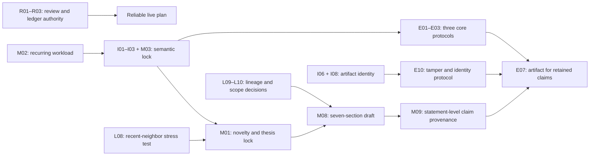

# ICPE 2027 Open Improvement Ledger

- **Last reviewed:** 2026-08-09
- **Review baseline:** CURRENT_WORKTREE at commit
  c53dac20a867470aa4184e7d35f5d76b56679801, tag v0.2.3
- **Manuscript intake hash:** SHA-256
  f1b7dad6cdcf39b6a333b33903705c04e6fc6d6178966d89cf885073b899a904
- **Primary review:** [Consolidated ICPE 2027 manuscript review](icpe-2027-review-results.md)
- **Meta-review and technical corrections:**
  [ICPE 2027 review meta-review](icpe-2027-review-meta-review.md)
- **Verified literature inventory:** [ICPE 2027 review reference candidates](icpe-2027-review-reference-candidates.md)
- **Independent first literature pass:**
  [ICPE 2027 related-work and novelty-stress report](icpe-2027-related-work-report.md)
- **First-pass bibliography:**
  [ICPE 2027 first-pass reference candidates](icpe-2027-reference-candidates.bib)
- **Recent and canonical literature pass:**
  [ICPE 2027 related-work second pass](icpe-2027-related-work-second-pass.md)
- **Pass-two bibliography:**
  [ICPE 2027 pass-two reference candidates](icpe-2027-reference-candidates-pass2.bib)
- **Worktree reconciliation record:**
  [ICPE 2027 worktree reconciliation](icpe-2027-worktree-reconciliation.md)
- **Venue check represented here:** 2026-08-09
- **Scope:** internal implementation, manuscript, literature, evaluation, and
  artifact improvements arising from the ICPE 2027 review

This file is the source of truth for closing the open improvement work identified
by the ICPE 2027 review, its meta-review, the technical audit, and both literature
passes. The original consolidated review and its queue are dated snapshots. They
remain valuable evidence, but they do not own live status after a finding is
corrected, merged, narrowed, or superseded here. This ledger is deliberately more
detailed than a revision checklist: each entry records why the work exists, what
current evidence supports it, what has to change, how completion will be checked,
and which claims must remain narrow in the meantime.

This is not a product roadmap, a release commitment, or evidence that any proposed
behavior exists. It does not supersede the
[Product Backlog](2026-07-feature-brainstorm.md) or the
[public roadmap](../src/roadmap.md). If an item changes public CLI behavior or a
durable product contract, it must be promoted to the product backlog under a
stable product ID and then follow the repository's normal implementation,
documentation, manpage, and test requirements. Manuscript-only and
evaluation-only work stays here.

The manuscript itself is not edited by this ledger. Missing experiments, results,
plots, or final packaging remain neutral **FUTURE_EVIDENCE** until the relevant
protocol is frozen and executed. A future result can support or falsify a claim;
it cannot retroactively close a wording or semantic-contract task.

## How to use this ledger

### Statuses

| Status | Meaning |
| --- | --- |
| **open** | The issue is accepted and work can start. |
| **in progress** | An owner is actively producing the stated deliverables. |
| **blocked** | A named hard or external dependency prevents every meaningful next action. Use a separate verification-blockers field when design or drafting can proceed but final closure cannot. |
| **review ready** | The deliverables and closure evidence exist and await an independent check. |
| **verified** | Every acceptance criterion passed at the recorded code, manuscript, and evidence baseline. |
| **deferred** | Deliberately outside the current submission gate; the reopening trigger remains recorded. |
| **superseded** | Replaced by another stable item; retain the old item and link its replacement. |
| **rejected** | Considered and intentionally declined with a recorded rationale. |

### Priorities and gates

| Label | Meaning |
| --- | --- |
| **P0** | Present correctness, safety, or fabricated-claim blocker. |
| **P1** | Material correctness, scientific-validity, or submission-readiness obligation. |
| **P2** | Substantial validity or quality improvement whose omission must be justified. |
| **P3** | Lower-severity polish or optional strengthening. |
| **before review reuse** | Must be resolved before the review package or this ledger is treated as authoritative input to another formal review. |
| **before prose** | Must be resolved before expanding the meta-draft into conventional full prose. |
| **before experiments** | Must be resolved before collecting data intended to support the paper. |
| **before submission** | Must be resolved before freezing the paper and companion artifact. |
| **optional** | Not required for the current paper unless the associated claim or feature is promoted. |

### Evidence classes

| Class | Meaning in this ledger |
| --- | --- |
| **VERIFIED_CURRENT** | Present behavior checked in current code, tests, user documentation, release metadata, official Slurm documentation, or a primary literature source. |
| **HISTORICAL** | A design, plan, backlog, roadmap, or release-positioning statement that does not establish current behavior by itself. |
| **PROPOSED_DESIGN** | A contract or manuscript structure that is not yet implemented or adopted. |
| **FUTURE_EVIDENCE** | A measurement, result, external-site observation, or artifact exercise that has not yet been performed. |
| **UNRESOLVED** | Current evidence is contradictory, incomplete, or requires an explicit author or implementation decision. |

### Closure and deduplication rules

- Stable IDs are never reused. Completed, deferred, superseded, and rejected
  items remain visible.
- One item owns one acceptance boundary even when its work spans code, tests,
  current documentation, and manuscript text.
- Implementation behavior and the manuscript's description of that behavior are
  separate items. Closing a prose item does not prove the implementation, and
  closing an implementation item does not automatically update the paper.
- Literature verification and novelty prose are separate. A comparison may be
  written only from verified sources, and unknown capabilities remain marked
  unknown.
- A hard dependency must be **verified** before the dependent item can be
  verified. Soft dependencies indicate a useful order but allow parallel work.
  External dependencies record site access, venue publication, or another state
  outside the repository.
- To move an item to **verified**, add dated closure evidence directly to that
  item: commit or manuscript hash, tests or read-back performed, reviewer, and
  any remaining limitation.
- When code or public behavior changes, update the relevant current docs and
  focused regression tests in the same change. Do not treat this planning file
  as user documentation.

## Portfolio overview

| ID | Workstream | Short outcome | Status | Priority | Gate | Main dependency |
| --- | --- | --- | --- | --- | --- | --- |
| ICPE-R01 | Review governance | Persona findings and disposition trail are reproducible | open | P1 | before review reuse | Review records |
| ICPE-R02 | Review governance | Versioned erratum and decision register | open | P1 | before prose | Technical audit |
| ICPE-R03 | Ledger governance | Coherent metadata and mechanical consistency checks | open | P1 | before review reuse | ICPE-R02 soft |
| ICPE-I01 | Implementation | Feasible task geometry after partial placement | open | P1 | before prose | Author decision |
| ICPE-I02 | Implementation | Explicit concurrent CPU, memory, and GRES sharing | open | P1 | before prose | Author decision |
| ICPE-I03 | Implementation | Tested supervisor, readiness, and failure state model | open | P1 | before prose | ICPE-I01, ICPE-I02 |
| ICPE-I04 | Implementation | Unambiguous run, job, attempt, and reuse namespace | open | P2 | optional | Evidence-schema decision |
| ICPE-I05 | Implementation | Deliberate publish-safe export path or explicit non-feature | open | P2 | optional | ICPE-M06, ICPE-L05 |
| ICPE-I06 | Implementation | Tested preview, dry-run, submission, and attribution boundaries | open | P1 | before experiments | ICPE-M04 |
| ICPE-I07 | Implementation | Storage paths classified by producer, consumer, and visibility | open | P2 | before experiments | ICPE-I03 |
| ICPE-I08 | Implementation | Exact submitted bytes preserved and verified through export | open | P1 | before experiments | ICPE-I06 |
| ICPE-I09 | Implementation | Deliberate sealed plan-to-submit receipt decision | open | P2 | optional | ICPE-I08, ICPE-L08 |
| ICPE-I10 | Implementation | Static scheduler-action and execution-effect budget | open | P2 | optional | ICPE-I03, ICPE-M03 |
| ICPE-I11 | Implementation | Deliberate complete source-to-submitted-artifact mapping decision | open | P2 | optional | ICPE-M03, ICPE-I06, ICPE-I08 |
| ICPE-M01 | Manuscript | Frozen two-contribution thesis and conditional promotion rule | open | P1 | before prose | Semantic decisions, ICPE-L08 |
| ICPE-M02 | Manuscript | One recurring causal workload | open | P1 | before prose | Semantic decisions soft |
| ICPE-M03 | Manuscript | Authoritative paper-core semantic table | open | P1 | before prose | ICPE-I01, ICPE-I02 decisions |
| ICPE-M04 | Manuscript | Accurate preview, submission, and attribution taxonomy | open | P1 | before prose | None |
| ICPE-M05 | Manuscript | Bounded evidence trust and reconstruction story | open | P1 | before prose | ICPE-L05 soft |
| ICPE-M06 | Manuscript | First-class privacy and export boundary | open | P1 | before prose | None |
| ICPE-M07 | Manuscript | Scenario-first Slurm, locus, and fit primer | open | P2 | before prose | ICPE-I03, ICPE-M02 soft |
| ICPE-M08 | Manuscript | Seven-section, terminology-controlled, venue-current draft | open | P2 | before prose | ICPE-M01–M07 soft |
| ICPE-M09 | Manuscript governance | Every material claim has implementation and evidence provenance | open | P1 | before submission | ICPE-M01/M03/M08, ICPE-E07 soft |
| ICPE-L01 | Literature | Closest-neighbor semantic matrix and narrow novelty | open | P1 | before prose | ICPE-M03 soft |
| ICPE-L02 | Literature | Fair DockSing comparator feasibility decision | open | P1 | before experiments | Semantic equivalence conditional |
| ICPE-L03 | Literature | Honest pilot and controller-locus contrast | open | P1 | before prose | ICPE-I03 soft |
| ICPE-L04 | Literature | Charitable workflow and service-system boundary | open | P1 | before prose | ICPE-L01, ICPE-L03 |
| ICPE-L05 | Literature | Provenance standards crosswalk and contribution decision | open | P1 | before prose | ICPE-M05 soft |
| ICPE-L06 | Literature | Runtime-substrate responsibility matrix | open | P2 | before prose | ICPE-M03 soft |
| ICPE-L07 | Literature | Living, verified, and auditable literature checkpoint | open | P2 | before submission | Primary-source access |
| ICPE-L08 | Literature | Novelty reopened against recent closest neighbors | open | P1 | before prose | ICPE-M03 soft |
| ICPE-L09 | Literature | Canonical lineage and owning-layer attribution restored | open | P2 | before submission | None |
| ICPE-L10 | Literature | Literature-inspired expansions explicitly accepted or rejected | open | P2 | before prose | ICPE-L08 |
| ICPE-E01 | Evaluation | Independent semantic-conformance oracle and corpus | open | P1 | before experiments | Semantic lock for final freeze |
| ICPE-E02 | Evaluation | Fair phase-separated cost-of-abstraction study | open | P1 | before experiments | ICPE-E01; ICPE-L02 conditional |
| ICPE-E03 | Evaluation | Reproducible static/dynamic boundary corpus | open | P2 | before experiments | ICPE-M02, ICPE-M03 soft |
| ICPE-E04 | Evaluation | Crossed backend-by-site study or narrower claim | open | P1 | before experiments | Site access for execution |
| ICPE-E05 | Evaluation | Reliability, recovery, and identity fault matrix | open | P2 | optional | ICPE-M05; retained claim |
| ICPE-E06 | Evaluation | Fault-by-stage-by-effect-by-quota assurance design | open | P2 | optional | Retained assurance claim |
| ICPE-E07 | Artifact | Tiered, pinned, privacy-checked research artifact | open | P1 | before submission | Protocols for retained claims |
| ICPE-E08 | Evaluation | Reader comprehension and diagnostic usability study | deferred | P3 | optional | Stable manuscript and artifact |
| ICPE-E09 | Evaluation | Service-attribution accuracy study | deferred | P3 | optional | Cross-site ground truth |
| ICPE-E10 | Evaluation | End-to-end submission and export integrity protocol | open | P1 | before experiments | ICPE-I08 for execution |
| ICPE-E11 | Evaluation | Supervisor scaling and lifecycle-stress envelope | deferred | P2 | optional | Scale claim retained |

## Critical path

The dependency view separates urgency from ordering. Useful work should proceed
in parallel whenever final verification, rather than the next meaningful action,
is what depends on another item. In particular, workload selection, closest-
neighbor analysis, site/comparator feasibility, semantic decisions, and immediate
factual manuscript repairs should start together.

| Phase | Parallel inputs | Work that becomes safe | Exit condition |
| --- | --- | --- | --- |
| A. Repair decision authority | ICPE-R01–R03 | Reliable review reuse and live planning | Persona support, corrections, decisions, status, gates, and dependencies are auditable |
| B. Discover and decide | ICPE-M02, ICPE-L01/L02/L08, ICPE-E04 site inventory, ICPE-I01/I02, immediate ICPE-M04–M06 corrections | A deliberately narrowed paper-core | The workload, strongest neighbors, available evidence cells, and resource decisions agree |
| C. Lock semantics and argument | ICPE-I03, ICPE-M03, ICPE-M01, ICPE-L09/L10 | Seven-section pre-results prose and three core RQs | One scenario, two default contributions, one semantic contract, honest lineage, and explicit non-goals |
| D. Freeze retained studies | ICPE-E01–E03, relevant parts of ICPE-E04–E06, ICPE-I06/I08/E10 | Reportable collection for retained claims | Every retained RQ has an independent oracle/control, estimand or invariant, practical threshold, and falsifier |
| E. Execute and package | Pinned release, workloads, sites, comparator decisions, ICPE-M09, ICPE-E07 | Results and artifact claims | Archived data, verified submitted artifacts, statement-level claim-to-evidence map, privacy review, and clean-room rehearsal |

ICPE-I04, ICPE-I05, ICPE-I09–I11, ICPE-E05, ICPE-E06, and ICPE-E11
are conditional work unless their associated evidence, assurance,
identity-chain, complete-mapping, effect-budget, or scaling claims are retained.
Accurate current
namespace, privacy, and evidence limitations in ICPE-M05/M06 remain mandatory
even when the corresponding product redesign is not selected.

## Review-synthesis and decision-governance items

These items do not edit the manuscript or decide its science by themselves.
They make the review package trustworthy enough that later authors and reviewers
can reconstruct who observed what, which technical statements were corrected,
and which unresolved points require an author choice rather than a code fix.

### ICPE-R01 — Publish a persona-by-persona audit trail and disposition register

- **Type:** review governance and research decision traceability
- **Tags:** personas, review evidence, consensus, adjudication, audit trail
- **Status:** open
- **Priority and gate:** P1, before review reuse
- **Owner role:** review lead with one independent process reviewer
- **Sources:** [consolidated review](icpe-2027-review-results.md) and
  [meta-review](icpe-2027-review-meta-review.md)
- **Evidence class:** VERIFIED_CURRENT for the consolidated summaries;
  UNRESOLVED for the missing per-persona audit trail

**Current evidence and limitation.** Seven persona perspectives informed the
review, and the consolidated report presents useful medians, ranges, priorities,
and a single action queue. The retained material does not yet let a later author
reproduce every aggregate, distinguish first-wave persona observations from
second-wave technical adjudication, or see why a minority concern was retained,
merged, downgraded, or rejected. A phrase such as “reviewers agreed” is therefore
stronger than the available audit trail unless the underlying votes or findings
are made explicit.

**Why this belongs in the ledger.** The purpose is not process ceremony. The
persona spread is evidence about how different ICPE readers may interpret the
same paper. Preserving disagreement makes revisions more useful: a change can
target a Slurm expert's semantic concern without incorrectly claiming that a
software-engineering reader or artifact evaluator raised the same issue.

**Work package.**

- Recover or reconstruct the seven-by-twenty-four score matrix used for the
  reported rubric, preserving missing values rather than filling them from the
  median.
- For each persona, retain a concise list of findings, confidence, evidence
  inspected, proposed improvement, and whether the observation came from the
  original review wave or later adjudication.
- Create a finding-disposition register with stable finding IDs and one of:
  retained, merged, downgraded, rejected, unresolved, or superseded.
- For every disposition, record the rationale, evidence, destination ledger ID,
  and responsible adjudicator. Record lead-author overrides explicitly.
- Label synthesized conclusions as unanimous, majority, cross-supported,
  minority-but-material, or lead-adjudicated. Do not describe a Wave-2 technical
  audit as seven-persona consensus.
- Document any raw material that cannot be recovered and state which aggregates
  consequently remain non-reproducible.

**Acceptance criteria.**

- [ ] Every aggregate score can be regenerated from retained persona data, or
      the exact unrecoverable input is named.
- [ ] Every P1 finding traces to at least one persona observation or a clearly
      labeled later technical audit.
- [ ] Every persona finding has a disposition, rationale, evidence pointer, and
      destination or explicit no-action decision.
- [ ] Consensus labels are mechanically consistent with the recorded support.
- [ ] Minority and rejected findings remain visible rather than disappearing
      from the historical record.
- [ ] The consolidated prose no longer implies more inter-reviewer agreement
      than the preserved evidence supports.

**Dependencies and guardrails.** No manuscript task depends on manufacturing a
consensus. This item can be closed with explicit missing-data limitations. It
must not rerun personas merely to obtain more favorable scores, and it must keep
the original review immutable as a dated snapshot.

### ICPE-R02 — Issue a versioned technical erratum and author-decision register

- **Type:** review governance and factual correction
- **Tags:** erratum, dry run, evidence integrity, author decisions, supersession
- **Status:** open
- **Priority and gate:** P1, before prose
- **Owner role:** review lead with compiler/runtime and evidence maintainers
- **Sources:** [meta-review](icpe-2027-review-meta-review.md), current v0.2.3
  code paths cited there, and official Slurm behavior cited by the review
- **Evidence class:** VERIFIED_CURRENT for identified corrections;
  PROPOSED_DESIGN for unresolved author choices

**Current evidence and limitation.** The second technical pass corrected and
refined several statements in the consolidated review. Most importantly,
ordinary Slurm up dry-run and ordinary submission share one invocation-specific
rendering path before the submission branch, while portable preview, remote
mode, local mode, selected source attribution, and later retained/exported bytes
remain separate artifacts. The audit also found two stronger integrity risks:
evidence initialization rereads a mutable script path after the scheduler call,
and bundle export rereads that path later without verifying it against the
manifest digest. In addition, one meta-review note about a duplicated
“Literature-to-ledger traceability” heading was itself an inspection artifact;
the baseline ledger has one such heading.

The review package also mixes evidence-resolved corrections with choices that
only the authors can make, such as the exact partial-placement contract, the
contribution count, and whether optional provenance or scaling claims remain.

**Why this belongs in the ledger.** A review is useful only if later tasks do not
continue to depend on a statement known to be false. At the same time, an author
choice should not be disguised as a bug or as evidence that an implementation
already exists. A versioned erratum preserves the original report while giving
subsequent work one clear interpretation.

**Work package.**

- Publish a compact correction table with original finding, corrected statement,
  evidence, consequence, and whether the correction supersedes all or only part
  of the original finding.
- Split the dry-run finding into ordinary same-context Slurm byte identity,
  portable preview identity, remote/local exceptions, selected attribution, and
  retained/exported submitted-artifact integrity.
- Add the post-scheduler-read and bundle-export mutable-path risks, linking them
  to ICPE-I08 and ICPE-E10.
- Split protocol design from future outcomes in the evaluation findings. A
  proposed study can be assessed now; its measurements remain future evidence.
- Distinguish evidence-resolved facts, implementation proposals, author
  decisions, and external dependencies in every affected review finding.
- Record the default decision that the paper has two contributions and treats
  evidence as supporting infrastructure unless a later, predeclared promotion
  gate is passed.
- Add a supersedes/does-not-supersede map so no live item depends on an obsolete
  review sentence.

**Acceptance criteria.**

- [ ] No live ledger item depends on the overbroad claim that all dry-run or
      preview artifacts necessarily differ from submitted bytes.
- [ ] The two mutable-script-path integrity risks are described separately and
      linked to an implementation owner and a falsifiable study.
- [ ] Every correction cites code, documentation, test, or primary-source
      evidence sufficient for an independent read-back.
- [ ] Author choices are visibly labeled decisions, not implementation defects.
- [ ] The original review remains available and the erratum states exactly what
      it supersedes.
- [ ] The erroneous duplicate-heading observation is corrected without deleting
      the history of the correction.

**Dependencies and guardrails.** Corrections to current manuscript-facing facts
must not wait for optional product work. The erratum must not claim that the
integrity risks are repaired merely because they are documented, and it must not
convert a qualified ordinary-mode byte relation into a remote, local, portable,
or cross-invocation guarantee.

### ICPE-R03 — Normalize ledger control metadata and enforce consistency

- **Type:** ledger governance and quality automation
- **Tags:** status, priority, gate, dependencies, evidence class, consistency
- **Status:** open
- **Priority and gate:** P1, before review reuse
- **Owner role:** ledger maintainer with release/quality reviewer
- **Sources:** [meta-review](icpe-2027-review-meta-review.md) and the current
  ledger structure audit
- **Evidence class:** VERIFIED_CURRENT for the identified inconsistencies;
  PROPOSED_DESIGN for the checker

**Current evidence and limitation.** The baseline ledger sometimes used
“blocked” when useful design, source verification, or site discovery could start;
used priority as a timing signal even though gates already own timing; labeled
study protocols as future evidence; and listed optional or conditional work as a
hard dependency. These distinctions affect the plan's behavior, not merely its
wording. A falsely blocked item suppresses parallel progress, while a falsely
hard dependency can make supporting evidence or an optional product redesign
appear mandatory for the core paper.

**Why this belongs in the ledger.** This file is intended to be an execution
authority. Its overview, detailed entries, dependency graph, and source links
must therefore agree. A small repeatable check prevents a future edit from
silently reintroducing duplicate IDs, dangling dependencies, or status and
evidence-class contradictions.

**Work package.**

- Keep status as work state and add a verification-blockers paragraph or field
  where final closure, but not useful next work, depends on another decision.
- Keep P0–P3 as importance/severity only and use gates as the sole timing field.
- Label protocol, schema, and artifact designs as PROPOSED_DESIGN; reserve
  FUTURE_EVIDENCE for measurements, observations, and executed artifact results.
- Distinguish hard, soft, conditional, and external dependencies in prose and in
  the portfolio overview.
- Mark the consolidated review queue as a dated snapshot and this ledger as the
  sole owner of live status and closure evidence.
- Add a repository check or documented repeatable procedure that verifies:
  overview IDs equal detailed item headings; IDs are unique; every dependency
  resolves or is explicitly external; required metadata exists; conditional
  dependencies are labeled; and relative source links resolve.
- Run the check at each ledger review and record its result with the baseline.

**Acceptance criteria.**

- [ ] Overview and detailed entries contain exactly the same stable IDs once,
      excluding explicitly documented compact rejected-direction labels.
- [ ] Every detailed item has type, tags, status, priority/gate, owner, sources,
      evidence class, acceptance criteria, and dependency/guardrail text.
- [ ] No optional item lies on the mandatory critical path without a conditional
      qualifier and reopening rule.
- [ ] Open work with a meaningful next action is not marked blocked solely
      because final verification awaits another item.
- [ ] Proposed study designs and future outcomes use different evidence classes.
- [ ] All internal report links resolve, and the consistency check can be rerun
      without maintainer-only knowledge.

**Dependencies and guardrails.** ICPE-R02 is a soft dependency because known
factual corrections should be represented before the checker freezes a new
baseline. The checker validates structure, not scientific truth; independent
review remains required for semantic claims and acceptance evidence.

## Implementation and semantic-correctness items

### ICPE-I01 — Resolve partial-placement task geometry

- **Type:** implementation
- **Tags:** resource semantics, Slurm, planner, renderer, correctness
- **Status:** open
- **Priority and gate:** P1, before prose
- **Owner role:** runtime/compiler implementer with a Slurm expert
- **Sources:** review P1-01;
  [planner](../../src/planner.rs) lines 724–806;
  [planner tests](../../src/planner/tests.rs) lines 1068–1145;
  [command renderer](../../src/render/command.rs) lines 57–68
- **Evidence class:** UNRESOLVED

**Current evidence and limitation.** A service placed on two nodes can inherit the
allocation-wide pair of 24 tasks and four tasks per node from a six-node
allocation. The current regression test expects that pair, and rendering emits it
alongside a two-node step. Those values do not describe one obvious feasible task
geometry. It is not yet established whether this is a deliberate request to let
Slurm resolve, a planner bug, or an undocumented compatibility behavior.

**Why this belongs in the ledger.** Resource geometry is part of the paper's
central compiler claim and also a prerequisite for a fair native-script baseline.
If the generated step requests a different number or distribution of ranks than
the source model implies, later conformance and overhead results would be
uninterpretable even if execution succeeds.

**Work package.**

- Write three explicit design options: reject inconsistent inherited geometry,
  recompute step tasks from the placed-node subset, or delegate a precisely
  documented relation to Slurm.
- Test the options against single-node, full-allocation, and explicit node-index
  placements, including CPU-only and GPU-distributed services.
- Select one rule and express it in the normalized plan rather than relying on a
  renderer-side accident.
- Align planner validation, plan serialization, command rendering, focused unit
  and integration tests, the current specification/execution documentation, and
  the later paper-core table.
- Obtain at least one real-Slurm observation for each retained boundary case
  before using it in RQ1 or RQ2.

**Acceptance criteria.**

- [ ] One option is selected with a compatibility and migration rationale.
- [ ] For every accepted partial placement, nodes, total tasks, tasks per node,
      CPUs per task, and GPUs describe a feasible and documented relation.
- [ ] Contradictory cases fail at the named validation layer with an actionable
      diagnostic, or are delegated under a documented and tested rule.
- [ ] Planner, renderer, tests, current user docs, and manuscript table agree.
- [ ] Real-Slurm evidence records the effective rank/resource distribution rather
      than treating submission success alone as proof.

**Dependencies and guardrails.** The author decision is external to mechanical
implementation. Preserve compatibility consciously; do not silently change rank
count. Do not claim formal semantic preservation until ICPE-E01 supplies an
independent oracle.

### ICPE-I02 — Define concurrent CPU, memory, and GRES sharing

- **Type:** implementation
- **Tags:** resource isolation, overlap, aggregate validation, performance validity
- **Status:** open
- **Priority and gate:** P1, before prose
- **Owner role:** planner/runtime implementer with Slurm and performance-methods reviewers
- **Sources:** review P1-01; [planner](../../src/planner.rs) lines 749–806;
  [command renderer](../../src/render/command.rs) lines 57–68; official Slurm
  srun semantics retained in the review
- **Evidence class:** UNRESOLVED

**Current evidence and limitation.** Service resource fit is checked largely one
service at a time, while every service step is rendered with **--exact** and
**--overlap**. Slurm documents overlap as allowing steps to share CPUs, memory,
and GRES. The current implementation therefore does not establish a simple
aggregate exclusivity guarantee for concurrently live services.

**Why this belongs in the ledger.** The question affects correctness, isolation,
readiness latency, interference, GPU assignment, and every performance
comparison. Removing overlap blindly could prevent intentionally concurrent
services from starting; retaining it without a declared sharing model could hide
oversubscription or invalidate a comparison against an exclusive native script.

**Work package.**

- Define separate semantics for disjoint placement, intentional co-location, and
  accidental aggregate overcommit.
- Decide which resources are exclusive, shareable, or explicitly delegated:
  nodes, tasks, CPU sets, memory, generic resources, and GPUs.
- Decide whether the planner proves aggregate concurrent feasibility, rejects
  ambiguous sharing, or requires a typed opt-in for intentional sharing.
- Document the precise role of **--exact** and **--overlap**, including
  backend/site prerequisites and any Slurm-version sensitivity.
- Add positive, negative, and contention-sensitive cases, then ensure the native
  evaluation scripts use the identical policy.

**Acceptance criteria.**

- [ ] The typed contract states the allowed sharing relation for every paper-core
      resource.
- [ ] Aggregate validation behavior and any explicit opt-in are implemented and
      documented.
- [ ] Generated commands and observed Slurm allocation/step accounting agree for
      disjoint, co-located, and rejected cases.
- [ ] RQ2's native baseline cannot differ only because one path receives exclusive
      resources and the other shares them.
- [ ] Unsupported or site-dependent cases are named rather than absorbed by a
      universal portability claim.

**Dependencies and guardrails.** This item can proceed in parallel with ICPE-I01
but both must close before ICPE-M03 and ICPE-E01. Do not broaden the project into
dynamic bin packing or a nested scheduler; the goal is a static, checkable
allocation/step contract.

### ICPE-I03 — Make the generated supervisor and readiness state model explicit

- **Type:** implementation and current documentation
- **Tags:** supervisor, readiness, failure, restart, cleanup, controller locus
- **Status:** open
- **Priority and gate:** P1, before prose
- **Owner role:** runtime owner with reliability and documentation reviewers
- **Sources:** review P1-02; RADICAL-Pilot service tasks
  (`merzky2025servicetasks`) and OpenVenus (`wan2023openvenus`);
  [execution model](../src/execution-model.md) lines 17–30 and 66–78;
  [renderer](../../src/render.rs) supervisor, readiness, monitoring, restart, and
  cleanup regions; [planner](../../src/planner.rs) lines 925–940
- **Evidence class:** VERIFIED_CURRENT for the mechanism; PROPOSED_DESIGN for the
  authoritative state contract

**Current evidence and limitation.** The generated batch shell records a
supervisor PID, launches steps, observes TCP, HTTP, log, or sleep readiness,
applies restart and failure policy, writes state, monitors service exits, and
cleans up. It is allocation-resident runtime logic even though there is no
separately deployed daemon or nested scheduler. The behavior exists, but no
single state machine and locus contract currently owns its semantics.

**Why this belongs in the ledger.** Naming the supervisor honestly improves both
the implementation and the paper. It exposes failure modes and measurable
overhead, clarifies which process owns lifecycle decisions, and prevents the
unsafe shorthand that there is no runtime controller at all.

**Work package.**

- Define service states, supervisor states, transitions, timers, retry counters,
  terminal outcomes, and cleanup ordering. Distinguish startup order, process
  start, one-time readiness, ongoing liveness, successful completion, exit,
  bounded restart, terminal failure, cancellation, and cleanup.
- Derive one readiness-execution record shared by planner, renderer, preflight,
  and inspection: probe type, observer node/locus, target, implicit-localhost
  status, required host tool, placement compatibility, and the limit of
  reachability assurance.
- Specify which host executes each readiness observer and what network or storage
  visibility it assumes. Preserve the current restriction that implicit
  localhost readiness is valid only for primary-node placement unless the
  implementation changes deliberately.
- Add transition-focused tests for simultaneous exit, readiness timeout,
  supervisor interruption, restart exhaustion, dependent-service cancellation,
  cleanup failure, and signal/requeue paths where applicable.
- Identify the durable and best-effort state written at each transition.
- Test post-acceptance autonomy: after `sbatch` accepts the job, terminate the
  invoking CLI and remove all login-host coordination. The allocation-resident
  supervisor must still launch, observe, terminate, clean up, and record its
  bounded state without a resident hpc-compose service.
- Define the autonomy invariant precisely: after scheduler acceptance there is
  no required hpc-compose client, login-host process, hpc-compose database,
  external work queue, or nested scheduler. Enumerate every allowed
  allocation-local helper and distinguish optional post-job readers from
  runtime dependencies.
- Exercise that invariant with optional telemetry/evidence collectors both
  enabled and disabled, retaining process trees, scheduler steps, open network
  dependencies, CPU/RSS, state writes, and teardown state.
- Update current architecture and execution documentation so future manuscript
  wording can cite a stable contract.

**Acceptance criteria.**

- [ ] One reviewed state-machine artifact accounts for launch, observation,
      readiness, restart, failure propagation, termination, and cleanup.
- [ ] Every transition identifies actor, host, timer, state write, and externally
      observable outcome.
- [ ] Focused tests exercise normal and adverse transitions, including races that
      could otherwise leave an orphaned step or stale ready state.
- [ ] `service_started`, `service_healthy`, and
      `service_completed_successfully` have distinct predicates, and the
      contract states whether readiness can be revoked after first success.
- [ ] A service that becomes ready and later loses probe responsiveness has a
      documented, tested outcome; one-time readiness is not mislabeled ongoing
      liveness monitoring.
- [ ] The allocation continues correctly after the invoking CLI exits, or any
      continuing off-allocation dependency is exposed as part of the architecture.
- [ ] Post-acceptance process and network inventories contain only the declared
      allocation-local helpers and scheduler/runtime processes; optional
      collectors cannot silently create a login-host control dependency.
- [ ] Current docs use “generated batch supervisor” and reserve “no separately
      deployed daemon or nested scheduler” for the architectural distinction.
- [ ] The contract names its overhead surface for ICPE-E02.

**Dependencies and guardrails.** Resource-related transitions depend on ICPE-I01
and ICPE-I02. Do not add a persistent proxy, external service, dynamic
allocation-internal scheduler, or login-node babysitter under this item.

### ICPE-I04 — Remove or deliberately document run, job, attempt, and ID-reuse ambiguity

- **Type:** implementation design
- **Tags:** identity, evidence, scheduler ID reuse, storage namespace, migration
- **Status:** open
- **Priority and gate:** P2, optional
- **Owner role:** evidence/storage maintainer with reliability reviewer
- **Sources:** review P1-06; [run evidence](../src/run-evidence.md) lines 73–92,
  151–191; existing identity and scheduler-ID-reuse tests cited by the review
- **Evidence class:** VERIFIED_CURRENT for the current limitation;
  PROPOSED_DESIGN for a replacement namespace

**Current evidence and limitation.** A run ID and Slurm job ID are distinct, but
the current metadata layout remains job-ID-keyed. One metadata root cannot safely
hold two distinct runs with the same scheduler ID. Attempts, sweep trials, reruns,
and reconstructed views add related identities whose relationships need to stay
explicit.

**Why this belongs in the ledger.** The manuscript can accurately document the
current constraint, but removing it would improve long-lived repositories,
cross-cluster aggregation, scheduler-ID reuse handling, and RQ5's identity story.
This is a product change, not something the paper should assume has happened.

**Work package.**

- Write a namespace decision record covering run ID, cluster/site identity,
  scheduler job ID, array/task identifiers, attempt, sweep trial, rerun, and
  legacy records.
- Compare retaining the compatibility layout with a run-ID-primary layout and
  explicit scheduler index.
- Define collision detection, atomic migration, discovery, cleanup, and
  degradation when old records lack one or more identity components.
- Add property and concurrency tests for job-ID reuse, multiple clusters, partial
  migration, interrupted index writes, and stale lookup data.
- If implementation is approved, promote it to the product backlog and update
  all public identity and file-layout documentation.

**Acceptance criteria.**

- [ ] The decision record states whether the present limitation is accepted or
      removed and why.
- [ ] No lookup can silently bind a new run to stale evidence from another site,
      job, or attempt.
- [ ] Legacy behavior and migration failure remain deterministic and recoverable.
- [ ] RQ5 tests use the implemented namespace rather than a manuscript-only ideal.

**Dependencies and guardrails.** The current limitation can be closed in the
paper through ICPE-M05 even if this optional implementation is deferred. Do not
claim cross-cluster identity or scheduler-ID-reuse support until the product
behavior and migration path are tested.

### ICPE-I05 — Decide whether to build a publish-safe evidence export

- **Type:** implementation and security design
- **Tags:** privacy, redaction, bundle, allowlist, provenance export
- **Status:** open
- **Priority and gate:** P2, optional
- **Owner role:** security/privacy owner with evidence and artifact maintainers
- **Sources:** review P1-07;
  [secrets documentation](../src/secrets.md) lines 64–68;
  [run evidence](../src/run-evidence.md) lines 236–253;
  literature candidates RC-18 through RC-21
- **Evidence class:** VERIFIED_CURRENT for the unsafe boundary;
  PROPOSED_DESIGN for a safe exporter

**Current evidence and limitation.** Diagnostic redaction does not sanitize
rendered or submitted scripts or persisted state. Exported bundles can contain
effective configuration, resolved secrets, paths, scheduler identifiers, notes,
tags, source references, and selected result payloads. They are neither
automatically publish-safe nor necessarily complete.

**Why this belongs in the ledger.** Accurate warning text is mandatory and is
owned by ICPE-M06. A genuinely publish-safe export may also be valuable, but it
requires a different contract from general provenance or convenient bundling.
The literature on research-object packaging does not supply sanitization
automatically.

**Work package.**

- Produce a go/no-go security design comparing an allowlist-based research export
  with an explicitly unsafe raw bundle plus human-review checklist.
- Inventory every possible source surface and classify secrets, personal or site
  metadata, unpublished results, absolute paths, and external references.
- If a safe mode is approved, define deterministic redaction, omission records,
  manifest completeness states, schema/versioning, and refusal behavior for
  unknown fields.
- Use synthetic canaries only; never place real credentials in fixtures or
  external services.
- Validate any standards-oriented export decision jointly with ICPE-L05.

**Acceptance criteria.**

- [ ] The project records a deliberate safe-export or no-safe-export decision.
- [ ] Every included and excluded surface is machine-auditable and documented.
- [ ] Secret canaries are excluded or cause a clear refusal/review failure.
- [ ] Missing payloads or mutable references cannot be labeled complete or
      self-contained.
- [ ] Any new public behavior is promoted to the product backlog before coding.

**Dependencies and guardrails.** ICPE-M06 is required regardless of this item's
outcome. Do not use “redacted,” “publish-safe,” “self-contained,” “reproducible,”
or standards-compliant for an export until the corresponding property has a
testable implementation.

### ICPE-I06 — Define and test preview, dry-run, submission, and attribution boundaries

- **Type:** implementation contract and regression coverage
- **Tags:** inspectability, source mapping, preview, dry run, submitted script
- **Status:** open
- **Priority and gate:** P1, before experiments
- **Owner role:** compiler/rendering owner with artifact reviewer
- **Sources:** review P1-05 and ICPE-R02; Drona (`kryvenko2025drona`) for
  editable preview and BioCodex (`ehrett2026biocodex`) for hash/tamper boundaries;
  [execution model](../src/execution-model.md) lines 98–130; current ordinary,
  remote, local, render, explain, and submission paths cited in the meta-review
- **Evidence class:** VERIFIED_CURRENT for the present artifact distinctions;
  PROPOSED_DESIGN for stronger attribution coverage

**Current evidence and limitation.** The prior review compressed several
different artifacts into one preview-versus-submission statement. The current
implementation instead has at least five relevant cases:

1. a portable preview produced by render, plan-with-script, or explain;
2. an annotated portable preview with selected source attribution;
3. ordinary non-remote, non-local Slurm up dry-run output;
4. remote and local dry-run paths with different rendering context or generated
   local identity; and
5. bytes consumed, retained, or later exported as the submitted artifact.

For ordinary Slurm mode, dry-run and real up render through the same
invocation-specific absolute-runtime-root path before the dry-run branch. Under
unchanged effective input, local context, profile, options, code, and discovered
tools, a qualified same-byte relation is therefore testable. It does not imply
that a portable preview is identical, that remote/local behavior is identical,
that the job executed successfully, or that later bundle bytes are authentic.
Selected source spans still cover designated feature regions rather than every
line of generated supervisory glue.

**Why this belongs in the ledger.** Precise artifact terminology prevents two
opposite errors: understating a real ordinary-mode dry-run guarantee and
overstating source attribution or durable submitted-byte identity. Drona and
BioCodex further show that editable preview, validated plan, content identity,
and tamper rejection are established but distinct comparison axes.

**Work package.**

- Publish an artifact/mode matrix for portable preview, annotated preview,
  ordinary dry run, ordinary submission, remote dry run/submission, local mode,
  retained script, and exported script.
- For each cell record producer, rendering context, portability, expected byte
  relation, source-attribution coverage, mutability, retention, and verifier.
- Add a fake-sbatch regression that captures exactly the bytes read by the fake
  scheduler and compares them with a preceding ordinary dry run under an
  explicitly frozen context.
- Add negative/metamorphic cases for profile, runtime root, environment,
  backend, option, input, tool-version, remote staging, and local generated-ID
  changes. Expected differences must remain visible.
- Inventory semantic core fields, generated regions, and deliberately unmapped
  glue. Define a semantic coverage denominator that does not reward meaningless
  line-level tagging.
- Keep mapping coverage separate from byte identity and from ICPE-I08's durable
  submission/export integrity contract.
- Promote any new public schema or command guarantee through the product backlog,
  cross-linking the existing DX-01 attribution feature.

**Acceptance criteria.**

- [ ] Each preview, dry-run, submission, retention, and export artifact has one
      unambiguous name and context domain in code-facing tests and documentation.
- [ ] Ordinary same-context Slurm dry-run bytes equal fake-scheduler-consumed
      bytes, or the manuscript claim is narrowed to the actual observed relation.
- [ ] Remote and local exceptions are independently tested and cannot inherit the
      ordinary-mode result.
- [ ] Every paper-core source field is mapped or explicitly classified as
      intentionally unmapped.
- [ ] Attribution coverage, deterministic transformation, byte identity,
      scheduler acceptance, and execution success remain distinct properties.
- [ ] ICPE-M04 remains accurate whether stronger source mapping is implemented or
      deliberately deferred.

**Dependencies and guardrails.** ICPE-M04 can be corrected immediately and is
not blocked by these tests. ICPE-I08 owns whether exact submitted bytes survive
evidence initialization and export. Do not generalize a paired unchanged-context
test into a universal cross-mode or cross-invocation determinism claim.

### ICPE-I07 — Inventory storage paths by producer, consumer, and visibility

- **Type:** implementation and current documentation
- **Tags:** storage locus, shared filesystem, preflight, active probes, safety
- **Status:** open
- **Priority and gate:** P2, before experiments
- **Owner role:** runtime/preflight owner with storage and safety reviewers
- **Sources:** review P1-02 and P1-08;
  [execution model](../src/execution-model.md) lines 5–15 and 42–64;
  [artifacts and resume](../src/artifacts-and-resume.md) lines 3–54;
  [preparation](../../src/prepare.rs) lines 326–350 and 821–852;
  [preflight](../../src/preflight.rs) lines 810–875 and 1042–1158
- **Evidence class:** VERIFIED_CURRENT for the partial checks;
  PROPOSED_DESIGN for a complete inventory

**Current evidence and limitation.** Preparation can run on the submission/login
host, while services and artifact teardown run on compute nodes and later export
can run back on the login host. The current preflight actively probes some cache,
runtime, resume, and scratch roots but does not apply the same coverage to all
default runtime roots, input volumes, local images, stage paths, and artifact
destinations.

**Why this belongs in the ledger.** Readiness, recovery, preparation, and
evidence all depend on path visibility and filesystem operations across loci.
Without a derived inventory, both the paper and the implementation can imply
shared visibility that was never checked. Active probes also mutate state and may
consume an allocation, so coverage and cost must be explicit.

**Work package.**

- Derive one StorageLocus inventory from the effective plan with path class,
  producer, consumers, required read/write/rename operations, visibility set,
  lifetime, sensitivity, and active-probe eligibility.
- Include resolved defaults as well as explicit paths, especially the default
  runtime root.
- Use read-only checks for inputs, volumes, and local images; use write,
  atomic-rename, and headroom checks only where the runtime requires them.
- Deduplicate roots using the strongest required contract and batch checks only
  when their safety and node-coverage semantics remain clear.
- Expose skipped or unknown paths with a reason rather than implying complete
  coverage.
- Coordinate structured quota/effect reporting with ICPE-E06.

**Acceptance criteria.**

- [ ] Every host path in the paper-core plan is classified or explicitly skipped.
- [ ] Producer/consumer loci and required operations match preparation,
      supervision, collection, resume, and export behavior.
- [ ] Read-only sources are never mutated by assurance.
- [ ] Active results record which nodes observed the path, how many allocations
      were consumed, and which visibility claims remain unknown.
- [ ] Current docs distinguish shared, submission-host-only, compute-visible, and
      intentionally node-local paths.

**Dependencies and guardrails.** ICPE-I03 supplies runtime loci; ICPE-E06 supplies
the final effect/quota envelope. This item does not benchmark filesystems,
provision storage, recursively scan user data, or promise node-local scratch
semantics. Any new public inspect/preflight output requires product-backlog
promotion and schema compatibility review.

### ICPE-I08 — Preserve and verify exact submitted bytes through evidence and export

- **Type:** implementation correctness and artifact integrity
- **Tags:** submission, script identity, digest, TOCTOU, evidence, bundle export
- **Status:** open
- **Priority and gate:** P1, before experiments
- **Owner role:** submission/runtime owner with evidence maintainer and an
  independent artifact reviewer
- **Sources:** ICPE-R02 and meta-review P1-MR02; BioCodex
  (`ehrett2026biocodex`) for hash/tamper discipline; Drona
  (`kryvenko2025drona`) for preview-versus-execution separation;
  [runtime submission path](../../src/commands/runtime/mod.rs) around lines
  1477–1537; [bundle exporter](../../src/job/bundle.rs) around lines 284–301;
  [evidence digest model](../../src/job/evidence.rs) around lines 118–130
- **Evidence class:** VERIFIED_CURRENT for the two integrity gaps;
  PROPOSED_DESIGN for the repair

**Current evidence and limitation.** There are two independent mutable-path
risks. First, `sbatch` receives a script path, and only after it returns does job
recording initialize evidence by reopening that path. The manifest digest is
therefore currently a post-submission path attestation, not proof that the same
bytes were consumed by `sbatch`; another writer can change the path during that
interval. Second, bundle export later reopens the recorded path and copies its
current bytes as `run/submitted.sbatch` without comparing them with the committed
manifest digest. Normal reuse of the default script path can consequently make
run A's bundle contain run B's script while still calling it submitted.

Evidence initialization is additive and best effort. When it fails, legacy job
state may still be committed. The repair must therefore define honest degraded
states rather than assuming every accepted scheduler job has complete evidence.
Integrity also does not imply privacy: digest-matching submitted bytes may contain
resolved secrets and remain unsafe to publish.

**Why this belongs in the ledger.** Submitted-script identity is foundational to
the paper's inspectability and artifact story. No source map, manifest, or bundle
can validate an experiment if the bytes associated with the scheduler boundary
can silently drift. BioCodex demonstrates that tamper rejection is already a
credible comparison axis, so fail-open naming would be especially damaging.

**Work package.**

- Render or copy the invocation-specific script into a nonce-, run-, or
  content-specific immutable location before scheduler submission. Do not assume
  the scheduler job ID is available for naming the pre-submission file.
- Hash the same stable bytes or safely held file object that `sbatch` is asked to
  consume. Avoid a read-hash-reopen sequence that recreates the race.
- After scheduler acceptance, bind the captured digest and archive identity to
  the run/job record without rewriting the original attestation from mutable
  state.
- Make evidence-initialization failure machine-visible. Define whether the job
  record stores `submitted_bytes_unavailable`, an archive reference, or another
  explicit degraded state.
- Make bundle export read the retained archive and verify its digest. If bytes are
  missing or mismatched, refuse, omit them, or include them only under an
  explicitly unverified bundle-time-snapshot name with expected and observed
  digests. Never label unverified bytes `submitted`.
- Cover ordinary Slurm, remote staging, and local mode separately. Record which
  mode has a real scheduler-consumption boundary and which only has a generated
  local execution artifact.
- Add fake-scheduler tests that capture bytes at scheduler read time and one
  adversarial fake that overwrites the original path before returning a job ID.
- Add export regressions for path overwrite, cross-run reuse, concurrent
  submissions, missing archive, symlink replacement, truncation, same-size
  different content, legacy records, and digest mismatch.
- Update run-evidence, bundle, privacy, and artifact documentation in the same
  product change.

**Acceptance criteria.**

- [ ] For every fully attested ordinary submission, the digest of bytes captured
      at the fake-scheduler read boundary equals the committed script digest.
- [ ] Mutation between scheduler consumption and evidence initialization is
      detected and cannot silently replace the attested identity.
- [ ] Two submissions that reuse the default script path cannot cross-bind run,
      manifest, archive, or exported script bytes.
- [ ] `run/submitted.sbatch` is emitted only when its included bytes verify
      against the run's committed digest; every other state is an explicit
      omission, refusal, or unverified snapshot.
- [ ] Expected and observed digests and the degradation reason are available to
      machine and human reviewers.
- [ ] Missing additive evidence never becomes a successful integrity result, and
      legacy behavior does not synthesize certainty.
- [ ] Integrity status is independent from privacy, completeness, portability,
      and reproducibility status.
- [ ] Focused regressions fail against the old mutable-path behavior and pass
      only after both scheduler-time and export-time boundaries are repaired.

**Dependencies and guardrails.** ICPE-I06 supplies artifact names and mode
boundaries. ICPE-I08 is independent of the optional publish-safe exporter in
ICPE-I05: truthfully identifying bytes is mandatory even when sanitization is
not built. Execution of ICPE-E10 and packaging any submitted-script evidence in
ICPE-E07 depend on this item; manuscript wording can describe the current defect
before the repair is complete.

### ICPE-I09 — Decide whether to add a sealed plan-to-submit receipt

- **Type:** implementation architecture decision
- **Tags:** compilation identity, normalized plan, receipt, schema, tamper check
- **Status:** open
- **Priority and gate:** P2, optional
- **Owner role:** compiler architect with evidence, privacy, and compatibility
  reviewers
- **Sources:** Drona (`kryvenko2025drona`), BioCodex
  (`ehrett2026biocodex`), AiiDA (`huber2020aiida`), and PROV-IO+
  (`han2024provio`)
- **Evidence class:** VERIFIED_CURRENT for existing partial digests and links;
  PROPOSED_DESIGN for a receipt

**Current evidence and limitation.** Existing records expose parts of a useful
chain, including effective-configuration, script, submission-record, input, run,
and job identities. They do not expose one versioned canonical relation from the
resolved source and normalized plan through compiler context and submitted bytes
to later run/job identity. Selected source attribution and a script digest answer
different questions; neither alone identifies which normalized semantics and
context produced the artifact.

The literature shows both the value and the scope risk of stronger lineage.
BioCodex uses a hash-checked RunSpec; Drona separates validated generation and
editable preview; AiiDA and PROV-IO+ provide much broader provenance engines.
hpc-compose should not drift into a general provenance graph merely to make its
local compiler/run relationship clearer.

**Why this belongs in the ledger.** This is a deliberate go/no-go decision, not
an assumed requirement. A small sealed receipt could strengthen tamper detection
and artifact interpretation if evidence remains contribution-adjacent. It could
also create schema, privacy, migration, and canonicalization burden that is not
needed for the default two-contribution paper.

**Work package.**

- Write an architecture decision comparing: no new receipt; a digest-only
  compilation record; and an immutable receipt with a separately protected plan
  snapshot.
- Define the candidate identity domain: schema and semantic-contract versions,
  hpc-compose release/commit, resolved effective-config digest, canonical
  normalized-plan digest, backend/profile/context identity, render mode,
  submitted-script digest, attribution schema/coverage version, and later
  run/job link.
- Separate pre-scheduler compilation identity from post-submission job identity
  so scheduler IDs do not create circular hashes.
- Define canonical serialization, map ordering, default expansion, path and
  environment treatment, backend/profile sensitivity, and schema evolution.
- Prefer digests over duplicated secret-bearing values. Inventory any retained
  plan/config snapshot under ICPE-M06's privacy boundary.
- Define legacy and unsupported states explicitly; never synthesize missing plan
  identity for older runs.
- If approved, add an independent verifier and metamorphic tests for ordering,
  repeated same-context compilation, meaningful source/context change, plan or
  script tampering, and run/job linkage.
- If rejected, record the rationale and keep ICPE-M04/M05 wording at the current
  artifact-specific evidence boundary.

**Acceptance criteria.**

- [ ] A reviewed decision records whether the receipt is needed for a retained
      claim and why its benefit exceeds compatibility and privacy cost.
- [ ] If implemented, every digest names its artifact, canonicalization version,
      context domain, and verification state.
- [ ] If implemented, an independent verifier detects changes to every bound
      component and explains all unbound, missing, legacy, or unknown components.
- [ ] Portable preview, ordinary same-context dry run, submitted bytes, run, and
      scheduler job remain separately named identities.
- [ ] The receipt and ICPE-I08's retained submitted bytes agree whenever both are
      present.
- [ ] Ordinary inspection/export does not expose new plaintext secrets.
- [ ] Neither decision outcome permits a claim of complete provenance,
      reproducibility, environment capture, or result reproduction.

**Dependencies and guardrails.** ICPE-M03 defines the normalized paper-core plan;
ICPE-M04/M05 define terminology and trust; ICPE-I04 supplies namespace terms;
ICPE-I08 supplies submitted-byte integrity. This item is not on the core paper
path unless the authors explicitly promote compiler-to-run linkage as a claim.

### ICPE-I10 — Emit a static scheduler-action and execution-effect budget

- **Type:** implementation and operational-inspectability design
- **Tags:** scheduler actions, effects, quota, static plan, safety, supervisor
- **Status:** open
- **Priority and gate:** P2, optional
- **Owner role:** planner/runtime owner with Slurm and safety reviewers
- **Sources:** DeBasher (`ortizmartinez2025debasher`), KNoC
  (`maliaroudakis2022knoc`), RADICAL-Pilot service tasks
  (`merzky2025servicetasks`), and Drona (`kryvenko2025drona`)
- **Evidence class:** PROPOSED_DESIGN

**Current evidence and limitation.** The paper's architecture depends on one
application allocation containing native Slurm steps and a generated supervisor.
That does not mean one scheduler operation, one process, no mutations, or no
optional assurance submissions. Preparation, readiness observers, retries,
artifact collection, active checks, cancellation, and cleanup can create
additional bounded effects whose exact or conditional counts are not currently
published as one machine-readable plan.

**Why this belongs in the ledger.** Literature contrasts make scheduling unit and
controller locus central: KNoC uses Pod-per-job translation, DeBasher pre-submits
multiple jobs with low resident footprint, and pilots manage dynamic tasks inside
resources. A static effect budget would let hpc-compose substantiate its narrower
“one application allocation” statement without implying operational invisibility.
It would also give ICPE-E06 and ICPE-E11 a stronger independent expectation.

**Work package.**

- Derive a versioned effect record from the normalized plan and supervisor state
  contract.
- Separate the application `sbatch` call; optional smoke/assurance submissions;
  native `srun` steps; readiness observers; preparation and artifact commands;
  local/background supervisor processes; filesystem writes; network/SSH
  operations; and cleanup/cancellation actions.
- Express exact counts where static, bounded counts where restart/failure policy
  varies behavior, conditional effects where a branch may execute, and unknown
  where the plan cannot know.
- Distinguish allocation, job, step, task, process, probe, and external-control
  contact. Never shorten one application allocation to one scheduler action.
- Expose the budget through a non-executing inspect path and compare it with
  captured fake-tool and controlled real-Slurm traces.
- Keep application effects separate from explicitly requested active assurance
  jobs and include storage effects from ICPE-I07.
- Promote any public structured output through the product backlog and normal
  compatibility review.

**Acceptance criteria.**

- [ ] Offline inspection performs zero submissions while declaring every known
      application and optional-assurance effect.
- [ ] Each scheduler call, native step, observer, background process, mutation,
      and external interaction is exact, bounded, conditional, or explicitly
      unknown.
- [ ] Restart and cleanup paths cannot exceed the declared bound without a
      conformance failure.
- [ ] Fake-tool traces and selected real-Slurm traces fall within the declared
      budget, with differences retained as defects or documented unknowns.
- [ ] The manuscript can support “one application allocation” without implying
      one process, one action, or absence of an allocation-resident supervisor.
- [ ] No dynamic scheduler, placement optimizer, persistent controller service,
      or site-accounting predictor is introduced.

**Dependencies and guardrails.** ICPE-I03 and ICPE-M03 are hard dependencies for
implementation; ICPE-I07 supplies storage effects. ICPE-E06 and ICPE-E11 may use
the record if it exists, but this optional feature must not block the default
two-contribution paper.

### ICPE-I11 — Decide whether to add complete source-to-plan-to-submitted-artifact mapping

- **Type:** implementation and schema architecture decision
- **Tags:** source mapping, normalized plan, submitted bytes, explainability,
  coverage, schema evolution
- **Status:** open
- **Priority and gate:** P2, optional
- **Owner role:** compiler architect with rendering, evidence, privacy, and
  artifact reviewers
- **Sources:** the
  [independent first literature pass](icpe-2027-related-work-report.md);
  ICPE-I06/I08/I09; Drona (`kryvenko2025drona`) and BioCodex
  (`ehrett2026biocodex`)
- **Evidence class:** VERIFIED_CURRENT for selected portable-preview
  attribution; PROPOSED_DESIGN for a complete mapping

**Current evidence and limitation.** Current annotations explain selected
portable-preview regions. They do not establish a versioned relation from every
effective source field and synthesized default through a stable normalized-plan
node to the exact byte or line span retained as the scheduler-consumed artifact.
ICPE-I06 deliberately separates attribution coverage from byte identity, and
ICPE-I08 preserves exact submitted bytes without by itself explaining their
semantic origin. Neither limitation is a defect unless the paper retains a claim
of complete or submitted-artifact-level source explainability.

**Why this belongs in the ledger.** The alternative worktree correctly exposed
this as a separate acceptance boundary. Combining it with ICPE-I09's receipt
would blur two questions: whether artifacts share an authenticated identity, and
whether a reviewer can trace each semantic decision into exact submitted
regions. The latter may strengthen the compiler contribution, but it introduces
schema stability, coverage, redaction, and generated-glue obligations.

**Work package.**

- Write a go/no-go decision tied to the precise manuscript claim. Compare the
  existing selected portable map, a normalized-plan-only explanation, and a
  complete source-to-plan-to-submitted-artifact map.
- If approved, assign versioned stable identities to paper-core normalized-plan
  nodes and represent authored fields, interpolated values, defaults, profile
  contributions, derived decisions, and deliberately generated glue.
- Map plan nodes to line and byte spans in ICPE-I08's digest-verified retained
  submitted artifact, not to a later mutable path or portable preview presented
  as though it were submitted.
- Define a semantic coverage denominator. Report mapped, derived, generated,
  redacted, unsupported, and unknown regions separately; do not inflate coverage
  by tagging boilerplate or hiding unrepresentable relations.
- Bind mapping schema version, submitted-artifact digest, tool version, backend,
  profile, render mode, and relevant context. Keep secret-bearing values out of
  the map unless an explicit privacy design approves them.
- Add independent round-trip, repeated-render, source mutation, context mutation,
  default-expansion, plan-node reordering, remote/local-mode, and corrupted-span
  tests. A verifier must reject a map whose spans target different bytes.
- If the public interface changes, promote the accepted shape to the product
  backlog and define compatibility and migration for older partial maps.

**Acceptance criteria.**

- [ ] A reviewed decision states whether complete submitted-artifact mapping is
      necessary for a retained contribution and why.
- [ ] If implemented, every paper-core source or derived semantic decision maps
      to a stable plan node and verified submitted span, or has an explicit
      unmapped/derived/redacted/unsupported state.
- [ ] Coverage has a published semantic denominator and cannot be satisfied by
      line-count annotation of generated boilerplate.
- [ ] A mapping is accepted only when its artifact digest matches ICPE-I08's
      scheduler-bound identity.
- [ ] Independent tests detect changed source, context, plan, artifact, digest,
      and span coordinates while preserving equivalent same-context mappings.
- [ ] Portable preview attribution, complete submitted mapping, receipt identity,
      scheduler acceptance, and execution success remain different properties.
- [ ] Either decision outcome leaves ICPE-M04 accurate and avoids claims of
      complete provenance or reproducibility.

**Dependencies and guardrails.** ICPE-M03 supplies the semantic nodes, ICPE-I06
supplies artifact and coverage terminology, and ICPE-I08 supplies verified
submitted bytes. ICPE-I09 may carry mapping identity if both options are
approved, but neither optional item requires the other. Protocol design in
ICPE-E10 may include mapping corruption cases conditionally. Do not place this
item on the mandatory paper path unless exact submitted-artifact explanation is
explicitly retained.

## Manuscript, accessibility, and scientific-story items

### ICPE-M01 — Freeze one thesis and contribution order

- **Type:** manuscript
- **Tags:** thesis, contributions, scope, novelty, red thread
- **Status:** open
- **Priority and gate:** P1, before prose
- **Owner role:** lead author with semantic, runtime, and provenance owners
- **Sources:** review executive verdict, P1-01 through P1-03, P1-06,
  [meta-review](icpe-2027-review-meta-review.md), and
  [related-work second pass](icpe-2027-related-work-second-pass.md)
- **Evidence class:** PROPOSED_DESIGN

**Current evidence and limitation.** The review found a viable thesis only after
qualifying the resource contract, naming the generated batch supervisor, and
removing broad provenance and control-plane language. The second literature pass
also establishes readiness-managed services inside acquired resources,
declarative concurrent components in one batch job, static low-residence Slurm
orchestration, generated/previewed scripts, hash-checked run specifications, and
scheduler-linked provenance as prior art. Novelty cannot rest on any of those
features alone or on an untested combination count.

**Why this belongs in the ledger.** A stable thesis prevents the paper from
oscillating between compiler semantics, product capability, workflow
orchestration, progressive assurance, and general reproducibility. Contribution
order also determines which evaluation results are necessary rather than merely
interesting.

**Work package.**

- Adopt one sentence centered on finite, allocation-scoped multi-service
  workloads, a constrained Compose-style input, native Slurm steps, and the
  generated batch supervisor.
- Use “without deploying a separate cluster daemon or nested scheduler” instead
  of language that implies no runtime controller exists.
- Default to two contributions: the finite typed semantic contract and its
  inspectable static lowering to one allocation, native steps, and a generated
  supervisor. Treat evidence as supporting infrastructure.
- Define a later promotion gate for bounded run identity/evidence: ICPE-L05/L08
  must leave a scheduler-specific unmatched insight and ICPE-E05 must produce a
  result that justifies the empirical burden. Promotion is not a prerequisite
  for writing the core paper.
- Create a claim inventory for title, abstract, introduction, contribution list,
  section openings, RQs, limitations, and conclusion.
- Record explicit non-contributions: YAML, container launch, multi-container
  orchestration, allocation-internal scheduling, script generation, and general
  provenance.

**Acceptance criteria.**

- [ ] The same thesis and ordered contributions appear without semantic drift in
      every high-salience location.
- [ ] Each thesis phrase maps to an implemented contract, a future experiment, or
      an explicit limitation.
- [ ] Evidence is demoted to supporting infrastructure if the standards crosswalk
      and RQ5 design do not leave a scheduler-specific research contribution.
- [ ] Every thesis phrase names its strongest pass-one or pass-two neighbor, and
      none depends on readiness, one job, static orchestration, script generation,
      hashing, or provenance individually being new.
- [ ] The novelty sentence is framed as an investigated design point or research
      question until evaluation supports a result.
- [ ] “First,” “only,” “unique,” “no control plane,” and generic “traceable path”
      are absent unless separately proven.

**Dependencies and guardrails.** Work can start now. Verification requires an
explicit author decision for ICPE-I01–I03 or deliberate exclusion of unresolved
behavior from the paper core, plus completion of ICPE-L08. ICPE-L05 and
ICPE-E05 become conditional dependencies only if evidence is promoted beyond
supporting infrastructure.

### ICPE-M02 — Select and instantiate one recurring causal workload

- **Type:** manuscript and reusable example design
- **Tags:** motivating scenario, performance engineering, causal chain, workload
- **Status:** open
- **Priority and gate:** P1, before prose
- **Owner role:** lead author with a domain practitioner and runtime reviewer
- **Sources:** review P1-04; workload precedents RC-12 Merlin, RC-13 SmartSim,
  and RC-14 SAIA
- **Evidence class:** PROPOSED_DESIGN

**Current evidence and limitation.** All seven review personas found the
motivating scenario insufficient. The meta-draft lists server/client,
simulation/service, database/worker, training/checkpoint, and system-under-test
plus driver patterns, but no single application carries the argument from source
through resource semantics, readiness, failure, inspection, and evidence.

**Why this belongs in the ledger.** A stable scenario turns a feature inventory
into a causal systems story. It lets readers see why separate jobs or a direct
script are awkward, which invariants matter, how the generated supervisor affects
cost and reliability, and what evidence belongs to one performance run.

**Work package.**

- Prefer an ICPE-centered finite system-under-test plus driver/load generator, or
  an equally concrete simulation plus data/ML service if it exercises the same
  compiler contracts more honestly.
- Write a one-page scenario contract naming stakeholder, service topology,
  allocation, task and device resources, placement, readiness relation, failure
  policy, outputs, and evidence.
- Create one canonical spec, normalized-plan excerpt, state/timeline view,
  generated-artifact excerpt, native reference script, and fault plan using the
  same service names.
- Add a counterfactual handoff showing why the selected case is not better
  represented as Wilkins-style in-situ coupling, a dynamic RADICAL-Pilot service
  workload, a persistent OpenVenus/SAIA service, a Pod/job bridge, or a DeBasher
  multi-job flow. If another class fits better, narrow or replace the scenario.
- Explain why this finite shared-lifetime application benefits from one
  allocation, and where direct Slurm, workflow engines, pilots, or persistent
  service systems would be a better fit.
- If a runnable example is added to the repository, promote and verify it through
  normal example checks rather than treating manuscript pseudo-code as shipped.

**Acceptance criteria.**

- [ ] A two-minute reader can narrate source to plan to allocation to supervisor
      and steps to readiness/failure to evidence.
- [ ] The same topology and assumptions appear in motivation, semantics,
      architecture, related work, RQs, threats, and artifact instructions.
- [ ] The scenario exercises partial or explicit placement, a meaningful
      readiness dependency, failure propagation, and at least one evidence
      boundary without becoming an artificial feature demo.
- [ ] The selection rationale says why the case is performance-relevant without
      claiming prevalence or representativeness.
- [ ] The counterfactual names the neighboring system class that would be a
      better fit when the finite one-allocation assumptions are relaxed.

**Dependencies and guardrails.** Provisional selection and artifact drafting can
start now. ICPE-I01 through I03 must be resolved or clearly bracketed before the
final scenario is frozen. SmartSim, Merlin, SAIA, Wilkins, and the other direct
neighbors are workload and boundary precedents, not evidence that this workload
is new or common.

### ICPE-M03 — Publish one authoritative paper-core semantic contract

- **Type:** manuscript and design contract
- **Tags:** language subset, normalized plan, invariants, rejection, escape hatches
- **Status:** open
- **Priority and gate:** P1, before prose
- **Owner role:** compiler/language-design lead with runtime reviewer
- **Sources:** review P1-01 and final readiness conditions 1–2
- **Evidence class:** PROPOSED_DESIGN; UNRESOLVED for the final resource rows

**Current evidence and limitation.** The implementation has real parsing,
normalization, planning, runtime derivation, preflight, preparation, rendering,
submission, and evidence stages. The manuscript does not yet identify the finite
typed subset whose semantics it will defend, and raw commands, hooks, setup
fragments, raw submission arguments, raw step arguments, and site policy remain
outside typed guarantees.

**Why this belongs in the ledger.** The label “compiler” is strongest when it
names input and intermediate representations, invariants between them, rejection
layers, and an independently testable lowering relation. Without one
authoritative table, different sections can accidentally claim different
coverage.

**Work package.**

- Enumerate the paper-core syntax rather than treating the full public product
  surface as the research language.
- For every row record source construct, interpolation/context inputs,
  normalization, preconditions, plan representation, Slurm effect, resource and
  placement relation, readiness/failure effect, rejection layer, and backend/site
  precondition.
- Add dependency kind (started, initially ready, or completed successfully),
  whether readiness is one-shot or ongoing, communication/dataflow ownership,
  scheduling decision time, application scheduling unit, controller locus, and
  artifact identity at each compiler stage.
- Define bounded runtime decisions that remain with the generated supervisor:
  wait for readiness, release preplanned dependents, apply a frozen restart
  policy, terminate, and clean up. Explicitly reject or hand off dynamic topology,
  resource-aware late binding, autoscaling, migration, multi-site movement, and
  persistent proxying.
- Mark escape hatches and operational validity conditions explicitly outside the
  preservation claim.
- Connect each semantic row to current code symbols and focused tests, then to an
  independent ICPE-E01 predicate.
- Keep extended CLI details and non-core product features in companion material.

**Acceptance criteria.**

- [ ] The table defines a finite universe for thesis wording and RQ1.
- [ ] Allocation and step resources, placement, readiness, failure, sharing, and
      rejection use the outcomes of ICPE-I01 and ICPE-I02.
- [ ] Predictably infeasible geometry is rejected, deterministically recomputed,
      or requires feasible explicit geometry; paper-core correctness does not
      merely delegate an expected contradiction to Slurm.
- [ ] The table distinguishes initial readiness from ongoing liveness and static
      topology from bounded runtime lifecycle decisions.
- [ ] Every accepted row has a positive fixture and every typed rejection rule has
      a negative case at the named layer.
- [ ] Escape hatches are never described as semantically validated merely because
      they are syntactically accepted.
- [ ] A reviewer can trace every core row through source, plan, renderer, and
      expected Slurm observation.

**Dependencies and guardrails.** Table structure and uncontested rows can be
written now. Final verification requires author decisions for ICPE-I01 and
ICPE-I02; ICPE-I03 supplies lifecycle semantics. Avoid turning the paper into a
full reference manual or expanding scope into unsupported Compose topology.

### ICPE-M04 — Correct the inspectability and attribution taxonomy

- **Type:** manuscript
- **Tags:** preview, submitted artifact, attribution, determinism, limitations
- **Status:** open
- **Priority and gate:** P1, before prose
- **Owner role:** compiler/docs owner with artifact reviewer
- **Sources:** review P1-05, ICPE-R02, Drona (`kryvenko2025drona`),
  BioCodex (`ehrett2026biocodex`), and
  [execution model](../src/execution-model.md) lines 98–130
- **Evidence class:** VERIFIED_CURRENT

**Current evidence and limitation.** The implementation provides selected
source-to-portable-preview attribution and does not map every generated glue
line. Portable preview, annotated preview, ordinary invocation-specific dry-run,
remote/local rendering, scheduler-consumed bytes, retained archive bytes, and
bundle-time bytes are different objects. A qualified ordinary Slurm dry-run
identity claim is defensible under unchanged effective input and rendering
context; it must not be collapsed into portable preview identity or into a claim
that later exported bytes are authentic. ICPE-I08 records the current
scheduler-time and export-time mutable-path risks.

**Why this belongs in the ledger.** Current manuscript wording can be corrected
immediately without waiting for ICPE-I06's before-experiments tests. Precise
artifact names improve artifact evaluability because a reviewer can tell which
bytes were inspected, submitted, stored, or mapped.

**Work package.**

- Define portable preview, annotated preview, ordinary dry-run artifact,
  invocation-specific rendered artifact, scheduler-consumed bytes, retained
  submitted archive, exported verified submitted bytes, unverified bundle-time
  snapshot, mapped feature region, and unmapped generated glue.
- Audit every use of exact, submitted script, trace, map, attribute, deterministic,
  and inspectable.
- State the context domain for any determinism claim: resolved input, tool
  version, backend, profile, runtime paths, and other effective inputs.
- Include one figure or example that shows selected source fields mapping to the
  portable preview, the ordinary same-context dry-run/submission relation, and
  the separate retention/export verification edge.
- Add Drona's editable preview and BioCodex's attested/tamper-rejected plan as
  comparison axes without implying hpc-compose already supplies those contracts.
- Treat complete source mapping as future design unless ICPE-I06 proves and ships
  it; treat durable submitted-byte identity as unavailable until ICPE-I08 closes.

**Acceptance criteria.**

- [ ] Every inspectability claim names both artifact and coverage.
- [ ] The manuscript states the qualified ordinary Slurm dry-run byte relation
      without generalizing it to portable, remote, local, changed-context, or
      bundle-time artifacts.
- [ ] Unmapped glue is visible as a declared boundary, not omitted from the
      explanation.
- [ ] The artifact plan preserves both relevant identities or clearly states what
      was not retained.
- [ ] Editable preview, selected attribution, deterministic transformation,
      content attestation, and tamper rejection are not used as synonyms.

**Dependencies and guardrails.** No hard dependency. Close this item against
current behavior; do not wait for a stronger optional product feature.

### ICPE-M05 — Split evidence by trust, identity, reconstruction, and namespace

- **Type:** manuscript
- **Tags:** provenance, evidence, RunView, identity, degradation
- **Status:** open
- **Priority and gate:** P1, before prose
- **Owner role:** provenance/reliability author with evidence maintainer
- **Sources:** review P1-06;
  [run evidence](../src/run-evidence.md) lines 33–92 and 110–234;
  literature candidates RC-18 through RC-21; BioCodex
  (`ehrett2026biocodex`), AiiDA (`huber2020aiida`), base RO-Crate
  (`soilandreyes2022rocrate`), and PROV-IO+ (`han2024provio`)
- **Evidence class:** VERIFIED_CURRENT for present behavior; UNRESOLVED for
  contribution status

**Current evidence and limitation.** Immutable RunManifest and InputsLock
documents can record mutable image references and explicitly unsupported,
missing, or unhashed content. When provenance is absent, current producers
ordinarily omit the corresponding entries; the schema permits an unavailable
identity state, but emitted entries ordinarily receive an available identity.
RunView is the object reconstructed from the manifest and valid event prefix.
Other state, collectors, logs, metrics, checkpoints, and artifacts can be mutable,
best effort, missing, or externally referenced. Storage is job-ID-keyed even
though run ID is the durable identity. Evidence initialization is additive and
can fail after legacy job-state commit. A manifest script digest, when present,
currently attests the path reread after scheduler submission, and a bundle can
later copy different path bytes unless ICPE-I08 is completed.

**Why this belongs in the ledger.** A single word such as “evidence” or
“rebuild” can imply byte immutability, complete provenance, environment
reconstruction, reproducibility, result reproduction, or cross-cluster identity.
The current implementation intentionally offers a narrower and still useful
protocol.

**Work package.**

- Build an evidence table covering manifest, input lock, event log, RunView,
  scheduler identity, tracked state, logs, metrics, checkpoints, collected
  artifacts, and export bundle.
- For each row record writer and locus, identity or digest, mutability, validation,
  omission/degradation behavior, reconstruction target, namespace, portability,
  and export role.
- For logs, metrics, checkpoints, and collected artifacts, record existence,
  size, digest availability, truncation, permissions, collection time, and the
  service/step/run relation. Include batch, extern, helper, and failed-to-start
  cases rather than assuming every service produced a normal step.
- Distinguish omitted entry, unavailable schema state, unsupported identity,
  mutable reference, unhashed content, post-submit path attestation, verified
  scheduler-consumed bytes, and bundle-time snapshot.
- Replace “immutable inputs” with “immutable records of available input
  identities and digests.”
- Name RunView whenever that is the reconstructed object; reserve rerun,
  reproduce, and replicate for their separate operational meanings.
- Use ICPE-L05 to decide whether the scheduler-specific fault/identity behavior is
  contribution three or supporting assurance infrastructure.
- State explicitly that hpc-compose does not provide runtime I/O interception, a
  general provenance graph/store, arbitrary lineage queries, complete
  environment capture, or automatic result reproduction.

**Acceptance criteria.**

- [ ] A reader can distinguish hashed bytes, content-addressed identity, mutable
      reference, frozen metadata, mutable observation, bundle-time snapshot, and
      missing evidence.
- [ ] Every reconstruction claim names the exact reconstructed object and required
      valid inputs.
- [ ] Every recovery claim states that its required evidence initialization and
      validation steps succeeded; additive failure is not hidden by legacy state.
- [ ] Run ID, site/cluster, job ID, attempt, and trial are either modeled or their
      current limitation is explicit.
- [ ] Submitted-script attestation has a distinct state from manifest presence
      and bundle inclusion.
- [ ] No general provenance or reproducibility novelty remains.
- [ ] The contribution-three decision is recorded with the empirical obligation
      it creates.

**Dependencies and guardrails.** ICPE-L05 and ICPE-L09 are soft dependencies;
ICPE-I04 is optional because the paper can state the current namespace boundary.
ICPE-I08 is required only for a claim that exact submitted bytes are durably
preserved. Do not imply that immutable metadata freezes the bytes named by
mutable references or that evidence initialization is transactionally
inseparable from job-state commit.

### ICPE-M06 — Make privacy and export safety first-class

- **Type:** manuscript and artifact policy
- **Tags:** privacy, secrets, redaction, bundles, publication safety
- **Status:** open
- **Priority and gate:** P1, before prose
- **Owner role:** security/privacy reviewer with artifact and documentation owners
- **Sources:** review P1-07;
  [secrets documentation](../src/secrets.md) lines 64–68;
  [run evidence](../src/run-evidence.md) lines 236–253;
  [runtime observability](../src/runtime-observability.md) lines 165–205
- **Evidence class:** VERIFIED_CURRENT

**Current evidence and limitation.** Redacted diagnostics do not make the
effective configuration, rendered or submitted scripts, persisted job state,
logs, metrics, evidence, collected payloads, or experiment bundle safe to share.
These surfaces can contain resolved secrets, sensitive paths, scheduler
identifiers, user notes, source references, and unpublished outputs. Bundles can
also omit payloads.

**Why this belongs in the ledger.** “Inspectable,” “artifact-ready,” and
“bundle” are positive words that readers may mistake for “sanitized,”
“complete,” or “publishable.” The paper and companion artifact need an explicit
human and machine boundary even if ICPE-I05 is deferred.

**Work package.**

- Add a surface table for diagnostic output, portable preview, submitted script,
  normalized-plan or compilation receipt if ICPE-I09 is selected, tracked state,
  logs, metrics, evidence records, collected payloads, raw bundle, and any future
  safe export.
- Record permissions, automatic redaction, possible sensitive contents,
  completeness, persistence, and required review for each surface.
- Write standard warning language for every share, attach, export, archive, or
  publish instruction.
- Define artifact secret-canary and omission checks in ICPE-E07.
- Distinguish safe diagnostic rendering from exact execution artifacts that may
  need secrets to run.

**Acceptance criteria.**

- [ ] No reader can infer that current bundles are automatically redacted or
      complete.
- [ ] Every publication path has an explicit review or refusal boundary.
- [ ] Secret canaries and sensitive metadata classes are represented in the
      artifact protocol without using real credentials.
- [ ] Missing payloads remain visible and cannot be reported as a complete
      research object.
- [ ] Any stronger product claim is linked to ICPE-I05 and its product-backlog
      promotion.

**Dependencies and guardrails.** None for accurate current wording. Packaging and
provenance standards do not themselves prove privacy or completeness.

### ICPE-M07 — Teach the execution model, controller loci, and fit through the scenario

- **Type:** manuscript and accessibility
- **Tags:** Slurm primer, locus, adoption, fit, diagnostics
- **Status:** open
- **Priority and gate:** P2, before prose
- **Owner role:** Slurm/runtime architect with a software-engineering writer
- **Sources:** review P1-02, P2-02, and practitioner read-back findings
- **Evidence class:** PROPOSED_DESIGN

**Current evidence and limitation.** Readers encounter allocation, job step,
submission host, primary compute node, readiness observer, shared storage, and
runtime backend before receiving a compact mental model. The draft also does not
yet make it easy for a prospective adopter to decide when the bounded application
model fits and when another system is more appropriate.

**Why this belongs in the ledger.** A two-sentence primer, one locus table, and
one fit/no-fit view can make the semantic sections understandable without turning
the paper into a Slurm tutorial. They also surface authorization, quota, and
failure boundaries that matter to RQ6.

**Work package.**

- Place a two-sentence allocation-versus-step primer immediately after the
  recurring scenario.
- Add a locus table with stage, actor, where it runs, scheduling/execution unit,
  controller lifetime, scheduler contact or quota, files/state touched,
  network/storage assumption, and observable failure.
- Include authoring, static validation, preparation, submission, generated batch
  supervision, each readiness type, service steps, evidence collection, and
  export.
- Add a fit/no-fit box for finite shared-lifetime services, explicit topology,
  supported runtimes, shared storage, and excluded dynamic scheduling,
  persistent proxying, and cluster administration.
- Use DeBasher, KNoC, RADICAL-Pilot, HPC-Whisk, OpenVenus, Wilkins, and relevant
  Kubernetes bridges as concrete contrasts for offline, submission-time,
  allocation-resident, and persistent-external controllers and for allocation,
  job, step, task, Pod, and function execution units.
- State a safe adoption path: offline inspect, environment/preflight checks,
  explicitly quota-authorized smoke or submission, then reconnect/status/evidence.

**Acceptance criteria.**

- [ ] A software engineer unfamiliar with Slurm can explain allocation versus
      step and identify every controller or observer.
- [ ] A reader can predict when localhost, a routable host, or shared log/storage
      is required.
- [ ] Static inspection is never presented as proof of scheduler, backend,
      network, or workload success.
- [ ] Active filesystem probes and smoke runs visibly state mutation and quota
      effects.
- [ ] No-fit cases are treated as intentional scope boundaries, not product
      failures.

**Dependencies and guardrails.** Drafting can start from current behavior;
verification depends on ICPE-I03 and the frozen ICPE-M02 scenario. ICPE-L03,
ICPE-L04, and ICPE-L08 help phrase the handoff to pilots, workflows, bridges, and
persistent-service systems. This is not a full CLI, installation, or Slurm guide.

### ICPE-M08 — Build a seven-section manuscript and enforce its claim-language contract

- **Type:** manuscript
- **Tags:** structure, terminology, venue, prevalence, page budget
- **Status:** open
- **Priority and gate:** P2, before prose
- **Owner role:** lead scientific writer with contribution owners
- **Sources:** review P2-01 through P3-01,
  [meta-review](icpe-2027-review-meta-review.md), and
  [related-work second pass](icpe-2027-related-work-second-pass.md)
- **Evidence class:** PROPOSED_DESIGN; VERIFIED_CURRENT for venue status checked
  on 2026-08-09

**Current evidence and limitation.** The meta-draft is intentionally list-heavy
planning material rather than polished prose. Its fourteen proposed sections and
repeated thesis, risks, guardrails, and acceptance logic create a migration and
future-redundancy risk, not a present failure to read like a finished paper. It
also contains stale venue wording, unsupported frequency language, and overloaded
terms including control plane, evidence, rebuild, reproduce, and replicate.

**Why this belongs in the ledger.** Structural compression is not cosmetic. It
keeps the semantic mechanism central, prevents evidence and assurance from
becoming adjacent papers, and ensures limitations are stated once in
authoritative tables rather than inconsistently repeated.

**Work package.**

- Adopt seven sections: introduction and recurring workload; problem and scope;
  application semantics; compiler and generated supervisor; evaluation
  design/results; related work; and limitations/conclusion.
- Use three core research questions: semantic conformance; phase-separated cost
  of abstraction; and useful boundary/generalizability. Treat backend/site cells
  as stratification and evidence, assurance, telemetry, or usability as
  conditional supporting questions unless explicitly promoted.
- Create a migration map from every meta-draft section to a destination,
  appendix, companion artifact, or deletion, with a provisional page and figure
  budget.
- Move command inventories, setup recipes, complete schemas, extended matrices,
  and reviewer instructions out of the main paper.
- Create a terminology table for resolved application instance, allocation,
  step, generated supervisor, readiness observer, run, job, attempt, trial,
  preview, submitted artifact, RunView reconstruction, rerun, reproduction, and
  statistical replicate.
- Update venue wording to the current 2027 broad call while treating detailed
  track rules as provisional until the official pages are populated.
- Remove unsupported prevalence language or support it through a predeclared
  corpus rather than anecdotes.
- Structure related work as: Slurm/container substrate; direct declarative and
  service neighbors; pilots and service fabrics; cloud/HPC bridges and persistent
  services; workflows/ensembles; and evidence/provenance. Cite the strongest
  representatives in prose and keep breadth in a matrix or appendix.
- Prepare a first-page packet containing the recurring workload, one-sentence
  thesis, two default contributions, and the three-RQ study promise.

**Acceptance criteria.**

- [ ] Each section has one unique argumentative job and one entry/exit claim.
- [ ] Each of the three core RQs maps to one default contribution or its declared
      boundary; optional evidence/assurance work cannot become a competing spine.
- [ ] The first page states workload, thesis, two contributions, and study promise
      without relying on later terminology repair.
- [ ] The same contribution order structures abstract, sections, RQs,
      limitations, and conclusion.
- [ ] A mechanical terminology and claim audit has no unqualified “one spec,”
      “no control plane,” “exact,” “immutable inputs,” “rebuild,” or unsupported
      frequency term.
- [ ] Venue statements cite current official material and clearly label any
      provisional rule.
- [ ] Removing meta-review scaffolding loses no technical premise or required
      limitation.

**Dependencies and guardrails.** Outline and migration work can proceed in
parallel with ICPE-M01–M07; final verification needs their authoritative
decisions, not necessarily every optional product enhancement. The final page
budget has an external dependency on the detailed 2027 Research Track call. Do
not insert future results to make the outline look complete, and do not treat
meta-draft planning repetition as failed polished prose.

### ICPE-M09 — Maintain statement-level claim, implementation, and evidence provenance

- **Type:** manuscript and review governance
- **Tags:** claim audit, evidence provenance, contribution traceability,
  terminology, results integrity
- **Status:** open
- **Priority and gate:** P1, before submission
- **Owner role:** lead author with contribution, evaluation, artifact, and
  independent review owners
- **Sources:** alternative worktree item ICPE27-18; ICPE-R01/R03;
  ICPE-M01/M03/M08; ICPE-E07
- **Evidence class:** PROPOSED_DESIGN for the register and audit;
  VERIFIED_CURRENT, HISTORICAL, PROPOSED_DESIGN, FUTURE_EVIDENCE, or UNRESOLVED
  for each registered claim according to its actual support

**Current evidence and limitation.** The live ledger classifies work items, and
ICPE-E07 proposes a figure/table-to-artifact map, but neither guarantees that
every material sentence in the eventual manuscript preserves the same scope,
mode, evidence class, and owner. A correct contribution list can still drift
through the abstract, mechanism sections, captions, related work, limitations,
and conclusion. Proposed protocols can also be accidentally narrated as executed
results during prose expansion.

**Why this belongs in the ledger.** The alternative ledger's strongest
manuscript-governance contribution is statement-level provenance. It makes
claim inflation mechanically reviewable and connects the persona reviews,
technical corrections, literature boundaries, implementation contracts, study
outputs, and artifact. This is mandatory scientific hygiene even though the
optional product receipts and source maps are not.

**Work package.**

- Maintain a register for every material novelty, mechanism, guarantee,
  performance, portability, reliability, artifact, prevalence, and limitation
  statement in the title, abstract, introduction, contributions, RQs, captions,
  results, discussion, and conclusion.
- Assign each statement an evidence class, exact semantic/mode/context domain,
  implementation owner, manuscript owner, supporting code/docs/source or data,
  retained limitation, and current disposition.
- Link each contribution through RQ, mechanism, independent oracle/control,
  result or future-result slot, limitation/falsifier, and artifact tier. Link
  literature-derived boundaries to the strongest neighbor and owning layer.
- Record wording decisions and supersession rather than deleting history.
  Unresolved author choices remain UNRESOLVED; proposed protocols remain
  PROPOSED_DESIGN; unexecuted outcomes remain FUTURE_EVIDENCE.
- Audit all present- and past-tense result statements against archived raw data,
  analysis versions, uncertainty output, and ICPE-E07 claim-to-evidence entries.
- Run the audit after major prose integration and at submission freeze, with a
  reviewer who did not author the relevant section.

**Acceptance criteria.**

- [ ] Every material manuscript claim has one register entry and resolves to its
      implementation/literature/evaluation evidence or an explicit unresolved,
      proposed, future, unsupported, or narrowed state.
- [ ] Contribution, RQ, mechanism, test, result, limitation, and artifact links
      are complete and use consistent terminology and scope.
- [ ] No current result or guarantee relies only on a plan, historical design,
      review assertion, generated filename, or unexecuted protocol.
- [ ] Every figure and table cell resolves to raw data, analysis version,
      execution tier, and submitted-artifact identity state where relevant.
- [ ] Lead-author overrides and rejected/downgraded persona findings are visible
      through ICPE-R01/R02 rather than presented as consensus.
- [ ] A final independent audit finds no present/past result without retained
      evidence and no material limitation stated only outside the claim's scope.

**Dependencies and guardrails.** Register design can begin immediately.
ICPE-M01/M03/M08 supply the final thesis, semantic, and structure anchors;
ICPE-E07 supplies artifact cells. This item records scientific provenance, not
authorship surveillance, and it does not turn missing experiments into defects
before their declared collection gate.

## Literature-driven implementation and manuscript items

Sources in this section come from three retained inventories: the consolidated
review's independently verified
[25-candidate inventory](icpe-2027-review-reference-candidates.md), which owns
the RC IDs; the independent
[first literature report](icpe-2027-related-work-report.md) and its
[first-pass bibliography](icpe-2027-reference-candidates.bib); and the
[second-pass report](icpe-2027-related-work-second-pass.md) with its
[pass-two bibliography](icpe-2027-reference-candidates-pass2.bib). Stable
BibTeX keys resolve in the union of the two bibliography files; new RC numbers
are not invented. This section deliberately distinguishes an executable
baseline from a semantic comparator, architectural contrast, workload precedent,
provenance standard, runtime substrate, and evaluation-method source. Systems
with different execution units and control planes must not be forced into one
performance ranking.

### ICPE-L01 — Complete the closest-neighbor semantic matrix

- **Type:** literature and manuscript
- **Tags:** novelty, direct comparators, semantic matrix, charitable comparison
- **Status:** open
- **Priority and gate:** P1, before prose
- **Owner role:** related-work lead with compiler and runtime reviewers
- **Sources:** RC-01 Singularity Compose, RC-02 DockSing, RC-03 StreamFlow,
  RC-04 Sarus Suite, RC-05 benchkit, RC-06 dagster-slurm, and RC-07 Maestro;
  first-pass InterLink, HPE Capsules, Mini Compose, IOPS, Executorlib, HPK, and
  SCUP-HPC
- **Evidence class:** VERIFIED_CURRENT for source metadata and documented overlap;
  UNRESOLVED for the final unmatched invariant

**Literature assessment.** These direct and adjacent systems collectively cover
multi-service container authoring, Compose-to-Slurm translation, communicating
container tasks, scheduler-native declarative execution, composable performance
studies, reproducible Slurm workflows, generated scripts, parameter expansion,
and monitoring. They rule out novelty based on any one of those features or on a
loose combination count.

**Why this belongs in the ledger.** The manuscript needs a novelty argument that
survives the strongest neighbor rather than a catalog of everything hpc-compose
can do. The likely defensible difference is a narrow, testable invariant for a
finite readiness-coupled service model lowered to one allocation and native
steps, but that conclusion must emerge from the comparison rather than be assumed.

**Work package.**

- Compare compilation/execution unit, allocation ownership, concurrency and
  readiness, resource semantics, placement, controller locus, failure policy,
  rejection behavior, generated-artifact visibility, source attribution,
  evidence scope, and deployment prerequisites.
- Preserve this first-pass matrix as the baseline and cross-link ICPE-L08 for the
  explicit second-pass stress test; do not silently rewrite old RC identities.
- Add the independent first-pass direct-neighbor cells for Pod-to-Slurm
  lifecycle, shared-allocation/native-step payloads, Compose health/dependencies
  inside an HPC job, generated-script/evidence continuity, native
  resource-described steps, and site-level Slurm provenance.
- Give each source its strongest documented capability and mark unknowns as
  unknown; do not infer absence from missing marketing text.
- Identify the closest source for every substantive thesis phrase.
- Write a synthesis paragraph that states the smallest material difference still
  unmatched after ICPE-M03 is frozen.
- Record which sources are executable baselines and which are semantic-only or
  architectural comparisons.

**Acceptance criteria.**

- [ ] Every thesis phrase has a closest-neighbor row and a substantive difference.
- [ ] Singularity Compose and DockSing prevent first-multi-service and
      first-Compose-to-Slurm wording.
- [ ] StreamFlow prevents a blanket claim that workflows cannot model concurrent
      communicating tasks.
- [ ] Sarus Suite is labeled as a preprint and compared on its demonstrated
      architecture.
- [ ] Unknown capabilities remain unknown; convenience-feature absence is not
      treated as novelty.
- [ ] Every system has a declared role: executable baseline, semantic comparator,
      artifact comparator, architectural contrast, workload precedent, or
      methodology source.

**Dependencies and guardrails.** ICPE-M03 is a soft dependency because matrix
work can begin now but cannot be finalized before the hpc-compose semantic side
is stable. ICPE-L08 is the required second-pass extension. The matrix may narrow
or eliminate a proposed contribution; that is a valid outcome, not a reason to
weaken comparison standards.

### ICPE-L02 — Establish DockSing's executable-comparator feasibility

- **Type:** literature, artifact, and evaluation preparation
- **Tags:** direct baseline, semantic equivalence, environment pinning
- **Status:** open
- **Priority and gate:** P1, before experiments
- **Owner role:** evaluation engineer with runtime and artifact reviewers
- **Sources:** RC-02 DockSing version 0.2.36; RC-01 Singularity Compose as an
  adjacent authoring comparison
- **Evidence class:** VERIFIED_CURRENT for package identity and documented
  behavior; FUTURE_EVIDENCE for runnable compatibility

**Literature assessment.** DockSing is the strongest verified threat to a broad
claim of being the first Compose/YAML-to-Slurm translator or the first tool to
show generated commands. Its documentation does not by itself establish the same
finite concurrent-service semantics, but that gap must not be converted into a
performance conclusion.

**Why this belongs in the ledger.** A direct executable comparator improves both
novelty discipline and RQ2. It also forces the authors to specify semantic
equivalence before measuring overhead. If the scenario cannot be represented
fairly, DockSing should remain a semantic comparator rather than a deliberately
failing benchmark.

**Work package.**

- Pin DockSing 0.2.36, its dependencies, Python/runtime environment, and any
  external Singularity/Slurm prerequisites.
- Translate the largest semantically equivalent subset of ICPE-M02's recurring
  workload and record every adaptation, omitted behavior, and unsupported
  construct.
- Create an equivalence checklist for image, command, environment, mounts,
  allocation and step resources, placement, lifecycle/readiness, measured phase,
  and result.
- Preserve generated commands, inputs, logs, and tool/version metadata.
- Make a recorded go/no-go decision for performance comparison. A no-go result
  still supplies a useful semantic comparison.

**Acceptance criteria.**

- [ ] The environment and input mapping are reproducibly pinned.
- [ ] Every measured dimension is semantically equivalent before performance
      values are compared.
- [ ] Unsupported concurrent behavior is described from observed or documented
      evidence, not guessed.
- [ ] Incompatible cases are excluded from performance ranking with a clear
      reason.
- [ ] Personal author attribution remains omitted because PyPI marks that field
      unverified.

**Dependencies and guardrails.** Environment pinning and capability
characterization can start now. A performance-comparison yes/no decision is
conditional on the frozen ICPE-I01/I02 semantics and ICPE-M02 workload; site and
runtime access are external. A documented no-go is acceptable. Do not report
superiority from different workloads, resource sharing, readiness, or measured
phases.

### ICPE-L03 — Explain the controller-locus boundary against pilot runtimes

- **Type:** literature and architecture
- **Tags:** pilots, nested scheduler, controller, allocation-internal runtime
- **Status:** open
- **Priority and gate:** P1, before prose
- **Owner role:** runtime architect with related-work lead
- **Sources:** RC-08 Flux, RC-09 HyperQueue, RC-10 QCG-PilotJob,
  RC-11 RADICAL-Pilot, and RC-25 Slurm; pilot-job survey
  (`turilli2018pilotjobs`), archival RADICAL-Pilot
  (`merzky2022radicalpilot`), service tasks (`merzky2025servicetasks`),
  DeBasher (`ortizmartinez2025debasher`), and HPC-Whisk
  (`przybylski2022hpcwhisk`)
- **Evidence class:** VERIFIED_CURRENT

**Literature assessment.** Allocation-internal execution, co-scheduling,
resource management, late binding, and task coordination are established prior
art. Flux, HyperQueue, QCG-PilotJob, and RADICAL-Pilot provide broader dynamic
runtime or pilot capabilities than hpc-compose intends to provide.

**Why this belongs in the ledger.** These systems make “no runtime control
plane” or generic allocation-internal orchestration novelty untenable. They also
support a useful design contrast: hpc-compose emits static allocation-resident
supervision without deploying a separate service or nested scheduler.

**Work package.**

- Compare controller lifetime and location, deployment, resource discovery,
  dynamic scheduling, late binding, failure recovery, task graph, and artifact
  visibility.
- Distinguish static pre-resolution, submission-time orchestration,
  allocation-resident shell supervision, pilot agents/schedulers, and persistent
  service/function fabrics. Record whether any process remains on the submission
  host after scheduler acceptance.
- Use the ICPE-I03 state model to describe the generated supervisor rather than
  presenting hpc-compose as controller-free.
- State why the narrower design favors finite, inspectable application topology
  and which dynamic workloads should use a pilot runtime instead.
- Identify performance dimensions that can be discussed architecturally but are
  not fair direct benchmarks.
- Preserve the repository scope: no dynamic bin packing or nested scheduler is
  proposed by this literature review.

**Acceptance criteria.**

- [ ] The related-work text names the allocation-resident supervisor and its
      overhead surface.
- [ ] “No separately deployed cluster daemon or nested scheduler” is used only as
      a deployment/controller distinction.
- [ ] Allocation-internal coordination is never claimed as novel.
- [ ] Pilot systems are not penalized for solving broader dynamic problems.
- [ ] The no-nested-scheduler design choice is explained as a scoped tradeoff, not
      universal superiority.

**Dependencies and guardrails.** ICPE-I03 is a soft dependency. Avoid a direct
performance ranking unless an independently equivalent execution unit and
workload can be constructed.

### ICPE-L04 — Define the workflow and service-system boundary charitably

- **Type:** literature and manuscript
- **Tags:** workflows, services, execution unit, lifecycle, workload boundary
- **Status:** open
- **Priority and gate:** P1, before prose
- **Owner role:** related-work lead with application-domain practitioner
- **Sources:** RC-03 StreamFlow, RC-06 dagster-slurm, RC-07 Maestro,
  RC-12 Merlin, RC-13 SmartSim, RC-14 SAIA, RC-15 Nextflow,
  RC-16 Snakemake, and RC-17 Parsl; Wilkins (`yildiz2024wilkins`),
  OpenVenus (`wan2023openvenus`), KNoC (`maliaroudakis2022knoc`),
  Kubernetes/HPC orchestration (`zhou2021kubernetesorchestration`), and the
  adaptive-container survey (`mujkanovic2023adaptivecontainers`)
- **Evidence class:** VERIFIED_CURRENT

**Literature assessment.** Workflow engines are not uniformly sequential DAG
systems incapable of concurrent communication: StreamFlow directly invalidates
that blanket statement. Merlin and SmartSim demonstrate dynamic ensemble and
simulation-plus-data/ML patterns. SAIA demonstrates Slurm-native persistent
services with discovery and security concerns. Nextflow, Snakemake, Parsl,
dagster-slurm, and Maestro provide representative workflow abstractions with
different execution units.

**Why this belongs in the ledger.** The paper needs to distinguish systems by
lifetime, scheduling unit, controller model, data model, and external-service
boundary rather than by whether their syntax looks like a DAG or YAML. This
produces a more credible scope argument and helps readers choose the right tool.

**Work package.**

- Organize systems into finite allocation-scoped services, workflow
  jobs/processes, dynamic ensembles or pilots, and persistent externally
  accessible services.
- Add in-situ dataflow/MPI coupling, Pod-per-job bridges, multi-job static flows,
  and dynamic function capacity as distinct categories rather than treating all
  non-hpc-compose systems as generic workflows.
- Compare shared lifetime, readiness/dependencies, data movement, dynamic
  expansion, proxy/discovery, autoscaling, scheduler integration, and evidence.
- Use SmartSim, Merlin, and SAIA to motivate realistic service patterns without
  claiming the workload pattern itself is novel.
- Write a fit/no-fit handoff from the recurring workload to each adjacent class.
- Assign Nextflow, Snakemake, and Parsl category-level comparison roles rather
  than forcing them into performance baselines.

**Acceptance criteria.**

- [ ] StreamFlow's concurrent communicating tasks are acknowledged explicitly.
- [ ] SAIA's Slurm-native service lifecycle and different persistent/proxy scope
      are described accurately.
- [ ] Workflow systems are not reduced to sequential jobs.
- [ ] The hpc-compose boundary relies on finite lifetime, allocation ownership,
      static topology, controller locus, and data/evidence model.
- [ ] Persistent proxying, autoscaling, dynamic ensembles, and general workflow
      data movement remain explicit non-goals.

**Dependencies and guardrails.** Soft dependencies are ICPE-L01 and ICPE-L03.
Do not treat an architecturally broader system's extra capabilities as defects or
claim it is inappropriate for workloads outside hpc-compose's model.

### ICPE-L05 — Crosswalk evidence to provenance standards and make a go/no-go decision

- **Type:** literature, manuscript, and architecture decision
- **Tags:** provenance, interoperability, RO-Crate, CWLProv, ReproZip
- **Status:** open
- **Priority and gate:** P1, before prose
- **Owner role:** provenance lead with security and artifact reviewers
- **Sources:** RC-18 RO-Crate, RC-19 Workflow Run RO-Crate, RC-20 CWLProv,
  and RC-21 ReproZip; base RO-Crate (`soilandreyes2022rocrate`), AiiDA
  (`huber2020aiida`), BioCodex (`ehrett2026biocodex`), PROV-IO+
  (`han2024provio`), and optional ProvLight (`rosendo2023provlight`)
- **Evidence class:** VERIFIED_CURRENT for prior-art scope; UNRESOLVED for
  contribution and exporter decisions

**Literature assessment.** Research-object packaging, prospective and
retrospective workflow-run provenance, input/output identity, execution records,
and environment capture are established areas. hpc-compose cannot claim general
provenance, packaging, or reproducibility novelty. Its possible research value is
narrower: scheduler-specific identity, local durability, valid-prefix recovery,
degradation, and interpretation under faults.

**Why this belongs in the ledger.** A field-level crosswalk is the most direct
way to decide whether contribution three contains a genuine scheduler-specific
insight or is a local representation of standard concepts. It also prevents the
project from inventing an incompatible exporter without a clear benefit.

**Work package.**

- Map every ICPE-M05 evidence row to RO-Crate, Workflow Run RO-Crate, CWLProv,
  ReproZip, or an intentionally local scheduler-specific concept.
- Compare identity, prospective/retrospective provenance, inputs/outputs,
  environment capture, packaging, reconstruction, degradation, namespace,
  privacy, validation, portability, graph/query support, runtime I/O capture,
  capture completeness, and overhead.
- Write an architecture decision record for three outcomes: no exporter,
  experimental mapping, or standards-based exporter with validation.
- Make a separate contribution decision: retain scheduler-specific evidence as
  contribution three only if ICPE-E05 can produce generalizable insight.
- Keep packaging completeness and publish safety separate from provenance
  metadata.

**Acceptance criteria.**

- [ ] Every current field is mapped, intentionally local, or explicitly out of
      scope.
- [ ] The contribution-three decision and its required evidence are recorded.
- [ ] No interoperability or conformance claim appears without an implemented
      exporter and relevant validation.
- [ ] ReproZip's broader environment-capture boundary is acknowledged without
      proposing system-call tracing by default.
- [ ] Privacy and omissions remain explicit even for a standards-shaped export.

**Dependencies and guardrails.** ICPE-M05 can be developed in parallel but both
items should be reviewed together. A standards exporter, if approved, is a new
product candidate and must not be smuggled into the paper as already implemented.

### ICPE-L06 — Separate compiler guarantees from runtime-substrate guarantees

- **Type:** literature and architecture
- **Tags:** Slurm, Pyxis, Enroot, Apptainer, Singularity, Sarus, responsibility
- **Status:** open
- **Priority and gate:** P2, before prose
- **Owner role:** runtime/backend owner with architecture writer
- **Sources:** RC-22 Singularity, RC-23 Sarus, RC-24 Pyxis, RC-25 Slurm,
  and RC-04 Sarus Suite; canonical Slurm (`yoo2003slurm`), Singularity
  (`kurtzer2017singularity`), archival Sarus (`benedicic2019sarus`), and the
  TSE container survey (`zhou2023containersurvey`)
- **Evidence class:** VERIFIED_CURRENT for the referenced substrates;
  PROPOSED_DESIGN for the responsibility matrix

**Literature assessment.** Scheduler-native container launch, scalable runtime
startup, multi-node container capability, host integration, and Slurm allocation
and step behavior belong partly or wholly to existing substrates. Sarus Suite is
a direct-adjacent integration architecture, not evidence that hpc-compose
supports Sarus.

**Why this belongs in the ledger.** “One authoring model” is credible only if the
paper states which common guarantees hpc-compose supplies and which behavior
depends on Slurm, Pyxis/Enroot, Apptainer/Singularity, host execution, or site
configuration.

**Work package.**

- Create a responsibility table with operation, owning layer, common
  hpc-compose guarantee, backend-specific behavior, site prerequisite, evidence
  source, and failure classification.
- Cover image preparation and identity, environment, mounts, networking,
  distributed launch, step resources, startup, cleanup, and evidence collection.
- Link the common portion to ICPE-M03 and backend/site deltas to ICPE-E04.
- State explicitly that Sarus and Sarus Suite remain literature comparisons
  unless a separately scoped product proposal adds support.
- Audit runtime-facing novelty and portability phrases against the table.

**Acceptance criteria.**

- [ ] Every runtime-facing claim names its owning layer and prerequisites.
- [ ] hpc-compose claims only the normalization, validation, lowering,
      supervision, and evidence behavior it actually supplies.
- [ ] Backend-specific deviations and site policy are not hidden by one-model
      language.
- [ ] The manuscript does not claim novel container execution, runtime
      performance, scheduler integration, or multi-node container support.
- [ ] Sarus comparison is not mistaken for Sarus support.

**Dependencies and guardrails.** ICPE-M03 is a soft dependency and ICPE-E04
provides future empirical evidence. Do not expand backend scope merely to fill a
matrix cell.

### ICPE-L07 — Maintain a living, verified literature checkpoint

- **Type:** literature verification
- **Tags:** bibliography hygiene, primary sources, exclusions
- **Status:** open
- **Priority and gate:** P2, before submission
- **Owner role:** related-work lead
- **Sources:** unverified-lead section in the reference-candidate file
- **Evidence class:** UNRESOLVED

**Current evidence and limitation.** Balsam's current documentation establishes
a dynamic HPC workflow role, but the candidate paper was not verified from
primary proceedings. No peer-reviewed Maestro paper was established. The
independent first pass resolved PSI/J's complete author list, e-Science 2023
proceedings metadata, pages, and DOI. DockSing's package and version are
verified, but its PyPI personal-author field is explicitly unverified. HPE
Capsules remains supported only by mutable, date-less corporate documentation,
so no publication year may be invented.

**Why this belongs in the ledger.** These sources may refine the comparison, but
incorrect authorship, venue, or feature claims would weaken an otherwise careful
literature section. The second pass also shows that the closest-neighbor set can
change quickly: 2025–2026 papers materially narrowed readiness, preview, and run-
identity language. Exclusion is preferable to filling a bibliography from search
snippets or secondary indexes, but a one-time search is not enough for a 2027
submission.

**Work package.**

- Seek primary publisher/proceedings pages or authoritative project
  documentation for each lead.
- Verify exact authors, title, venue, year, volume/pages or article number, DOI,
  and the specific capability used in the manuscript.
- Record an explicit exclusion if primary metadata or relevance cannot be
  established.
- Preserve Maestro as authoritative software documentation unless a scholarly
  publication is verified.
- Cite DockSing as a versioned package without personal author attribution unless
  a primary identity source resolves it.
- Retain the verified PSI/J proceedings entry from the first-pass bibliography.
  Decide near submission whether HPE Capsules merits an author-less/date-less
  online entry with access date; exclusion is preferable to an invented year.
- Near thesis freeze and again before submission, rerun forward and backward
  searches over the strongest direct papers, including a 2026–2027 publication
  window. Record query, date, databases, inclusion/exclusion, and new direct
  neighbors.
- Refresh metadata, venue classification, and approximate citation snapshots;
  never use citation count as a substitute for technical relevance.
- Upgrade workshop/preprint citations to archival versions when the technical
  claim is the same, while retaining both versions when they support distinct
  architecture and lifecycle claims.
- Check Crossmark, publisher correction/retraction notices, duplicate BibTeX
  keys/DOIs, link reachability, and citation metadata. Pin mutable documentation
  by version, commit, archive, or access date where possible.

**Acceptance criteria.**

- [ ] Every newly retained citation has complete primary-source metadata and a
      claim-specific comparison note.
- [ ] Unverified leads remain outside the bibliography and novelty argument.
- [ ] Exclusions are recorded rather than silently forgotten.
- [ ] No secondary search result is treated as the final source.
- [ ] Search dates, queries, citation-snapshot dates, and newly published direct
      neighbors are reproducible at thesis freeze and submission freeze.
- [ ] Every replaced citation records why the archival or newer source is the
      stronger authority for the claim.

**Dependencies and guardrails.** Primary-source access is external. This item
must not block the already verified comparison if the leads remain unavailable;
recorded exclusion is an acceptable closure outcome.

### ICPE-L08 — Re-open the novelty boundary against the recent closest-neighbor set

- **Type:** literature, manuscript, and contribution decision
- **Tags:** novelty stress test, recent work, direct neighbors, semantic matrix
- **Status:** open
- **Priority and gate:** P1, before prose
- **Owner role:** related-work lead with semantic/runtime and artifact reviewers
- **Sources:** [first literature report](icpe-2027-related-work-report.md) and
  its [BibTeX inventory](icpe-2027-reference-candidates.bib);
  [related-work second pass](icpe-2027-related-work-second-pass.md) and its
  [BibTeX inventory](icpe-2027-reference-candidates-pass2.bib), especially
  `merzky2025servicetasks`, `yildiz2024wilkins`,
  `colonnelli2021streamflow`, `kryvenko2025drona`,
  `ehrett2026biocodex`, `ortizmartinez2025debasher`,
  `maliaroudakis2022knoc`, `przybylski2022hpcwhisk`,
  `wan2023openvenus`, `mujkanovic2023adaptivecontainers`, and conditionally
  `han2024provio`
- **Evidence class:** VERIFIED_CURRENT for paper metadata and inspected overlap;
  UNRESOLVED for the final unmatched invariant

**Literature assessment.** The second pass materially narrows the candidate
novelty. RADICAL-Pilot service tasks establish readiness/liveness-managed
services inside acquired HPC resources. Wilkins establishes declarative
concurrent components in one submitted batch job. StreamFlow establishes
communicating multi-container workflow environments. DeBasher establishes static
pre-resolution with low resident submission-host footprint. Drona establishes
validated generation and editable batch-script preview. BioCodex establishes
deterministic hash-checked run specifications and tamper rejection linked to
asynchronous Slurm execution. OpenVenus, KNoC, HPC-Whisk, and adaptive-container
architectures cover additional service, bridge, and controller designs.

No verified source in the pass matches the entire proposed conjunction, but that
absence is a search result, not proof of uniqueness. The best current hypothesis
is a narrower design point: finite typed readiness-coupled services, statically
lowered to one Slurm allocation and native steps, with an explicit generated
allocation-resident supervisor, published resource/rejection semantics, and
bounded artifact identity, without a separately deployed daemon or nested
scheduler.

**Why this belongs in the ledger.** ICPE-L01 owns the original comparison set.
This item preserves that baseline while forcing the thesis through a stronger,
recent set before prose freezes. It also prevents a large citation count or a
prestigious venue from displacing a technically closer but less cited paper.

**Work package.**

- Extend the matrix with execution unit; allocation ownership; startup,
  readiness, liveness, and completion relations; controller locus/lifetime;
  static versus dynamic decision time; resource/placement semantics; rejection
  and handoff; preview mutability; dry-run/submission relation; content identity;
  tamper rejection; source attribution; evidence scope; and deployment burden.
- Give every source its strongest primary-source-supported capability and retain
  unknown cells as unknown.
- Assign one or more explicit roles: executable baseline, semantic comparator,
  artifact/integrity comparator, architectural contrast, workload precedent, or
  evaluation-method source.
- Map every phrase in the proposed thesis and contributions to the strongest
  neighbor, not merely to the first paper found in the category.
- Write the smallest unmatched invariant after ICPE-M03 freezes hpc-compose's
  side of the comparison. Delete or narrow every phrase for which the difference
  is only convenience, packaging, syntax, or an unmeasured conjunction.
- Record why each close system is or is not an executable performance comparator.
  A no-go based on scheduling-unit or lifecycle mismatch is a legitimate result.

**Acceptance criteria.**

- [ ] Readiness, one job, static/no-resident orchestration, script generation,
      inspectability, hashing, and provenance are not claimed individually novel.
- [ ] Every thesis phrase has a strongest second-pass neighbor, verified overlap,
      decisive difference, source role, and claim consequence.
- [ ] RADICAL-Pilot service tasks, Wilkins, StreamFlow, Drona, BioCodex, and
      DeBasher receive direct treatment rather than being hidden in category lists.
- [ ] Unknown competitor capabilities remain unknown; silence is never coded as
      absence.
- [ ] Native Slurm remains the primary performance control unless a comparator
      independently passes semantic-equivalence admission.
- [ ] The resulting novelty language is a falsifiable design hypothesis and does
      not use “first,” “only,” or a feature-combination count.
- [ ] If no material unmatched invariant remains, the contribution or submission
      framing is revised rather than weakening comparison standards.

**Dependencies and guardrails.** ICPE-M03 is a soft dependency: source work and
matrix structure can proceed now, but the unmatched invariant cannot close until
the paper-core semantics are stable. PROV-IO+ becomes central only if evidence is
promoted; otherwise it delimits a supporting feature. Do not benchmark broader
pilots, bridges, or service fabrics as equivalent implementations merely because
they share one architectural dimension.

### ICPE-L09 — Restore canonical lineage and attribute guarantees to the owning layer

- **Type:** literature, background, and claim-attribution audit
- **Tags:** canonical citations, citation impact, Slurm, containers, workflows,
  pilots, provenance, responsibility
- **Status:** open
- **Priority and gate:** P2, before submission
- **Owner role:** related-work lead with Slurm/runtime and provenance reviewers
- **Sources:** canonical Slurm (`yoo2003slurm`), Singularity
  (`kurtzer2017singularity`), Nextflow (`ditommaso2017nextflow`), pilot-job survey
  (`turilli2018pilotjobs`), AiiDA (`huber2020aiida`), base RO-Crate
  (`soilandreyes2022rocrate`), Swift/T (`wozniak2013swiftt`), archival Sarus
  (`benedicic2019sarus`), TSE container survey (`zhou2023containersurvey`), and
  FAIR workflows (`wilkinson2025fairworkflows`)
- **Evidence class:** VERIFIED_CURRENT for metadata, technical scope, and dated
  citation-impact snapshots; PROPOSED_DESIGN for manuscript integration

**Literature assessment.** The first pass covered many relevant systems but
underrepresented canonical lineage. Approximate citation counts are not quality
scores, yet omission of field-defining Slurm, Singularity, Nextflow, pilot-job,
RO-Crate, and mature provenance/workflow papers can make the comparison look
selectively recent. These sources also identify the owning layer for properties
that hpc-compose must not appropriate: Slurm owns allocation/job-step behavior;
container runtimes own isolation and image execution; workflow/pilot systems own
established orchestration abstractions; provenance standards and engines own
general packaging and lineage concepts.

**Why this belongs in the ledger.** This item is distinct from ICPE-L08.
ICPE-L08 tests novelty against the closest systems. ICPE-L09 establishes field
legitimacy and ensures each technical guarantee is attributed to the layer and
canonical source that actually provides it.

**Work package.**

- Build a claim-to-citation and owning-layer map for allocation, native step,
  container execution, image mobility/identity, runtime scaling, static compiler,
  workflow/pilot orchestration, research-object packaging, run lineage, and FAIR
  or reproducibility terminology.
- Cite foundational Slurm before introducing the allocation/step model;
  foundational Singularity and Sarus before claiming container/runtime
  portability; the pilot survey before individual pilot systems; base RO-Crate
  before Workflow Run RO-Crate; and mature workflow/provenance systems before
  narrowing hpc-compose's evidence claim.
- Use archival RADICAL-Pilot 2022 for architecture/performance and the 2025
  service-task paper for the distinct lifecycle claim. Use Sarus 2019 for the
  runtime foundation and Sarus Suite 2026 only for the newer integration design.
- Keep approximate citation snapshots dated and separate from technical
  inclusion. A technically direct low-citation paper outranks a famous but
  generic paper in the novelty paragraph.
- Allocate main-text space to the strongest representatives and preserve breadth
  in an appendix matrix or companion artifact.

**Acceptance criteria.**

- [ ] Every substrate-facing or provenance-facing claim names the owning layer
      and a primary or canonical source.
- [ ] Slurm, Singularity, pilot-job, workflow, container-runtime, RO-Crate, and
      mature provenance lineage are represented where their abstractions enter.
- [ ] No scheduler, runtime, container, workflow, pilot, packaging, or provenance
      property is attributed to hpc-compose unless hpc-compose itself adds and
      evaluates that property.
- [ ] Citation counts are dated context only and never appear as evidence of
      correctness, novelty, or superiority.
- [ ] Archival and recent sources are paired only when they support distinct
      claims, not duplicated for bibliography volume.
- [ ] The main prose stays selective while the complete comparison remains
      inspectable outside the page-constrained narrative.

**Dependencies and guardrails.** No hard dependency. ICPE-L06 consumes the
runtime responsibility mapping, ICPE-M08 consumes the related-work architecture,
and ICPE-M05/L05 consume the provenance lineage. Canonical citations must narrow
attribution, not pressure the implementation to reproduce neighboring systems.

### ICPE-L10 — Record literature-inspired expansion decisions and handoffs

- **Type:** literature-to-product scope decision
- **Tags:** non-goals, rejected directions, handoff, scope control, roadmap
- **Status:** open
- **Priority and gate:** P2, before prose
- **Owner role:** product/research lead with architecture and related-work reviewers
- **Sources:** ICPE-L08/L09 and the complete second-pass source set
- **Evidence class:** VERIFIED_CURRENT for neighboring capabilities;
  PROPOSED_DESIGN for final accept/reject/reopen decisions

**Current evidence and limitation.** The literature suggests attractive features
that would make hpc-compose more similar to pilots, workflow engines, persistent
service fabrics, Kubernetes bridges, or provenance systems. Importing those
features without an explicit decision would violate the repository's finite,
static, one-allocation scope and could turn one defensible paper into several
under-evaluated systems. Ignoring them entirely would also be a mistake: each
neighbor identifies either a useful local contract or an important handoff.

**Why this belongs in the ledger.** A literature review should change decisions,
not only citations. This grouped item records which lessons are accepted as
bounded improvements and which architectures are rejected for this paper, with a
reopening trigger that prevents “rejected” from meaning “never considered.”

**Decision table to review.**

| Literature-inspired direction | Proposed decision for this paper | Local lesson retained | Reopening trigger |
| --- | --- | --- | --- |
| Resident pilot scheduler, late binding, or dynamic bin packing | Reject | Publish static/dynamic decision boundary and handoff | Separate approved product/research thesis |
| MPI communicator partitioning or in-situ dataflow transport | Reject | Clarify that application communication is user-owned | New typed communication model and evaluation |
| Kubernetes/Argo reconciliation or Pod-per-job bridge | Reject | Compare scheduling unit and controller locus | Separate external-control-plane integration proposal |
| Persistent registry, proxying, autoscaling, or FaaS capacity | Reject | Publish finite allocation-scoped lifetime and no-fit cases | Persistent-services roadmap and security model |
| General workflow DSL, dynamic graph expansion, or multi-job arrays as core | Reject | Provide explicit workflow/pilot handoff | New workflow-system scope decision |
| Runtime I/O interception and provenance query service | Reject | Crosswalk evidence and measure only retained capture | Separate provenance/data-system contribution |
| Editable generated-script round trip or Open OnDemand framework | Reject | Keep preview mutability, validation, and revalidation distinct | Approved edit-and-revalidate or UI product design |
| Agentic MCP job service or domain-specific RunSpec | Reject | Reuse hash/tamper/run-linkage lessons | Separate domain/interface proposal |
| Exact submitted-byte preservation | Accept through ICPE-I08 | Fail-closed integrity without general provenance | Reconsider only if implementation cost invalidates claim |
| Sealed compilation/run receipt | Conditional through ICPE-I09 and product candidate OP-11 | Decide whether authenticated compiler-to-run identity justifies schema/privacy cost | Retained identity-chain claim after ICPE-I08 |
| Complete source-to-submitted mapping | Conditional through ICPE-I11 | Keep current selected attribution honest; add complete mapping only if claimed | Retained exact/source-explainable artifact contribution |
| Workflow Run RO-Crate-compatible export | Conditional through ICPE-I05/L05 and product candidate RW-11 | Reuse standards shape only with explicit omissions, privacy, and validation | Approved standards/export decision |
| Static action/effect budget | Conditional through ICPE-I10 | Make one-allocation effects inspectable | Retain assurance/operational-safety claim |

**Work package.**

- Review each proposed decision against repository scope, the two-contribution
  thesis, implementation cost, and whether a manuscript claim actually needs it.
- Record the final decision, rationale, owner, destination backlog ID for every
  accepted public feature, and exact reopening trigger for every rejected or
  deferred direction.
- Add the corresponding non-goal and charitable handoff to ICPE-M03, M07, M08,
  L03, or L04 rather than describing neighboring capability as a defect.
- Check that no mandatory dependency silently requires a rejected architecture.
- Revisit the table only when the paper thesis changes or a materially closer
  system invalidates the current boundary.

**Acceptance criteria.**

- [ ] Every listed direction has a reviewed accept, reject, or defer decision,
      rationale, local lesson, and reopening trigger.
- [ ] Accepted public behavior is promoted to the product backlog before coding.
- [ ] Rejected architectures do not appear as hidden dependencies or implied
      future work required for acceptance.
- [ ] The manuscript names the corresponding non-goal and points readers to the
      better-fitting system class without disparaging broader designs.
- [ ] Literature-derived contracts, integrity checks, and evaluation methods are
      imported only where they strengthen the existing scoped system.
- [ ] A future scope change creates a new research/product decision rather than
      silently reopening this paper's contract.

**Dependencies and guardrails.** ICPE-L08 supplies the closest-neighbor evidence.
This item cannot authorize product expansion by itself. Repository scope and the
default two-contribution manuscript take precedence; rejection is a successful
outcome when accompanied by an actionable handoff.

## Evaluation and artifact items

Protocols, schemas, or artifact designs in this section are
**PROPOSED_DESIGN**. Measurements, observations, and executed artifact outcomes
remain **FUTURE_EVIDENCE**. The presence of a protocol records work to do; it does
not predict a positive result. Negative, null, unsupported, and unavailable
outcomes remain useful if the protocol and boundaries are reported honestly.

### ICPE-E01 — Freeze an independent semantic-conformance oracle and corpus

- **Type:** evaluation design and test infrastructure
- **Tags:** RQ1, oracle, conformance, metamorphic testing, real Slurm
- **Status:** open
- **Priority and gate:** P1, before experiments
- **Owner role:** semantics evaluator independent from the lowering implementation
- **Sources:** review P1-01 and P1-08; RC-01 through RC-04 for direct pattern
  coverage; RC-08 through RC-11 for allocation-internal contrasts; RC-25 Slurm;
  RADICAL-Pilot service tasks (`merzky2025servicetasks`), Wilkins
  (`yildiz2024wilkins`), and OpenVenus (`wan2023openvenus`)
- **Evidence class:** PROPOSED_DESIGN for the oracle/protocol;
  FUTURE_EVIDENCE for execution and outcomes

**Current limitation.** The proposed declarative oracle is not yet demonstrably
independent of current implementation output. Existing unit and fake-tool tests
are strong implementation checks, but generated commands cannot serve as their
own semantic ground truth, and the current real-Slurm development cluster is
single-node.

**Why this belongs in the ledger.** The main compiler claim needs more than
snapshot agreement. An independent relation must say what allocation, step,
task, device, placement, readiness, failure, sharing, and rejection behavior
should occur, then compare both generated and native artifacts with observed
Slurm behavior.

**Work package.**

- Derive predicates from ICPE-M03 without copying planner or renderer algorithms.
- Construct positive, negative, boundary, differential, and metamorphic cases.
- Build a transition matrix from ICPE-I03 covering plan, launch, readiness
  pending, ready, dependent release, service exit/liveness loss as currently
  defined, retry wait, restart exhaustion, cancellation, normal termination,
  cleanup, and final outcome. For each transition record actor/locus, trigger,
  precondition, timer, durable/best-effort write, expected Slurm observation,
  dependent consequence, and falsifier.
- Include partial placement, disjoint placement, intentional sharing, provable
  overcommit, primary-node helpers, distributed ranks, observer reachability,
  readiness/failure transitions, unsupported Compose assumptions, and escape
  hatches outside the guarantee.
- Test reordered equivalent inputs and controlled context perturbations to
  separate semantic stability from byte-level preview identity.
- Assert trace partial orders, not only final exit status. Include races such as
  ready-then-immediate-exit, probe success during step termination, dependent
  launch versus timeout, concurrent dependency changes, cancellation during
  launch, restart exhaustion during cancellation, and cleanup failure.
- Validate oracle sensitivity with deliberately faulty supervisor mutations such
  as early dependent launch, stale ready state, skipped cleanup, or unbounded
  restart. A mutation accepted by the oracle invalidates that oracle cell.
- After scheduler acceptance, terminate the invoking CLI and verify that the
  allocation-resident supervisor completes its bounded lifecycle without an
  off-allocation hpc-compose controller.
- Repeat the autonomy case with optional telemetry/evidence collection both
  enabled and disabled; capture process trees, open network dependencies,
  scheduler steps, CPU/RSS, state writes, and teardown so “no resident
  hpc-compose service” is an observed invariant rather than a naming choice.
- Build a separate, initially manual or nightly, genuine two-node Slurm
  conformance path. Record Slurm version/configuration, node names, ranks,
  nodelists, step/accounting rows, and cleanup.
- Keep the oracle document and its review ownership separate from expected output
  generated by hpc-compose.

**Acceptance criteria.**

- [ ] Every paper-core semantic row has at least one positive predicate, one
      relevant boundary or negative case, and an explicit falsifier.
- [ ] An accepted case that violates the independent relation is reported as a
      failure even if the command executes.
- [ ] Real multi-node evidence demonstrates actual placement and rank/resource
      distribution rather than emitted flags alone.
- [ ] Impossible geometry fails at the intended layer before it is used in
      performance data.
- [ ] Every paper-core lifecycle transition has a normal, boundary/race, and
      failure case, and trace partial orders are checked independently of shell
      text.
- [ ] Known-bad supervisor mutations are rejected by the oracle.
- [ ] No accepted successful trace launches a dependent early, preserves stale
      readiness, exceeds retry limits, or leaves an orphaned step/helper.
- [ ] Slurm/accounting eventual consistency is modeled explicitly rather than
      mistaken for a lifecycle violation.
- [ ] Raw escape hatches and site policy are classified as excluded or externally
      validated, never silently counted as conformance.

**Dependencies and guardrails.** Oracle structure and adversarial corpus work can
start now. Final protocol freeze requires ICPE-I01/I02/M03 semantics and
ICPE-I03 lifecycle predicates. The two-node harness is not evidence for
production networking, GPUs, high-speed fabric, container backends, federation,
or scheduler high availability. Broader systems define dimensions and negative
boundaries; they are not presumed executable controls.

### ICPE-E02 — Pre-register a fair, phase-separated cost-of-abstraction study

- **Type:** evaluation design
- **Tags:** RQ2, overhead, non-inferiority, baselines, performance methods
- **Status:** open
- **Priority and gate:** P1, before experiments
- **Owner role:** performance-methods lead with runtime and artifact evaluators
- **Sources:** review P1-08; RC-05 benchkit as a same-venue methodological
  precedent; RC-02 DockSing where compatible; RC-25 Slurm and expert native
  scripts as the primary control; DeBasher (`ortizmartinez2025debasher`),
  archival RADICAL-Pilot (`merzky2022radicalpilot`), service tasks
  (`merzky2025servicetasks`), OpenVenus (`wan2023openvenus`), and conditionally
  PROV-IO+/ProvLight (`han2024provio`, `rosendo2023provlight`)
- **Evidence class:** PROPOSED_DESIGN for the protocol;
  FUTURE_EVIDENCE for measurements and results

**Current limitation.** Plan/render, cold or warm preparation, queue delay,
step launch, readiness, supervisor work, cleanup, and steady-state application
runtime can be mixed into one elapsed value. Baselines can also differ in
resources, sharing, lifecycle, or readiness while appearing superficially
similar.

**Why this belongs in the ledger.** A cost-of-abstraction result is meaningful
only after semantic equivalence and phase boundaries are frozen. benchkit is a
useful ICPE quality bar for composable performance-study methodology, but it is
not automatically an executable baseline for the same application model.

**Comparator-role registry.** Native expert Slurm is the primary executable
control. DockSing is executable only after ICPE-L02 establishes semantic
equivalence. Executorlib is a potential narrow component control for native
`srun`, per-unit resources, concurrency, placement, and failure capture. IOPS
is a potential narrow comparator for validation, generated/retained scripts,
single-allocation execution, and status, but its documented sequential Bash
semantics are not a native-step service-lifecycle baseline. Singularity Compose
and DockSing remain Compose-side comparators. InterLink and HPK require their
full resident control planes and are executable only if that deployment is
legitimate and its footprint is included. RADICAL-Pilot service tasks, Wilkins,
and StreamFlow are semantic or architectural comparators by default. Drona and
BioCodex inform validation, preview, identity, and integrity methods. DeBasher
informs submission-host footprint and scaling measures. HPE Capsules, Mini
Compose, SCUP-HPC, broader pilots, Kubernetes bridges, HPC-Whisk, and Flux
Operator remain descriptive or architectural contrasts unless a separate
equivalence review admits a specific cell.

**Work package.**

- Define expert-authored native Slurm as the primary baseline and use DockSing
  only for the semantically equivalent cases approved by ICPE-L02.
- Audit whether an evidence-disabled path can be a real ablation. It is admitted
  only if rendered bytes, lifecycle behavior, tracking, and measured boundaries
  remain equivalent apart from the intended capture work. Otherwise disclose
  the differences and use it only as a non-equivalent diagnostic control; never
  label render-plus-direct-`sbatch` or another changed path “evidence off.”
- Create admission dossiers for Executorlib and IOPS using the same equivalence
  checklist. Preserve IOPS's sequential-Bash execution in the dossier rather
  than translating it into a stronger service model.
- Freeze an equivalence checklist for image, command, environment, mounts,
  resources, placement, sharing, readiness, failure, outputs, and measured phase.
- Instrument planning/rendering, cold and warm preparation, queue delay
  separately, scheduler/step launch, time to readiness, supervisor CPU and
  memory, submission-host residence, scheduler-call/step count, cleanup,
  steady-state application time, generated artifact size, and plan/script
  verification overhead where useful.
- Use ICPE-E11 for the detailed supervisor scaling envelope if a scale or
  lightweight-controller claim is retained; keep the recurring workload's
  supervisor cost inside this complete RQ2 accounting regardless.
- Add a deliberately non-equivalent negative-control script, for example one
  without readiness or with different sharing, and require the admission
  checklist to reject it.
- Predeclare paired design, order/randomization, repetitions, warm-up/cache
  state, uncertainty method, outlier/missing-run policy, and practical
  non-inferiority margins.
- Report absolute time and resource values as well as ratios; expose queue and
  site noise rather than attributing it to the compiler.

**Acceptance criteria.**

- [ ] Every estimand has a start/stop definition, instrumentation source, unit,
      analysis, practical threshold, and falsifier.
- [ ] Baseline equivalence is reviewed before any performance row is admitted.
- [ ] Queue time is reported separately and never labeled compiler overhead.
- [ ] Supervisor overhead is measured rather than hidden inside application time.
- [ ] Incompatible systems remain qualitative or semantic comparators.
- [ ] The known-non-equivalent negative control fails comparator admission.
- [ ] Any evidence-disabled ablation has verified byte/behavior equivalence or is
      explicitly labeled a non-equivalent diagnostic control.
- [ ] Every excluded direct neighbor has a recorded no-go reason rather than
      disappearing from the evaluation.
- [ ] Negative or margin-exceeding results narrow the claim without changing the
      pre-registered threshold.

**Dependencies and guardrails.** ICPE-E01 and ICPE-M02 supply the semantic oracle
and workload. ICPE-L02 is conditional: only a DockSing result depends on a
successful feasibility decision, and a documented no-go is acceptable. Do not
claim zero, negligible, acceptable, or superior overhead before the data exist,
and do not rank systems with different scheduling units or lifecycle contracts.

### ICPE-E03 — Build a reproducible static/dynamic expressiveness and boundary corpus

- **Type:** evaluation design and research corpus
- **Tags:** RQ3, expressiveness, unsupported features, sampling, coding protocol
- **Status:** open
- **Priority and gate:** P2, before experiments
- **Owner role:** language evaluator with two independent corpus coders
- **Sources:** review future-evidence RQ3; Eng, Hindle, and Stroulia's public
  Compose-pattern replication package (`eng2024composepatterns`); RC-01,
  RC-02, RC-03, RC-07,
  RC-12, RC-13, RC-14, and RC-15 through RC-17; RADICAL-Pilot service tasks,
  Wilkins, DeBasher, OpenVenus, KNoC, HPC-Whisk, Kubernetes/HPC bridges,
  PROV-IO+, and the workflow/resource-manager interface paper
- **Evidence class:** PROPOSED_DESIGN for corpus and coding protocol;
  FUTURE_EVIDENCE for coded outcomes

**Current limitation.** A set of convenient repository examples would show that
the implementation handles those examples, not that the selected language
covers a useful bounded class. The draft does not yet freeze sampling, coding,
adaptation categories, licensing, or disagreement handling.

**Why this belongs in the ledger.** Verified neighboring systems expose public
pattern families from which a fair boundary corpus can be constructed. The goal
is not to estimate prevalence but to test whether the declared subset accepts,
adapts, rejects, or excludes patterns in a reproducible way.

**Work package.**

- Define inclusion/exclusion criteria and a public-source manifest before coding.
- Use the public Eng et al. Compose-pattern replication package as the primary
  reproducible sampling frame, then add predeclared neighboring-system cases
  for semantic dimensions it does not contain. Record version, DOI, license,
  sampling rule, and every excluded pattern.
- Normalize each pattern without copying restricted material; preserve source
  links when redistribution is not licensed.
- Classify cases as directly expressible, expressible with documented
  adaptation, intentionally unsupported, or outside the application model.
- For every case record when topology, resources, placement, dependencies, and
  lifecycle decisions become known: authoring, load/interpolation, planning,
  render, allocation startup, bounded supervisor runtime, or external-controller
  runtime.
- Include one-dimension boundary pairs for fixed versus discovered topology,
  fixed resources versus elasticity, predetermined placement versus late
  binding, bounded restart versus dynamic rescheduling, allocation-bounded versus
  persistent lifetime, static dependencies versus runtime-created tasks, one
  site versus multi-site movement, and internal endpoint versus persistent proxy.
- Seed the corpus with Wilkins-like in-situ coupling, RADICAL-like dynamic
  services, a DeBasher-like multi-job flow, OpenVenus/SAIA-like persistent
  service, KNoC/HPK-like Pod-per-job bridge, and a general provenance case. A
  clear rejection or handoff is a positive boundary result.
- Use two coders, a frozen rubric, retained disagreements, and an adjudication
  record.
- Maintain an unsupported-feature taxonomy tied to rejection layer and
  diagnostic actionability.
- Keep the recurring workload as a deep case, not the entire corpus.

**Acceptance criteria.**

- [ ] Sampling and coding rules are published before outcomes are counted.
- [ ] Every classification is reproducible from a normalized case and rubric.
- [ ] Disagreements and adaptations remain visible.
- [ ] Licensing determines whether inputs are redistributed or referenced only.
- [ ] Results are not described as market share, real-world prevalence, or proof
      that unsupported systems or patterns are invalid.
- [ ] Every accepted case identifies static decisions and the bounded lifecycle
      decisions left to the generated supervisor.
- [ ] Every non-fit case has a reproducible, actionable rejection or explicit
      handoff; raw escape-hatch encodings do not count as native model coverage.
- [ ] Pre-enumerating a dynamic workload is labeled an adaptation, not evidence
      of dynamic scheduling support.
- [ ] Runtime traces contain no topology expansion, resource-aware placement, or
      other scheduling decision outside the frozen supervisor contract.

**Dependencies and guardrails.** Corpus discovery and rubric design can start
now; final classification depends on ICPE-M02/M03 and ICPE-L04/L08. Do not alter
categories post hoc to improve apparent coverage, silently serialize unsupported
dynamic intent, or count a hand-written escape hatch as typed expressiveness.

### ICPE-E04 — Cross backend by site, or narrow the portability claim

- **Type:** evaluation design and conformance infrastructure
- **Tags:** RQ4, portability, backend, site, confounding, versioned evidence
- **Status:** open
- **Priority and gate:** P1, before experiments
- **Owner role:** backend/runtime evaluator with site owners
- **Sources:** review P1-08; RC-22 through RC-25 and RC-04;
  [runtime backends](../src/runtime-backends.md);
  [cluster profiles](../src/cluster-profiles.md)
- **Evidence class:** PROPOSED_DESIGN for the matrix and result schema;
  FUTURE_EVIDENCE for populated site/backend cells

**Current limitation.** Backend and site effects can be confounded if each
backend is observed at only one cluster. Current fake-runtime tests and the
single-node host development cluster verify important mechanics but do not prove
production Pyxis/Enroot, Apptainer/Singularity, GPU, fabric, or multi-node
portability.

**Why this belongs in the ledger.** “One authoring model” should mean a declared
common semantic contract plus visible backend/site deltas, not identical
execution everywhere. If crossed access is unavailable, a narrower, accurately
worded claim is scientifically stronger than an underidentified comparison.

**Work package.**

- Pre-register the desired backend-by-site cells and the minimum contrast each RQ
  needs. Record unavailable cells before collection.
- Create a stable, redacted conformance-result schema containing site alias or
  hash, Slurm/runtime versions, image identity, inputs, preparation, mounts,
  environment, entrypoint, single/multi-node behavior, MPI/GPU if applicable,
  readiness, job identity, timestamps, evidence tier, and deviations.
- Automate the host development-cluster cell; keep real Pyxis/Enroot and
  Apptainer/Singularity cells opt-in, authorized, and site-owned.
- Exercise the ICPE-I07 storage visibility contract and ICPE-I03 readiness loci
  in every relevant cell.
- Classify each failure or semantic change as backend, site, unsupported intent,
  unknown, or infrastructure failure.
- Treat Sarus/Sarus Suite as literature comparison unless a separate product
  proposal intentionally adds support.

**Acceptance criteria.**

- [ ] Every claimed backend/site combination has pinned inputs, versions,
      commands, observed results, evidence paths, timestamp, and tier.
- [ ] Untested cells state “not evaluated” rather than inheriting another cell's
      result.
- [ ] Crossed cells support the claimed effect, or the RQ and manuscript are
      narrowed before collection.
- [ ] Local host/real-Slurm evidence is not presented as container-backend, GPU,
      fabric, or production-site evidence.
- [ ] Site reports are redacted and integrity-checked before inclusion.

**Dependencies and guardrails.** Site-cell inventory, access negotiation, and
schema design can start now. Final protocol freeze depends on ICPE-I07/M03;
execution depends on external site/backend access. Do not install or administer
cluster runtimes, obtain credentials, or expand supported backends under this
evaluation item.

### ICPE-E05 — Freeze the reliability, recovery, and identity fault matrix

- **Type:** evaluation design
- **Tags:** RQ5, evidence, faults, recovery, identity, filesystem
- **Status:** open
- **Priority and gate:** P2, optional
- **Owner role:** reliability evaluator with evidence maintainer
- **Sources:** review P1-06 and P1-08;
  [run evidence](../src/run-evidence.md); verified provenance candidates
  RC-18 through RC-21
- **Evidence class:** PROPOSED_DESIGN for the fault protocol;
  FUTURE_EVIDENCE for injected-fault outcomes

**Current limitation.** The repository contains locks, atomic replacement,
valid-prefix handling, degradation, immutable records, and scheduler-ID-reuse
checks, but the paper has not frozen which fault classes are recoverable, what is
reconstructed, or when evidence becomes unavailable rather than complete.

**Why this belongs in the ledger.** This is the experiment that could justify a
scheduler-specific evidence contribution. It must focus on identity,
interpretability, and bounded recovery under real failure modes rather than
restate general provenance or package completeness.

**Work package.**

- Define faults for interruption before and after commit, concurrent writers,
  torn/corrupt tails, missing manifest or lock, stale derived view, legacy
  records, missing payloads, permission loss, scheduler-ID reuse, and
  shared-filesystem visibility or rename differences where safe.
- Add the concrete submitted-script faults from ICPE-I08: mutate the shared path
  after scheduler consumption but before evidence initialization; overwrite it
  after evidence commit but before export; race two runs that reuse the default
  path; remove the retained archive; replace it with same-size different-content
  bytes; and preserve metadata while removing a captured relationship.
- For each fault record injection method, affected object, expected invariant,
  recoverable versus non-recoverable classification, user-visible degradation,
  cleanup, and falsifier.
- Record evidence state using implemented terminology and a translation table
  when comparing literature taxonomies: existence, digest/integrity, size,
  truncation, permissions, collection time, and
  available/missing/unsupported/degraded status. Do not silently rename current
  producer behavior to “partial,” “stale,” or another literature term.
- Verify exact run/job/attempt binding under the current ICPE-I04 boundary or the
  implemented replacement.
- Separate valid-prefix RunView reconstruction from rerunning a workload,
  restoring an environment, or reproducing a result.
- Include concurrency and filesystem assumptions in the threat analysis.

**Acceptance criteria.**

- [ ] A committed event is not silently lost under a fault claimed recoverable.
- [ ] A stale scheduler identity is never rebound to a different run.
- [ ] RunView reconstruction is exact for its declared valid inputs.
- [ ] Missing, corrupt, mutable, or unverifiable evidence is reported as such and
      never presented as complete.
- [ ] RunView or export never reports exact submitted bytes when the available
      file does not match a digest bound to scheduler-consumed bytes.
- [ ] Results determine whether contribution three remains, narrows, or is
      demoted.

**Dependencies and guardrails.** Protocol design can start from ICPE-M05 and the
documented current ICPE-I04 namespace. Execution of submitted-byte fault cells
requires ICPE-I08 and ICPE-E10. The item becomes submission-critical only if an
evidence/recovery contribution is retained; otherwise it stays optional
supporting work. Shared-filesystem access may be external. Use disposable
fixtures and bounded fault injection—never corrupt real user evidence.

### ICPE-E06 — Freeze the fault-by-stage-by-effect-by-quota assurance design

- **Type:** evaluation design and observability schema
- **Tags:** RQ6, assurance, diagnostics, quota, side effects, actionability
- **Status:** open
- **Priority and gate:** P2, optional
- **Owner role:** methods lead with diagnostics, preflight, and scheduler owners
- **Sources:** review P1-08 and practitioner actionability findings;
  [command families](../src/command-families.md);
  [agent command safety](../src/agent-command-safety.md);
  current preflight, doctor, and runtime-test paths cited in the review
- **Evidence class:** PROPOSED_DESIGN for the assurance protocol;
  FUTURE_EVIDENCE for discrimination results; VERIFIED_CURRENT for the fact
  that some probes submit jobs

**Current limitation.** The assurance story risks implying a monotonic,
pre-quota ladder even though active filesystem checks and smoke tests can submit
jobs, wait, cancel, mutate temporary state, and consume allocation time. Current
diagnostics do not uniformly preserve structured job IDs, timing, requested
resources, accounting, or proof boundaries.

**Why this belongs in the ledger.** RQ6 should establish which stage detects
which fault, at what cost, and with what false-result risk. It should not reward a
later allocation-consuming probe merely for being called “preflight.”

**Work package.**

- Freeze a fault set covering unsupported fields, missing variables, invalid
  geometry, absent backend/tool, path visibility, scheduler rejection, readiness
  timeout, service exit, cleanup failure, and contradictory evidence.
- Define an assurance-event envelope with stage, evidence tier, declared effects,
  submitted flag, job IDs, requested nodes/tasks/GPUs/time, relevant timestamps,
  terminal state, detected fault class, allocation-seconds, optional TRES
  seconds, and explicit unknowns.
- If ICPE-I10 is selected, compare observed application `sbatch` calls,
  auxiliary active-check submissions, native steps, external controller contacts,
  submission-host residence, and mutations against its declared effect budget.
- For every fault-by-stage cell record applicability, expected evidence, false
  positive/negative criteria, mutation, quota/time, action, residual unknown, and
  falsifier.
- Query accounting opportunistically after terminal state while preserving
  “unknown” when site accounting is absent.
- Use ICPE-I07 to batch storage probes only where equivalent coverage and safe
  cleanup are proven.

**Acceptance criteria.**

- [ ] Static stages report zero scheduler submissions and do not claim
      environment/runtime proof.
- [ ] Every active stage exposes exact mutation and observed or unknown quota
      cost.
- [ ] The first detecting stage is attributable for each injected fault.
- [ ] “Actionable” always names a supported next action; “early” names the
      compared commitment boundary.
- [ ] Missing accounting and inapplicable faults remain explicit rather than
      coerced to zero or failure.

**Dependencies and guardrails.** ICPE-M03 and ICPE-I07 are soft dependencies;
ICPE-I10 is conditional. Promote this protocol to a before-experiments gate only
if assurance/actionability remains a manuscript claim. Output-schema evolution
may require product-backlog promotion. This is not a billing system, cross-site
normalized cost model, automatic self-healer, or user productivity study.

### ICPE-E07 — Define and assemble a tiered, pinned, privacy-checked artifact

- **Type:** artifact
- **Tags:** exercisability, archival pins, claim map, integrity, privacy
- **Status:** open
- **Priority and gate:** P1, before submission
- **Owner role:** artifact evaluator with CI/release, security, and RQ owners
- **Sources:** review final readiness conditions and future-evidence ledger;
  ICPE artifact page remains externally pending in detail
- **Evidence class:** PROPOSED_DESIGN for tiers, manifest, and artifact shell;
  FUTURE_EVIDENCE for final rehearsal and claim execution

**Current limitation.** Offline/static checks, fake-tool integrations,
single-node real Slurm, and external production-site runs have different
prerequisites and prove different things. Current bundles are not automatically
redacted or complete, and the final release, data, comparator environments, and
claim-to-command map do not yet exist.

**Why this belongs in the ledger.** A tiered artifact allows basic claims to be
checked without privileged cluster access while keeping production-only evidence
honest. It also makes omissions, cost, and privacy review visible.

**Work package.**

- Freeze provisional tiers:
  - Tier 0: offline source, semantic contract/oracle, plan, preview, and recorded
    data inspection;
  - Tier 1: hermetic focused and fake-tool integration tests;
  - Tier 2: controlled real-Slurm development-cluster execution within its
    documented host/single- or two-node scope;
  - Tier 3: access-dependent production backend/site/GPU/multi-node cells.
- Map every retained claim to tier, command or procedure, input, expected output,
  analysis/data, integrity check, time/cost, privilege/network need, and known
  omission.
- Pin release/commit, source archive, semantic table/oracle, workloads, native
  scripts, comparator environments, analysis code, raw data, and checksums.
- Package offline lifecycle and integrity verifiers with valid and intentionally
  invalid fixtures. Include ICPE-E10 overwrite, digest-corrupt, cross-run,
  remote-mode, and local-mode cases whenever submitted-artifact claims remain.
- Retain comparator equivalence dossiers and no-go decisions so semantic-only
  neighbors do not disappear from the artifact record.
- Add a machine-readable claim-to-evidence map from each manuscript table/figure
  cell to run ID, site/backend tier, exact submitted-script verification state,
  raw data, analysis version, and known omission.
- Cross-link that artifact map to ICPE-M09's statement-level claim register so
  prose, captions, tables, and conclusions cannot acquire different evidence
  domains.
- Add secret-canary inspection across every exported surface and record human
  privacy review. Prefer an allowlist artifact rather than publishing a raw
  working bundle.
- Provide a degradation path when reviewers lack Tier 2 or Tier 3 access.
- Run a clean-environment rehearsal led by someone other than the artifact
  maintainer. Retain setup time, execution time, hidden prerequisites, failures,
  deviations, and exactly which claims were exercised.

**Acceptance criteria.**

- [ ] Every retained claim has an appropriate executable or inspectable tier.
- [ ] No main claim depends only on undocumented privileged infrastructure.
- [ ] Expected outputs, costs, failure interpretation, and evidence limits are
      explicit per tier.
- [ ] Pins and checksums connect paper figures/tables to exact code and data.
- [ ] Canaries, sensitive metadata, and payload omissions pass the recorded
      export review.
- [ ] A reviewer can distinguish fake-tool, controlled Slurm, and production-site
      evidence without reading hidden setup notes.
- [ ] Offline verifiers reject intentionally corrupt lifecycle and submitted-byte
      fixtures.
- [ ] Every paper table/figure cell resolves to raw data and a verified or
      explicitly missing submitted artifact.
- [ ] Tier 2/3 evidence remains inspectable through raw traces, schemas,
      checksums, and verification commands when reviewers cannot rerun it.
- [ ] Clean-room rehearsal failures are fixed or retained as known limitations.

**Dependencies and guardrails.** Artifact-shell and Tier 0/1 work can start now.
Final contents depend only on protocols and outputs for retained claims, not on
every optional E04–E06 branch. ICPE-I08 and ICPE-E10 are hard dependencies for
any artifact labeled exact submitted bytes. Final venue requirements and some
infrastructure are external. Do not call a tier reproducible, portable, or
self-contained beyond the property it actually exercises.

### ICPE-E08 — Evaluate reader comprehension and diagnostic usability if claimed

- **Type:** optional evaluation
- **Tags:** accessibility, adoption, diagnostics, comprehension, usability
- **Status:** deferred
- **Priority and gate:** P3, optional
- **Owner role:** methods lead with HPC practitioner or usability researcher
- **Sources:** practitioner review; neutral future-evidence notes on productivity
  and diagnostic usefulness
- **Evidence class:** PROPOSED_DESIGN if reopened;
  FUTURE_EVIDENCE for participant-study outcomes

**Reopening trigger.** Reopen only if the final paper claims improved reader
understanding, diagnostic usability, safer action selection, saved researcher
time, or reduced allocation waste. Accurate accessibility prose by itself does
not require a user study.

**Potential work package.**

- Ask representative software engineers to explain allocation, step, supervisor,
  and locus; decide whether a workload fits; choose the safe first stage; and
  diagnose controlled authoring, environment, and runtime failures.
- Compare against a fair reference such as direct Slurm documentation, native
  scripts, or a previous paper/CLI presentation.
- Predeclare comprehension accuracy, completion, inappropriate-action rate,
  time, confidence calibration, and qualitative misconception coding.
- Separate paper comprehension from CLI usability and from system performance.

**Acceptance criteria if reopened.**

- [ ] Participant background, materials, tasks, baseline, analysis, threshold,
      and falsifier are frozen before data collection.
- [ ] Participants need no hidden maintainer knowledge.
- [ ] Negative or null outcomes narrow the claim.
- [ ] Anecdotes are not counted as performance or productivity evidence.

**Dependencies and guardrails.** Requires stable ICPE-M07/M08 material and an
appropriate artifact tier. It is not a prerequisite while the paper makes only
mechanism and conformance claims.

### ICPE-E09 — Evaluate service-level attribution only if ground truth is available

- **Type:** optional evaluation
- **Tags:** RQ7, telemetry, attribution, uncertainty, backend coverage
- **Status:** deferred
- **Priority and gate:** P3, optional
- **Owner role:** performance/evidence evaluator
- **Sources:** review's optional RQ7 future-evidence row
- **Evidence class:** PROPOSED_DESIGN if reopened;
  FUTURE_EVIDENCE for attribution measurements

**Reopening trigger.** Reopen only if the authors promote service-level
CPU/GPU/resource attribution into the claim set and can obtain independent ground
truth across the relevant backend/site cells.

**Potential work package.**

- Define the service-to-step/job identity relation and collector coverage.
- Instrument independent ground truth and preserve evidence availability states.
- Predeclare error, unknown rate, collector coverage, overhead, tolerance, and
  stratification by backend/site/evidence status.
- Report partial evidence as partial rather than imputing complete attribution.

**Acceptance criteria if reopened.**

- [ ] Ground truth is independent of the collector being evaluated.
- [ ] Accuracy thresholds and unknown handling are frozen before collection.
- [ ] Collector overhead is measured.
- [ ] Results are stratified by evidence availability and do not generalize past
      populated backend/site cells.

**Dependencies and guardrails.** Requires ICPE-E04 and an explicit author
decision. Keep this deferred rather than adding empirical burden to a paper whose
core claim is semantic compilation.

### ICPE-E10 — Verify the end-to-end submission and export integrity chain

- **Type:** evaluation, regression protocol, and artifact integrity
- **Tags:** submitted bytes, digest, tamper detection, TOCTOU, bundle, run identity
- **Status:** open
- **Priority and gate:** P1, before experiments
- **Owner role:** evaluator independent from submission/evidence implementation,
  with compiler and artifact reviewers
- **Sources:** ICPE-R02/I06/I08; Drona (`kryvenko2025drona`), BioCodex
  (`ehrett2026biocodex`), AiiDA (`huber2020aiida`), and RO-Crate lineage
- **Evidence class:** VERIFIED_CURRENT for the present distinctions and identified
  risks; PROPOSED_DESIGN for the protocol; FUTURE_EVIDENCE for repaired-chain
  results

**Current limitation.** Existing tests and evidence do not prove one continuous
identity relation for the bytes actually consumed at the scheduler boundary.
ICPE-I08 records two implementation gaps: post-scheduler evidence initialization
can attest bytes reread from a changed path, and later export can copy changed
path bytes without digest verification. ICPE-I06 separately shows that portable
preview, ordinary dry run, remote/local rendering, selected attribution, and
submitted bytes have different relations. Documentation alone cannot close
either integrity gap.

**Why this belongs in the ledger.** This protocol is the falsifiable bridge
between implementation repair and manuscript/artifact claims. It tests identity,
not general reproducibility. A chain may be partial or unavailable and still be
reported honestly; the unacceptable outcome is a silent false binding.

**Work package.**

- Freeze a per-mode chain for authored source/interpolation inputs, effective
  configuration, normalized plan, portable preview, annotated preview, ordinary
  dry-run bytes, invocation-specific rendered bytes, bytes captured when the
  scheduler control reads them, submission record, manifest digest, retained
  archive, run/job identity, bundle bytes, and result/log references.
- For every edge classify the relation as byte identity, deterministic
  transformation under named context, selected semantic attribution, mutable
  reference, verified link, unsupported, missing, or unknown.
- Implement an independent fake-sbatch capture oracle and compare its digest with
  the committed manifest and retained archive.
- Inject context changes including source/environment/profile/runtime-root,
  backend/tool version, remote staging, and local generated identity.
- Inject integrity faults including pre-return path overwrite, concurrent shared-
  path reuse, overwrite after evidence commit, missing evidence initialization,
  missing archive, symlink replacement, manifest/digest corruption, and bundle
  mismatch.
- Test ordinary same-context dry-run identity separately from portable preview,
  remote, and local exceptions.
- Provide an offline verifier that reports every verified, mismatching, missing,
  unsupported, and unknown edge without trusting filenames or path equality.
- If ICPE-I11 is approved, add corrupted source/plan/span maps and require every
  accepted span to target the digest-verified submitted artifact. Mapping
  coverage remains optional and distinct from chain integrity.
- Require each paper result row that needs submitted-artifact identity to link to
  the exact verified run object; otherwise mark the identity unavailable and
  narrow the claim.

**Acceptance criteria.**

- [ ] Scheduler-captured bytes, committed digest, retained archive, and exported
      submitted bytes agree for every fully attested run admitted to paper data.
- [ ] Mutation between scheduler consumption and evidence initialization is
      detected and cannot produce a fully attested result.
- [ ] Cross-run path reuse cannot associate run A with run B's script.
- [ ] Bundle export includes a submitted-script label only after content
      verification; mismatch or absence is explicit.
- [ ] Qualified ordinary Slurm dry-run identity passes under its named unchanged
      context, while remote/local/portable exceptions are independently tested.
- [ ] The offline verifier rejects intentionally corrupted script, manifest,
      digest, archive, and bundle fixtures.
- [ ] Missing or degraded evidence never becomes a successful integrity result.
- [ ] Every claim lists the modes and context over which its identity relation
      was actually checked.

**Explicit falsifiers.** The protocol fails if the fake scheduler captures bytes
that differ from the manifest while the run is labeled fully attested; an
overwritten path changes `run/submitted.sbatch` without warning; two runs cross-
bind; filenames are trusted without hashing; or a result requiring exact identity
remains in the paper when its submitted bytes cannot be identified.

**Dependencies and guardrails.** Protocol design can proceed with the current
known-bad fixtures. Successful execution depends on ICPE-I08; terminology depends
on ICPE-I06/M04. ICPE-E05 consumes the fault/degradation cases and ICPE-E07
packages the verifier for retained claims. Do not mark this item verified from a
schema review, a preview comparison, or a digest generated after the scheduler
boundary without an independent capture oracle.

### ICPE-E11 — Characterize supervisor scaling and lifecycle stress if claimed

- **Type:** optional evaluation design and performance characterization
- **Tags:** supervisor, controller locus, scaling, scheduler pressure, interference
- **Status:** deferred
- **Priority and gate:** P2, optional
- **Owner role:** performance-methods lead with runtime owner and a Slurm/site
  administration reviewer
- **Sources:** DeBasher (`ortizmartinez2025debasher`) for submission-host
  footprint; RADICAL-Pilot performance (`merzky2022radicalpilot`) and service
  tasks (`merzky2025servicetasks`) for bootstrap/lifecycle dimensions; OpenVenus
  (`wan2023openvenus`) for startup/storage characterization; PROV-IO+/ProvLight
  only if evidence capture is enabled
- **Evidence class:** PROPOSED_DESIGN if reopened;
  FUTURE_EVIDENCE for measurements and scaling results

**Reopening trigger.** Reopen if the manuscript retains “lightweight,” “bounded
overhead,” “scales to,” “acceptable scheduler pressure,” or another claim that
one recurring-workload measurement in ICPE-E02 cannot support. Without such a
claim, E02 still reports supervisor cost for the recurring workload and this
separate envelope study remains deferred.

**Current limitation.** No separately deployed daemon or nested scheduler does
not mean orchestration is free or operationally invisible. The generated
supervisor polls readiness, launches and observes steps, writes state, applies
restart/failure policy, and cleans up. Cost may vary with service count,
dependency shape, node count, polling interval, failure activity, event volume,
and evidence collection. A single average CPU/RSS value would conceal locus,
lifetime, scheduler pressure, saturation, and cleanup anomalies.

**Potential work package.**

- Inventory every hpc-compose-owned client, supervisor, observer/helper, step,
  collector, and post-job process with host/locus, parent, start/stop boundary,
  CPU, peak/time-series RSS, process/thread/file-descriptor count, filesystem
  activity, scheduler-command rate, and cleanup outcome.
- Vary service count; dependency depth/fan-in/fan-out; allocation node count;
  readiness type and interval; concurrent starts; restart/failure cascades;
  workload duration; log/event rate; and optional evidence capture.
- Measure parse/plan/render time and artifact size, submission-host residence,
  supervisor idle and active footprint, scheduler-call/step count, time to first
  launch/readiness/all readiness, polling/write amplification, application
  interference, cleanup tail, and state/event growth.
- Use minimal payloads to isolate control cost plus the recurring workload to
  detect interference. Keep queue delay and payload work separate.
- Retain a lifecycle-equivalent native Slurm control. A payload-only script may
  be an instrumentation floor but is not semantically equivalent.
- Predeclare factor levels, safe stopping rules, practical margins, site-policy
  review, and claim-narrowing behavior. Preserve saturation points, failed cells,
  unavailable scheduler-RPC metrics, and adverse results.
- Report absolute values, uncertainty, and empirical slopes over the measured
  envelope; do not infer an asymptotic class or extrapolate beyond it.

**Acceptance criteria if reopened.**

- [ ] Every owned process has a locus, phase, lifetime, and measured or explicitly
      unavailable resource footprint.
- [ ] The invoking CLI terminates after submission, or any off-allocation
      persistence is included in the architecture and cost.
- [ ] Supervisor CPU, memory, processes, I/O, polling, scheduler calls, and
      cleanup are measured across a predeclared topology/lifecycle envelope.
- [ ] Results report uncertainty, empirical slopes, saturation, failed cells,
      application interference, and cleanup tail separately.
- [ ] No successful case leaves an orphaned step, observer, writer, or probe.
- [ ] Every “bounded,” “lightweight,” or “acceptable” statement names the tested
      envelope and practical margin.
- [ ] Missing scheduler-accounting/RPC visibility remains unknown, not zero.

**Dependencies and guardrails.** Final design uses ICPE-I03/E01 lifecycle
contracts and ICPE-E02 phase definitions. ICPE-I10 is a useful conditional oracle.
Do not rank RADICAL-Pilot, Kubernetes operators, HPC-Whisk, or other broader
controllers as equivalent runtimes unless scheduling unit and lifecycle are
independently matched; their papers motivate dimensions and contrasts.

## Literature-to-ledger traceability

This table records what the verified literature changes in the implementation or
manuscript. It prevents references from becoming decorative citations and
prevents prior work from silently broadening the product scope.

| Verified literature lane | Main candidates | Ledger consequence | Explicit non-consequence |
| --- | --- | --- | --- |
| Direct Compose/Slurm/declarative systems | RC-01–RC-07 | ICPE-L01 closest-neighbor matrix; ICPE-L02 DockSing feasibility; narrower thesis and inspectability claims | No claim that YAML, Compose syntax, scripts, monitoring, or multi-container lifecycle are novel |
| First-pass direct Slurm/HPC neighbors | InterLink, HPE Capsules, Mini Compose, IOPS, Executorlib, HPK, SCUP-HPC | ICPE-L01/L08 direct-neighbor cells; ICPE-E02 narrow comparator dossiers; ICPE-E03 corpus dimensions | No broad novelty for Pod-to-Slurm lifecycle, shared allocations/native payload steps, Compose health inside an HPC job, retained scripts/status, native resource-described steps, or Slurm provenance |
| Readiness-managed services and one-job in-situ coupling | `merzky2025servicetasks`, `yildiz2024wilkins`, `wan2023openvenus` | ICPE-I03 lifecycle contract; ICPE-L08 novelty stress test; ICPE-E01 transition oracle | No novelty for readiness/liveness, concurrent components, managed service lifetime, or one batch job individually |
| Allocation-internal schedulers, pilots, and static low-residence orchestration | RC-08–RC-11, `turilli2018pilotjobs`, `merzky2022radicalpilot`, `ortizmartinez2025debasher`, `przybylski2022hpcwhisk` | ICPE-L03 controller-locus contrast; ICPE-I10 effect-budget option; ICPE-E11 scaling methods | No nested scheduler, dynamic bin packing, or ranking against a broader controller without equivalence |
| Workflow, in-situ, and service-system boundaries | RC-03, RC-06–RC-17, `colonnelli2021streamflow`, `yildiz2024wilkins`, `wan2023openvenus` | ICPE-M02 counterfactual workload; ICPE-L04 taxonomy; ICPE-E03 static/dynamic boundary corpus | No blanket claim that workflows are sequential or cannot host communicating components |
| Kubernetes/HPC bridges, Pod-per-job, and persistent/FaaS systems | `maliaroudakis2022knoc`, `zhou2021kubernetesorchestration`, `mujkanovic2023adaptivecontainers`, `przybylski2022hpcwhisk` | ICPE-M07 scheduling-unit/locus primer; ICPE-L10 explicit handoffs | No external reconciler, Pod-per-job bridge, persistent service fabric, or FaaS expansion in this paper |
| Validation, preview, hashing, and tamper rejection | `kryvenko2025drona`, `ehrett2026biocodex` | ICPE-I06 artifact taxonomy/tests; ICPE-I08 fail-closed submitted-byte integrity; optional ICPE-I09 receipt; ICPE-E10 verifier | No novelty for generated/previewed scripts, deterministic RunSpecs, hashing, or tamper checks alone |
| Provenance, packaging, and environment capture | RC-18–RC-21, `soilandreyes2022rocrate`, `huber2020aiida`, `han2024provio` | ICPE-M05 trust table; ICPE-L05 crosswalk; ICPE-I05 export decision; ICPE-E05 fault study | No general provenance novelty, I/O capture, query service, complete environment capture, or automatic publish safety |
| Runtime, scheduler, and canonical lineage | RC-22–RC-25, `yoo2003slurm`, `kurtzer2017singularity`, `benedicic2019sarus`, `zhou2023containersurvey` | ICPE-L06/L09 responsibility and citation map; ICPE-E01 real-Slurm checks; ICPE-E04 cells | No runtime novelty, universal portability, backend equivalence, or implied support for unimplemented runtimes |
| Performance and capture methodology | RC-05, `merzky2022radicalpilot`, `ortizmartinez2025debasher`, `rosendo2023provlight` | ICPE-E02 phase/equivalence discipline; ICPE-E11 controller footprint; conditional capture-overhead measures | Methodological precedents are not automatically equivalent executable baselines |

## Current claim guardrails

Until the relevant items are verified, use the following boundaries in planning,
issues, talks, draft prose, and artifact descriptions:

- The current resource relation for partial placement and overlapping steps is
  unresolved; do not claim semantic preservation or aggregate isolation.
- Predictably infeasible paper-core geometry must be rejected, deterministically
  recomputed, or made explicitly feasible; it cannot be defended solely by
  delegating the contradiction to Slurm.
- The generated batch script contains an allocation-resident supervisor. The
  defensible distinction is absence of a separately deployed cluster daemon or
  nested scheduler.
- Readiness-managed services inside acquired HPC resources, declarative
  concurrent components in one batch job, static low-residence orchestration,
  generated/previewed scripts, and scheduler-linked provenance are prior art.
- Current readiness is an initial dependency gate unless ICPE-I03 establishes a
  separate ongoing-liveness contract; do not borrow broader liveness wording.
- For ordinary Slurm mode with neither remote nor local execution, and under
  unchanged effective input, context, profile, options, code, and discovered
  tools, up dry-run produces the invocation-specific bytes the corresponding up
  path would pass to `sbatch` if submission is reached. This does not generalize
  to portable preview, remote/local modes, changed invocations, scheduler
  acceptance, or execution success.
- Selected source attribution covers designated portable-preview regions. It is
  separate from dry-run byte identity, complete generated-glue mapping, and
  submitted-artifact retention.
- Complete source-to-plan-to-submitted-byte mapping is not current behavior.
  ICPE-I11 is optional and becomes mandatory only if the paper retains that
  stronger explainability claim.
- Until ICPE-I08 closes, evidence may attest bytes reread after scheduler
  submission, and bundle export may reread a reused mutable path. An exported
  file is not authenticated as submitted bytes merely because of its filename.
- Immutable evidence documents record available identities and digests; they do
  not make every referenced input byte immutable.
- Evidence preservation and RunView recovery claims apply only when additive
  evidence initialization succeeds and all required inputs validate.
- RunView is the documented deterministic reconstruction target. “Rebuild,”
  “rerun,” “reproduce,” and “replicate” are not interchangeable.
- The inspectable object is the generated batch artifact and selected mapped
  regions, not the Slurm job as an abstract object.
- The paper defaults to two contributions. Evidence/provenance remains supporting
  infrastructure unless ICPE-L05/L08 and executed ICPE-E05 evidence justify a
  deliberate promotion.
- Current bundles are not automatically redacted, publish-safe, complete,
  self-contained, or standards-conformant.
- Fake-tool, single-node development Slurm, and production multi-node/backend
  evidence are separate tiers.
- Missing experiments and results remain neutral FUTURE_EVIDENCE. Do not imply
  outcomes, negligible overhead, portability, prevalence, usability improvement,
  or reliability before measurement.

## Suggested ownership and review cadence

| Review point | Minimum participants | Required read-back |
| --- | --- | --- |
| Review-package freeze | Review lead, persona/process reviewer, technical adjudicator | Per-persona support, dispositions, errata, decisions, and ledger consistency |
| Resource decision | Compiler/runtime owner, Slurm expert, performance-methods reviewer | Partial placement, overlap, aggregate demand, native-baseline equivalence |
| Supervisor/locus freeze | Runtime owner, reliability reviewer, software-engineering reader | Actor, host, lifetime, reachability, storage, transition, failure, overhead |
| Evidence/privacy freeze | Evidence owner, security/privacy reviewer, artifact owner | Trust, identity, reconstruction, namespace, redaction, omission, export |
| Novelty freeze | Related-work lead plus one non-author reviewer | Strongest neighbor per phrase, unknowns, comparator role, narrow invariant |
| Evaluation freeze | Methods lead, semantic/runtime owner, artifact evaluator | Independent control, estimand/invariant, threshold, analysis, falsifier |
| Submission freeze | Lead author, release/artifact owner, security reviewer | Pins, current venue rules, claim/data map, privacy review, remaining limits |

Review this ledger whenever one of the following occurs:

- a resource, readiness, supervisor, evidence, or export contract changes;
- the manuscript thesis, contribution order, or retained RQs change;
- a new direct neighbor or provenance standard is verified;
- an evaluation site, backend, workload, or comparator becomes available or is
  lost;
- the official ICPE 2027 Research Track or Artifact Evaluation requirements
  change;
- a paper or artifact release is pinned.

At each review, update the date and baseline, reassess blocked/deferred items,
record closure evidence, rerun the ICPE-R03 consistency procedure, refresh the
literature checkpoint when applicable, and ensure the Product Backlog is
cross-linked for every accepted public product change. Do not delete negative
decisions or unavailable evidence; they are part of the audit trail.
