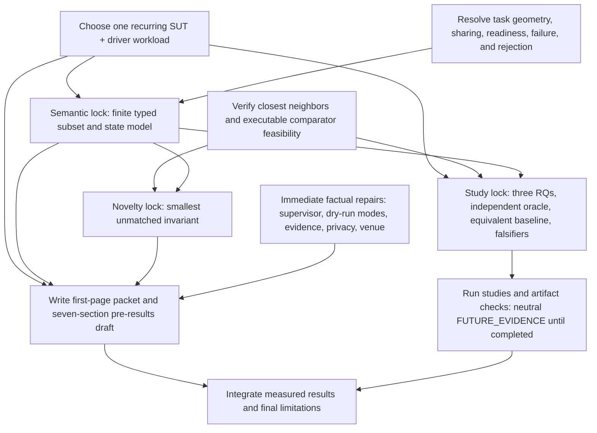

# ICPE 2027 review meta-review

- **Date:** 2026-08-09
- **Scope:** read-only assessment of the manuscript and of the complete review
  package produced in the previous review task
- **Manuscript baseline:** `docs/plans/icpe-2027-meta-draft.md`, SHA-256
  `f1b7dad6cdcf39b6a333b33903705c04e6fc6d6178966d89cf885073b899a904`
- **Review baseline:** `icpe-2027-review-results.md`, SHA-256
  `1365bfcb2c5e087375a41651d57c440c370806631cb952e039b2b0793b3785d5`
- **Improvement-ledger baseline:** `icpe-2027-open-improvement-ledger.md`,
  SHA-256
  `81fc49b81e408750c9a0f58449d8d85aba151ca9737fffc054952c91b6bf5982`
- **Method:** independent persona-fidelity, Slurm/runtime, scientific-writing,
  top-venue-literature, and citation-impact audits, followed by lead synthesis
- **Early-draft rule:** missing measurements, results, plots, and final artifact
  packaging remain neutral `FUTURE_EVIDENCE`

## 1. Disposition

The review package is technically valuable and the proposed research story is
viable. It should not yet be treated as an authoritative, fully auditable
seven-persona synthesis, however. Two technical conclusions require correction,
one material evidence-integrity risk is missing, the published aggregation does
not let a reader reconstruct the persona judgments, and the improvement ledger's
evidence classes, statuses, priorities, dependencies, and document ownership are
not yet internally consistent.

Use separate status labels for separate objects:

| Object | Recommended status | Meaning |
| --- | --- | --- |
| Research idea | **VIABLE** | No present P0 invalidates a paper about a bounded service model compiled to one Slurm allocation and native steps. |
| Current meta-draft | **VIABLE_BUT_NOT_READY_FOR_PROSE** | The story, recurring workload, semantic contract, and closest-neighbor boundary must be frozen before conventional prose expansion. |
| Consolidated review | **MAJOR_REVISION_AS_SYNTHESIS** | Most findings are useful, but the technical corrections, persona audit trail, severity model, and ledger control metadata need repair. |
| Future evaluation | **NEUTRAL_FUTURE_EVIDENCE** | Study designs need freezing; absent measurements and results are not present defects. |

This dual disposition resolves the apparent reviewer disagreement. The
Slurm/runtime audit found no fatal technical blocker and considered
`READY_WITH_TARGETED_REVISIONS` defensible as a statement about the idea. The
persona and writing audits found that the same phrase understates eight P1s,
foundational author decisions, a structural rewrite, and an explicitly failed
full-prose gate. Both observations are true once the idea and the next draft are
reported separately.

## 2. What survives the meta-review

The smallest coherent paper remains:

> For finite readiness-coupled workloads, hpc-compose compiles a bounded service
> model into a generated Slurm batch program executed as one allocation. An
> allocation-resident supervisor coordinates native job steps under explicit
> resource, readiness, failure, and rejection rules; the study tests conformance
> to that contract and coordination cost against semantically equivalent native
> Slurm scripts.

This is a **novelty hypothesis**, not an established novelty claim. The new
literature pass finds prior work for each individual ingredient: declarative
multi-container environments, one-batch-job workflows, readiness-coupled service
tasks, allocation-internal scheduling, generated Slurm scripts, inspectable run
plans, and provenance. The potentially defensible boundary is their narrow,
tested conjunction with a generated Slurm batch artifact whose orchestration is
allocation-resident and no separately deployed daemon or nested scheduler.

Two core contributions are ready to guide the draft:

1. A finite typed application contract with explicit allocation/step resources,
   placement, readiness, failure, sharing, rejection, and escape-hatch limits.
2. Inspectable lowering of that contract to native Slurm steps plus an explicit
   allocation-resident supervisor.

Run identity and evidence should be supporting infrastructure by default. Promote
them to a third research contribution only if a standards comparison and later
fault study reveal scheduler-specific, generalizable insight.

## 3. Severity-ranked findings about the review package

### P0

None. No fabricated result, present safety claim, or known exact prior duplicate
invalidates the paper concept.

### P1-MR01 — Correct the dry-run and preview taxonomy

The original P1-05 combines two different artifacts and consequently rejects too
much.

- `render`, `plan --show-script`, and `explain` use a portable preview path.
- An ordinary Slurm `up --dry-run` with neither `--remote` nor `--local` uses the
  ordinary absolute-runtime-root renderer, writes the script, and only then
  branches before submission
  ([runtime/mod.rs](../../src/commands/runtime/mod.rs)).
- Ordinary `up` passes that rendered file to `sbatch` if the submission path is
  reached.
- Remote dry-run deliberately renders locally while real remote submission
  renders after staging, and local mode embeds a newly generated local job
  identity; neither mode supports the general byte-identity claim.

The manuscript can therefore claim:

> For ordinary Slurm mode with neither `--remote` nor `--local`, under unchanged
> effective input, local context, discovered profile, options, and code,
> `up --dry-run` produces the bytes that the corresponding invocation would pass
> to `sbatch` if it reaches submission.

It cannot generalize that statement to a later remote invocation, successful
preflight or preparation, runtime success, or complete source attribution.
Selected source-to-preview attribution remains incomplete for generated glue.

**Required review repair:** split P1-05 into byte identity for ordinary Slurm
`up --dry-run`, remote and local-mode exceptions, portable-preview identity,
submitted-artifact identity, and selected attribution coverage. Retain a P1 for
attribution coverage, not for the qualified ordinary-Slurm dry-run statement. Add
a fake-`sbatch` regression comparison and resolve the conflicting description in
[`files-and-directories.md`](../src/files-and-directories.md).

### P1-MR02 — Add the missing evidence-bundle integrity defect

The review correctly narrows evidence claims but misses a concrete integrity
failure. When additive evidence initialization and bounded script attestation
succeed, the immutable manifest records a submitted-script digest
([evidence.rs](../../src/job/evidence.rs)). Bundle export later reads the bytes
currently found at the mutable recorded script path
([bundle.rs](../../src/job/bundle.rs)). The default script path can be reused by a
later command. Export may therefore label stale or replaced bytes
`run/submitted.sbatch` without checking them against the manifest digest.

**Impact:** a bundle can contain a script different from the one whose digest was
committed for the run. This is stronger than a prose caveat and belongs in the
review's P1-06, evidence study, and artifact-integrity checks.

**Required review repair:** require a digest match before calling the exported
file submitted bytes; otherwise omit it or label it a bundle-time snapshot.
Prefer archiving submitted bytes under a run- or content-specific path. Add a
regression case in which the shared path is overwritten before export.

### P1-MR03 — Publish the persona audit trail

The review says seven personas independently read the whole draft, but publishes
only the median and range for each dimension. From the published scorecard:

- only 5 of 24 dimensions are unanimous;
- 19 of 24 contain disagreement;
- six span the entire 1--3 range;
- the lead is below the median on 11 dimensions and selects the minimum observed
  score on 15 of the 19 disputed dimensions.

Median and range cannot reveal coalitions, multimodality, confidence, or which
finding was retained, merged, downgraded, or rejected. The two Wave-2 reviewers
also account for a disproportionate share of explicit non-universal P1
attributions. That may be sound adversarial adjudication, but it is not equivalent
to seven independent votes.

**Required review repair:** add the 7-by-24 score matrix, one concise finding list
per persona, and a disposition table with `retained`, `merged`, `downgraded`,
`rejected`, or `unresolved`. Report Wave 1 observations separately from Wave 2
adjudication. Replace the loose heading “consensus strengths” with `unanimous`,
`majority`, `cross-supported`, or `lead-adjudicated` labels.

### P1-MR04 — Make P1-08 internally consistent

Study-protocol quality is simultaneously described as a present P1, neutral
`FUTURE_EVIDENCE`, absent from the prose gate, and present in the experiment gate.
The categories must be separated:

- oracle independence, estimands, baseline equivalence, fault applicability,
  analysis, practical margins, and falsifiers are present `PROPOSED_DESIGN` work;
- measurements, outcomes, plots, and completed artifact exercises are neutral
  `FUTURE_EVIDENCE`.

**Required review repair:** make a study-design lock a prerequisite for data
collection, not for writing the mechanism and related-work sections. Do not say
all eight P1s gate prose if P1-08 does not.

### P1-MR05 — Break the contribution-three circular gate

The review says evidence remains contribution three only if RQ5 yields a
generalizable scheduler-specific result, while the thesis and contribution order
must be frozen before prose. Those conditions cannot both be final at the same
time.

**Required review repair:** classify evidence as supporting material now. Reopen
promotion only after the E05/RQ5 study produces qualifying evidence. A standards
crosswalk and study design can justify running that study, but cannot establish
the research contribution's result in advance.

### P1-MR06 — Normalize ledger semantics and ownership

The finished ledger contains 31 overview items and a detailed entry for each one.
Its completeness is strong, but its control metadata still conflicts:

- E01--E07 are primarily protocol or artifact designs and should be
  `PROPOSED_DESIGN`; only their execution and outcomes are `FUTURE_EVIDENCE`.
- optional I04 appears in mandatory critical-path Phase A; split mandatory
  documentation of the current namespace boundary from optional product redesign.
- M05's overview dependency on L05 should be marked soft, matching the item text.
- M01, M03, and E01 are marked `blocked` although meaningful design work can
  begin; distinguish “work open, verification blocked” from an actual inability
  to proceed.
- P2 is a severity while `before prose`, `before experiments`, and
  `before submission` are gates; do not let the P2 definition imply a different
  timing rule.
- E07 should depend on protocols for retained claims, not unconditionally on all
  E01--E06 work after optional RQs are demoted.
- the review retains a full dated queue while the ledger calls itself the live
  source of truth. Mark the review queue as a snapshot and make the ledger own
  current status, next action, dependencies, acceptance, and closure evidence.

**Erratum (2026-08-09):** the reported duplicate
`Literature-to-ledger traceability` heading was caused by overlapping inspection
output; the baseline ledger contains one such heading. No heading removal is
needed. Add a mechanical overview-versus-heading ID check to preserve the
now-complete inventory.

### P1-MR07 — Tighten the resource-contract resolution

The original P1-01 is valid but too permissive. A service placed on fewer nodes
can inherit allocation-wide task geometry, and every step can receive
`--exact --overlap`. Predictable infeasibility in the paper-core language should
not be described as safely “delegated to Slurm.” Accepted core cases should
reject contradictory geometry, recompute it under a published rule, or require
an explicit feasible service geometry. CPU, memory, and GRES sharing also require
an aggregate contract and real-Slurm checks.

The escape-hatch wording should say that raw arguments are outside the typed
**semantic guarantee**, not outside all validation: they still receive structural
and collision checks.

### P2-MR01 — Reorder the work around discriminating decisions

The original queue is unnecessarily serial and begins rewriting the thesis before
the recurring workload and closest-neighbor invariant are fixed. Workload choice,
direct-comparator feasibility, and site availability constrain the useful paper
contract and should start first or in parallel. Preview, supervisor, evidence,
privacy, and venue wording can be corrected immediately.

### P2-MR02 — Keep meta-draft genre and privacy severity proportionate

The source explicitly identifies itself as a list-heavy, pre-experimental
meta-draft. Redundancy and presentation are real expansion risks, but they should
not be interpreted as defects in finished prose. Likewise, the draft already
warns that scripts and local state may contain secrets. A surface/export table is
valuable; future secret-canary exercises remain artifact design rather than a
present manuscript failure.

### P2-MR03 — Correct smaller evidence wording

The schema permits unavailable identities, but current producers ordinarily omit
entries when provenance is absent; emitted entries receive an available identity.
Current output may still contain mutable image references or unsupported,
missing, or unhashed content. Also qualify evidence preservation with “when
additive initialization succeeds,” because initialization is best effort after
the legacy job-state commit.

### P2-MR04 — Name the inspectable artifact, not an “inspectable job”

The original replacement thesis calls the result “one inspectable Slurm job,”
although the review elsewhere requires every inspectability claim to name the
artifact and coverage. Prefer “one Slurm allocation produced by an inspectable
generated batch artifact.” The allocation and running job are observable; the
generated batch program and selected preview regions are what the compiler makes
inspectable. Storage-locus item I07 is a useful addition for this distinction and
should gate relevant experiments, not all mechanism prose.

## 4. Persona feedback retained in the revised decision model

| Persona | Distinct feedback that must survive | Concrete response |
| --- | --- | --- |
| ICPE performance methods | Direct neighbors, independent oracle, equivalent native baseline, phase-separated cost, practical margins | Reduce to three core RQs and freeze controls before collection. |
| Slurm/HPC runtime architect | Partial-placement geometry, resource sharing, generated supervisor, observer/network/storage loci | Make these explicit in the semantic table, state model, and architecture figure; test on versioned real Slurm. |
| Compiler/language-design reviewer | Typed subset, intermediate representations, rejection layers, deterministic domain, attribution coverage | Make the semantic mapping and negative boundary contribution one; distinguish preview, dry-run, submitted bytes, and mapping. |
| Reproducibility/provenance reviewer | Trust levels, namespaces, degradation, standards overlap, privacy/export | Default evidence to supporting infrastructure; add a field-level standards and trust crosswalk. |
| Practitioner/software-engineering reader | One recurring workload, a two-sentence Slurm primer, fit/no-fit guidance, actionable diagnostics | Lead with one SUT-plus-driver story and teach allocation versus step before formal semantics. |
| Novelty skeptic | No feature-combination novelty; compare the strongest neighbor charitably | Write the closest-neighbor matrix before the novelty sentence and call the result a hypothesis until evaluated. |
| Reliability/privacy meta-reviewer | Failure applicability, ID reuse, bundle integrity, secret-bearing surfaces | Add explicit fault and export boundaries; include the newly found script-digest mismatch case. |

## 5. Factual corrections versus author decisions

The prior review mixes evidence-resolved corrections with choices that require an
author decision. Keeping them separate will make revision faster.

| Evidence-resolved correction | Genuine author decision |
| --- | --- |
| Name the generated allocation-resident supervisor. | Choose the recurring workload and stakeholder. |
| Qualify “no control plane” as no separately deployed daemon or nested scheduler. | Reject, recompute, or require explicit partial-placement task geometry. |
| Preserve the qualified ordinary non-remote/non-local Slurm `up --dry-run` byte claim. | Define concurrent CPU, memory, and GRES sharing. |
| Limit annotations to selected source-to-preview regions. | Decide whether evidence earns contribution status. |
| Add the mutable-script bundle integrity risk. | Choose the smallest unmatched novelty invariant and comparator set. |
| Update venue wording and keep detailed 2026 rules provisional. | Choose backend/site scope and narrow claims if cells are unavailable. |
| Distinguish immutable records from mutable, missing, or unhashed referents. | Choose evaluation breadth after the story and semantic locks. |

## 6. Revised dependency graph

This graph deliberately permits implementation work and literature work in
parallel. An unresolved product behavior need not block all prose if it is
excluded from the paper-core contract and disclosed as a limitation.

## 7. Recommended manuscript and evaluation shape

### Seven-section manuscript

1. **Introduction and running workload.** SUT plus driver/load generator,
   stakeholder, performance consequence, thesis, and two core contributions.
2. **Problem and scope.** Allocation-versus-step primer, fit/no-fit boundary, and
   strongest alternatives.
3. **Application semantics.** Typed subset, resources, placement, readiness,
   failure, sharing, rejection, and escape hatches.
4. **Compiler and generated supervisor.** Stages, native-step lowering, controller
   loci, preview/dry-run/submitted artifacts, and selected attribution.
5. **Evaluation design and results.** Keep results empty until measured; include
   the frozen design meanwhile.
6. **Related work.** Direct translators and service runtimes first, then pilots,
   workflows, runtime substrates, and provenance.
7. **Limitations and conclusion.** Unsupported topology, controller, site/backend,
   evidence, identity, privacy, and external-validity boundaries.

Keep full schemas, command inventories, setup recipes, extended matrices, and
artifact-review instructions outside the main paper. Place evidence inside
sections 4 and 7 unless later results justify a standalone contribution.

### Three core research questions

| RQ | Claim under test | Minimum control | Falsifier |
| --- | --- | --- | --- |
| RQ1: semantic conformance | The frozen typed subset lowers to the declared allocation/step, resource, readiness, failure, and rejection semantics. | Implementation-independent contract, positive/negative corpus, expert native scripts, real Slurm where needed | Any accepted core case violates a predicate or unsupported typed intent survives silently. |
| RQ2: cost of abstraction | The compiler and generated supervisor add acceptable phase-specific cost versus semantically equivalent native Slurm. | Resource- and lifecycle-equivalent native script; queue time separated; predeclared practical margins | Equivalence fails or the relevant upper uncertainty bound exceeds its margin. |
| RQ3: useful boundary and generalizability | The bounded model covers declared workload patterns and rejects non-fit cases clearly across the claimed sites/backends. | Public coded corpus plus independently authored cases and explicit backend/site cells | Representative target cases require undocumented semantics, or unsupported cases are accepted misleadingly. |

Portability is a stratification of these questions. Evidence recovery remains an
optional RQ only if retained as a contribution. Progressive assurance and service
attribution should not become separate paper spines without discriminating data.

## 8. Acceptance gates for the next review

### Gate A — review-package repair

- [ ] P1-05 distinguishes portable preview, ordinary non-remote/non-local Slurm
      `up --dry-run`, remote/local exceptions, submitted bytes, and selected
      attribution.
- [ ] The mutable-script bundle integrity case is added.
- [ ] The 7-by-24 score matrix and persona finding-disposition ledger exist.
- [ ] P1-08 separates proposed study design from future measurements.
- [ ] Ledger evidence classes, statuses, gates, optional dependencies, and live
      document ownership are internally consistent.

### Gate B — story inputs and comparator feasibility

- [ ] One recurring workload is used from motivation through evaluation.
- [ ] Two core contributions are fixed and evidence defaults to supporting
      infrastructure pending a qualifying E05 result.
- [ ] Strongest-neighbor and executable-comparator feasibility checks are
      complete enough to constrain the semantic contract.

### Gate C — semantic lock

- [ ] Partial-placement task geometry and aggregate resource sharing are explicit.
- [ ] The supervisor/readiness/failure state model and controller loci are named.
- [ ] The paper-core subset, rejection layers, and escape-hatch boundary are finite.
- [ ] Core cases have positive, negative, and real-Slurm checks where applicable.

### Gate D — novelty lock and coherent pre-results draft

- [ ] Each thesis phrase has a strongest-neighbor comparison.
- [ ] The novelty sentence is the smallest unmatched, testable invariant after
      the semantic lock.
- [ ] The first page contains the workload, thesis, two contributions, and study
      promise.
- [ ] The seven sections have unique argumentative jobs.
- [ ] Artifact, evidence, and privacy terms are bounded consistently.
- [ ] No unmeasured result is written as fact.

### Gate E — study execution

- [ ] RQ1 has an independent oracle.
- [ ] RQ2 has semantic equivalence, phase estimands, repetitions, uncertainty,
      and practical margins.
- [ ] RQ3 has a declared corpus, coding procedure, backend/site cells, and a
      narrowing rule.
- [ ] Any exported `run/submitted.sbatch` is digest-verified against the run
      manifest, or is omitted/explicitly labeled an unsafe bundle-time snapshot;
      overwrite-before-export is a regression case.
- [ ] Exact versions, inputs, native scripts, comparator environments, expected
      outputs, omissions, and privacy checks are pinned.

## 9. Final meta-review judgment

The original review should be retained, not discarded. Its strongest contribution
is the recovery of a credible paper spine from a broad tool inventory. Its main
weakness is that it presents an adversarial lead synthesis as if it were a fully
auditable seven-persona consensus and then translates that synthesis into an
overly serial ledger whose otherwise thorough entries use inconsistent status,
evidence-class, dependency, and ownership rules.

After the corrections above, the review becomes a strong revision instrument.
Until then, use it as a technically informed hypothesis and decision register,
not as the final authority on persona agreement or manuscript readiness.
