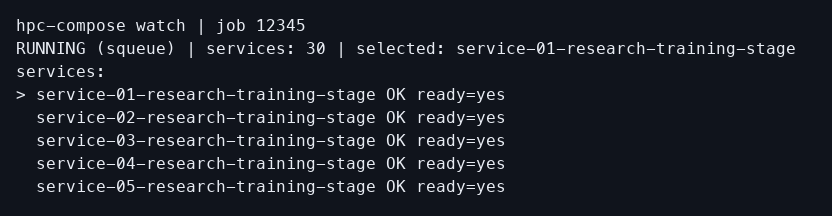
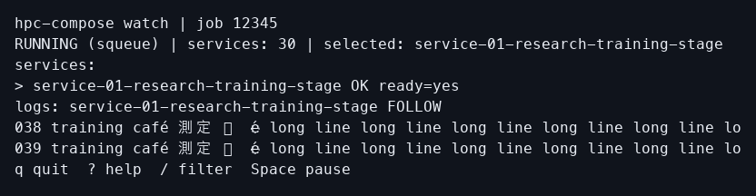
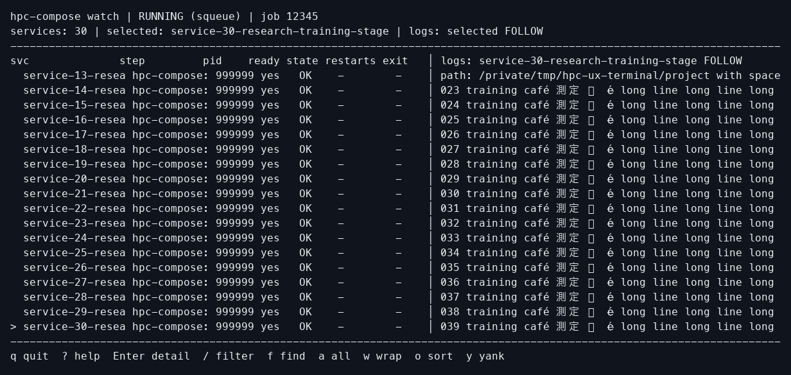
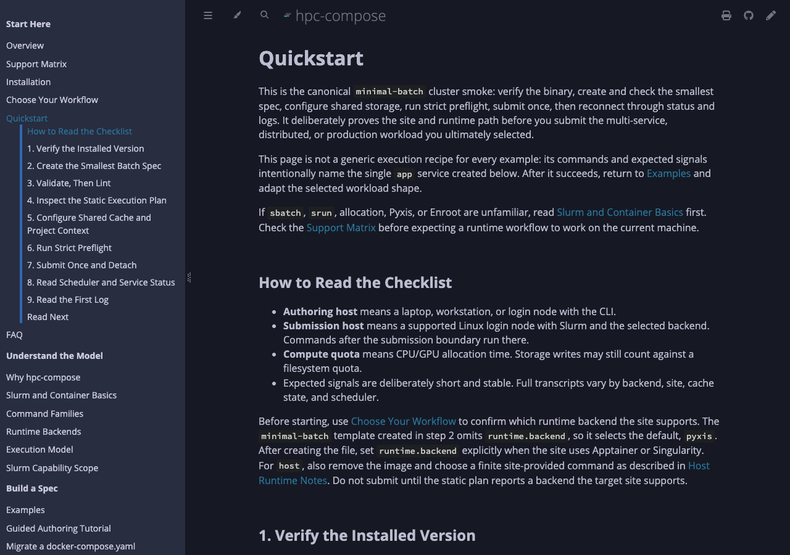
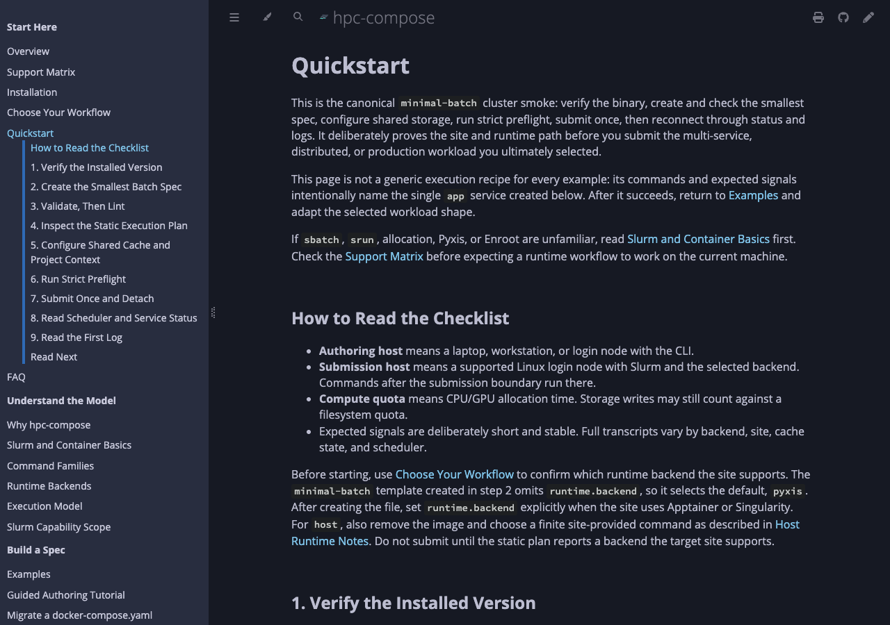

# Terminal and YAML UX review

Review date: 2026-09-04. Baseline: `main`, `02caf87fd3a4` (`0.2.4`).

## Outcome and evidence boundaries

The ordinary authoring pipeline works: example selection, file creation,
validation, planning, normalized inspection, script explanation, and submission
preview all completed locally. The most consequential defects were in recovery
and authoring feedback: suggested commands lost their selected context, crowded
watch views hid selection and controls, editor messages discarded the actual
error, and variable/schema views disagreed with effective configuration.

Focused fixes are implemented below. Accepted YAML meanings, compatibility
aliases, JSON payload structures, redaction, exit-code categories, and scheduler
operations are retained. The effective-config schema is corrected to accept
fields the serializer already omits. No commands or configuration mechanisms
were added.

This is an analytical walkthrough, not participant research. The five user
perspectives below organize evidence; there are no measured completion rates,
satisfaction scores, or claims about actual users.

Work used temporary projects, independent tracked records, fake scheduler and
runtime tools, explicit offline authoring, and PTYs. Fake scenarios used deny
stubs or explicit fake executables so they could not fall through to a real
cluster. The test harness uses disposable state and fake tools. No real SSH,
Slurm allocation, container import, publication, commit, or user-data removal
was performed. The three pre-existing untracked ICPE planning documents were
preserved. This report's path did not exist before the review.

## Surface inventory and execution boundaries

| Surface | Intended purpose | Main owners |
| --- | --- | --- |
| `new`/`init`, examples, `evolve` | Select and scaffold a supported workload | CLI/help, init, examples, evolve |
| `setup`, `context`, settings/profile/resource profiles | Resolve authoring/submission context and show sources | context, commands/init, commands/spec |
| `validate`, `lint`, schema, LSP | Catch illegal shapes/semantics and risky valid choices | spec, lint, schema, authoring diagnostics, LSP |
| `config`, `plan`, `inspect`, `render`, `explain` | Inspect effective values, derived execution, and script provenance | commands/load, planner, runtime_plan, commands/spec, output |
| `preflight`, doctor, weather | Check host/site prerequisites and advisory scheduler conditions | preflight, doctor, cluster, weather |
| `up`, when, alloc/run/shell/notebook, test/dev | Prepare and execute within the supported allocation/local model | commands/runtime, prepare, render, job tracking |
| status/ps/watch/replay/logs/debug/stats/score | Observe execution, uncertainty, failures, and available telemetry | job, output, watch_ui, runtime/debug |
| artifacts/pull/checkpoints/experiment/diff/sweeps | Retrieve and compare tracked evidence and workflows | job artifacts/evidence, runtime families |
| cancel/down/clean/cache/workspace/rendezvous | Manage job/resource/state lifetime | lifecycle, cache, workspace, rendezvous |
| docs, manpages, completions, feedback | Discover commands and integrate with local authoring tools | help, manpages, docs search, completion values |

The one-allocation model is central: allocation resources reserve capacity for
one batch job; service steps describe execution inside it. Dependencies order
or gate those steps, and readiness is a distinct predicate from “process
started.” This distinction is already supported by explicit plan geometry,
resource validation, and the execution-model reference.

Safety was checked at the actual handlers. Ordinary offline authoring commands
read/normalize local inputs. `lint --fix` and scaffolding write files and were
not treated as read-only. `render` prints a script unless `--output` is supplied;
`render --format json` includes the preview in JSON. `up --dry-run` writes its
script but returns before prepare, provenance/cache staging, tracking, or
submission. `--offline preflight` rejects probing; plain preflight can run local
prerequisite/scheduler queries and active `--fs-probes` can submit work. Those
active paths were not run against a real environment. Rendered scripts were
inspected and shellchecked, never submitted by the audit.

## Severity-ranked findings and implemented fixes

P2 means a demonstrated obstacle to completing or correctly interpreting a
normal task. P3 means a narrower defect or documentation/discovery gap. No
confirmed P0/P1 issue was identified. Ranking considers exposure, consequence,
recovery, and compatibility; it is not a numerical usability score.

| Priority | Finding | Kind | Result |
| --- | --- | --- | --- |
| P2 | Follow-up commands lose the selected spec, profile, settings, or job | Defect | Context retained and shell quoted |
| P2 | Crowded watch/replay views hide selection, logs, or controls | Defect | Selection viewport and reserved compact rows |
| P2 | Unknown scheduler state is described as an active job | Defect | Uncertainty stated explicitly; executable next command |
| P2 | Common YAML type mistakes expose internal enum names | Demonstrated authoring friction | Field/type/correction diagnostics |
| P2 | Editor diagnostics omit the failure cause and visible recovery | Defect | Full causal message and visible help |
| P2 | Inherited interpolation variables disappear from source views | Defect | References follow effective inheritance |
| P2 | Minimal config JSON fails its own published schema | Defect | Empty `x-env` correctly optional |
| P2 | Printed artifact-copy operands break on spaces/apostrophes | Defect | Shell argument boundaries preserved |
| P2 | Documentation themes have low-contrast links and example text | Accessibility defect | Scoped color corrections |
| P3 | Line watch omits pending reason changes | Demonstrated diagnostic friction | Changed queue details emitted once |
| P3 | LSP ranges count Unicode characters instead of UTF-16 units | Protocol defect | UTF-16 ranges |
| P3 | Help/reference explanations leave avoidable ambiguity | Documentation/discovery gap | Command guide and specific corrections |
| P3 | Status table and following log label share a line | Presentation defect | Table terminated with a newline |

### P2: Follow-up commands must preserve the selected context

Affected tasks: continuing after validation; diagnosing an older run; exporting
or stopping that selected run. Confidence: high, including execution of the
printed read-only commands.

Authoring reproduction, using files in a temporary directory:

```toml
# custom settings.toml
[profiles.research.env]
IMAGE = "alpine:3.20"
```

```yaml
# study.yaml
services:
  app:
    image: ${IMAGE}
    command: [echo, hello]
```

```bash
hpc-compose --offline --settings-file 'custom settings.toml' \
  --profile research validate -f study.yaml
```

Before, `Next:` supplied `hpc-compose plan -f '.../study.yaml'`. Following it
failed with `missing variable 'IMAGE'`: the just-validated profile had been
discarded. `plan --explain` had the same problem.

After, the hint includes `--settings-file '.../custom settings.toml' --profile
'research'`. Executing it from outside the project succeeds. The regression
also uses spaces and an apostrophe in the directory, and a profile containing a
space. Values from the environment or secrets are not copied into the hint.

Recovery reproduction: create tracked jobs `12345` and `12346`, make `12346`
latest, and give their logs the distinct lines `OLDER selected run` and `NEWER
latest run`. With fake scheduler tools:

```bash
hpc-compose status -f 'study with spaces/experiment.yaml' --job-id 12345 \
  --squeue-bin ./fake-squeue --sacct-bin ./fake-sacct
```

Before, `logs --follow` and `down` had neither the selected file nor job ID.
Executing the suggested logs command read `NEWER latest run`. The corrected
logs command reads `OLDER selected run`. The `down` hint now also carries the
selected job; it was inspected but never executed. The existing confirmation
policy is unchanged: an explicit job ID skips the prompt unless cache purge is
also requested. The corrected hint therefore expresses that explicit target.
Artifact/pull hints are emitted only when the
tracked run has an export directory, avoiding a demonstrated dead end.

Owners: [output context/hint builders](/Users/nicolas/hpc-compose/src/output/mod.rs:217),
[static command handlers](/Users/nicolas/hpc-compose/src/commands/spec.rs:107),
[status handler](/Users/nicolas/hpc-compose/src/commands/runtime/inspect.rs:78), and
[debug guidance](/Users/nicolas/hpc-compose/src/commands/runtime/debug.rs:370).

Regression commands:

```bash
cargo test --locked --test cli_authoring authoring_next_commands_preserve_explicit_settings_and_profile
cargo test --locked --test cli_runtime recovery_hints_preserve_selected_job_and_quoted_context -- --exact
```

Limit: suggestions preserve durable file/profile/settings/job/service
selection where applicable; they do not serialize the caller's entire process
environment or copy transient binary overrides into every command.

### P2: Watch/replay must keep the selected service and controls visible

Affected: a returning user inspecting many services in a short or narrow
terminal. Confidence: high, from rendered PTY screens and keyboard navigation.

Fixture: 30 named services, long paths and log lines, deterministic tracked
state, and fake `squeue` reporting `RUNNING`. Run `watch --hold-on-exit always`,
then press `G`. The same renderer is used for replay.

Before at 80×8, service rows consumed the entire display: no logs or quit/help
guidance remained. At 40×24 and 80×24, a long service list likewise hid the
footer. At 120×24, the split view switched its log pane to service 30 but kept
the table on services 1–18, so the selected row was invisible. At 160×50 the
fixture already fit and worked.

After, the table viewport follows selection in both layouts. Compact rendering
reserves a log heading, log content, and keyboard controls before budgeting
service rows. This uses the existing renderer and key bindings.

Owners: [compact rendering](/Users/nicolas/hpc-compose/src/watch_ui.rs:2172) and
[service viewport](/Users/nicolas/hpc-compose/src/watch_ui.rs:2403).

```bash
cargo test --locked --lib render_watch_frame_keeps_selected_service_and_logs_visible_with_many_services
cargo test --locked --lib compact_watch_keeps_recovery_controls_when_status_details_fill_the_header
```

PTY acceptance covers the requested 80×24, 40×24, 80×8, 160×50, plus 120×24
split mode, last-service navigation, replay controls, and resizing. Help,
search, wrap, detail panels, and mouse behavior received source/test inspection;
not every interaction combination was exercised in the PTY. Screen captures are reconstructed from the terminal emulator's
rendered cell grid, not assessed merely by ANSI presence or process exit.
The raster font has incomplete CJK/emoji glyph coverage; cell width and
selection evidence are separate from that font limitation.

Quitting with `q` or the Ctrl-C key left the fake job intact. Signal and normal
exit checks inspected terminal attributes, alternate-screen state, and cursor
visibility. No cancellation call occurred. A fatal refresh error was also reproduced after the TUI was visibly running:
corrupting only its temporary tracked record made the worker return a parse
error and exit 1. The alternate screen, cursor, and terminal attributes were
restored; the original record bytes were then restored. Panic restoration
remains source/test inspection only. macOS's transient `PENDIN` input flag was
excluded from termios equality; canonical/echo and all other fields matched. Local `dev` supervisor lifetime is
a separate command policy; this finding does not change it.

### Rendered terminal before/after

80×8 with 30 services, before (log and controls absent):



After (selected service, log content, and controls retained):



120×24 after pressing `G`, before (table selection offscreen):


After (service 30 visible and selected):



The before and after rasterizers used different CJK fallback coverage. The
repaired behavior is row allocation and selection visibility; the screenshots
do not establish a product glyph-rendering change.

### P2: Unknown scheduler state must remain unknown

Affected: users investigating unavailable accounting or scheduler tools.
Confidence: high, using missing-tool and deterministic scheduler-state fixtures.

```bash
hpc-compose debug -f experiment.yaml --job-id 12345 --format json \
  --squeue-bin ./missing-squeue --sacct-bin ./missing-sacct
```

Before, the scheduler was unknown while the recommendation said the job was
“still active.” Pending/running/completed reports also stored prose in
`summary.next_command`, despite its name. Failed-run advice lost job selection
and failed to quote paths.

After, unavailable state explicitly allows queued, running, or finished and
suggests a contextual `status` retry. `summary.next_command` is an executable
command for each tested state. Failed jobs suggest preflight once; after a
preflight-inclusive debug, they suggest logs instead of another identical
debug loop. Completed jobs without configured export suggest logs rather than
an artifact command that cannot work. Service selection is retained.

Owner: [debug guidance](/Users/nicolas/hpc-compose/src/commands/runtime/debug.rs:370).
Regression: `cargo test --locked --test cli_runtime
debug_guidance_distinguishes_unavailable_and_terminal_runs -- --exact`.
Scheduler probing, state reconciliation, JSON fields, and process exit
categories are unchanged. A nonzero scheduler tool that provides only generic
failure text may still produce less detail than a spawn or timeout failure.

### P2: YAML diagnostics should name the author's mistake

Affected: first-job researchers and Compose users authoring values. Confidence:
high; invalid fixtures and the suggested corrected files were executed.

```yaml
# Before: invalid scalar types
services:
  app:
    image: alpine:3.20
    command: [echo, 123]
    environment:
      ENABLED: true
```

Before, validation reported an untagged `CommandSpec` or `EnvironmentSpec`
decoding failure. A field was sometimes available, but the enum name did not
explain the required edit.

```yaml
# After: same intended argument/environment values, explicitly strings
services:
  app:
    image: alpine:3.20
    command: [echo, "123"]
    environment:
      ENABLED: "true"
```

`hpc-compose --offline validate -f invalid.yaml` now identifies the offending
argument or environment key, expected string, actual scalar type, and a
quoting correction. `env_file` gets path/string guidance. These friendly
diagnostics run only after authoritative deserialization fails; valid null,
tagged-string, shell, and argument-list forms retain their behavior. Matching
is scoped to the actual fields, so `secrets.NAME.env` is not confused with a
service environment mapping. Values themselves are not echoed by the new
type guidance.

Missing `${IMAGE}` previously reported only the variable name. The corrected
diagnostic retains that cause and adds file/service/field context where modeled,
plus ways to supply a process or compose-adjacent `.env` value, use an intentional
default, or escape a literal dollar. The exact suggestions were followed with
quoted values, a default, and a literal-dollar fixture. No new interpolation
syntax or environment pass-through form was introduced.

Owners: [failure-only type adaptation](/Users/nicolas/hpc-compose/src/spec/validation.rs:646),
[parser context](/Users/nicolas/hpc-compose/src/spec/parse.rs:82),
[interpolation loading](/Users/nicolas/hpc-compose/src/spec/load.rs:178), and
[diagnostic definitions](/Users/nicolas/hpc-compose/src/spec_error.rs:27).

```bash
cargo test --locked --lib invalid_authoring_values_identify_the_key_or_argument_and_valid_correction
cargo test --locked --lib descriptive_type_errors_preserve_valid_null_tagged_and_command_forms
cargo test --locked --lib missing_variables_name_file_service_and_environment_key_without_echoing_values
cargo test --locked --lib unrelated_env_fields_keep_their_actual_string_or_mapping_contracts
```

Limit: not every semantic error has an exact source span, particularly after
inheritance. The report does not claim universal file/line provenance.

### P2/P3: Editor messages and ranges must support correction

Affected: editor and agent authoring loops. Confidence: high for actual stdio
messages, with no claim of native-editor visual acceptance.

Open this unsaved buffer through `hpc-compose lsp`:

```yaml
services:
  app: [
```

Before, `Diagnostic.message` contained only `failed to parse YAML at PATH`.
The CLI's useful cause, `did not find expected node content at line 3 column
1`, was discarded. `cpus_per_task: many` similarly lost the expected type.
Unsupported `ports` recovery existed only in `Diagnostic.data.recommendation`.

After, messages preserve the causal explanation, deduplicate transparent
wrappers, and include available `Help:`. Structured code, field, recommendation,
and severity remain available. An actual `didChange` to valid YAML clears
diagnostics; shutdown completes without unsolicited protocol output.

Separately, `ports: [] # 🧪` at indentation four produced end character 17;
UTF-16 requires 18. Indexed and fallback ranges now use UTF-16. The primary
[LSP Position specification](https://raw.githubusercontent.com/microsoft/language-server-protocol/gh-pages/_specifications/lsp/3.17/types/position.md)
defines that default; the
[Diagnostic specification](https://raw.githubusercontent.com/microsoft/language-server-protocol/gh-pages/_specifications/lsp/3.17/types/diagnostic.md)
distinguishes visible messages from arbitrary `data`. Both were consulted for
these narrow recommendations.

Owners: [authoring messages](/Users/nicolas/hpc-compose/src/authoring_diagnostics.rs:372) and
[LSP adapter](/Users/nicolas/hpc-compose/src/lsp.rs:267). Reproduction/regression:

```bash
cargo test --locked --test cli_authoring cli_lsp::lsp_stdio_publishes_diagnostics_for_did_open -- --exact
```

### P2: Effective variables must include inherited authoring inputs

Affected: diagnosing changes in a shared base spec. Confidence: high.

```yaml
# base.yaml
services:
  app:
    image: alpine:3.20
    environment:
      VALUE: ${HPC_UX_INHERITED}
```

```yaml
# compose.yaml
extends: base.yaml
```

```bash
HPC_UX_INHERITED=from-process hpc-compose --offline config --format json
HPC_UX_INHERITED=from-process hpc-compose --offline config --variables --format json
```

Before, effective config contained `VALUE: from-process`, while variables and
sources were `{}`. `context` also omitted the input. The reference query read
only the leaf file.

After, reference collection follows the existing resolved inheritance model,
including external service templates and child overrides. Overridden-away
variables are excluded. Literal shell-form commands, entrypoints, and scripts
must not be interpreted as author-host interpolation. A review regression
covers inherited `echo ${NAME:=fallback}` and runtime `$HOME` alongside real
exec-form/field interpolation. Source precedence and redaction are retained.

Owner: [reference collection](/Users/nicolas/hpc-compose/src/spec/interpolate.rs:88).
Regression: `cargo test --locked --lib
referenced_variables_follow_effective_inheritance_and_leaf_overrides`.

### P2: Emitted config must satisfy its published schema

Affected: scripts and agents validating output contracts. Confidence: high;
actual emitted JSON was checked with a Draft 2020-12 validator.

For `services: {app: {image: 'alpine:3.20'}}`:

```bash
hpc-compose --offline config -f compose.yaml --format json > config.json
hpc-compose schema --output spec-config > config.schema.json
```

Before, schema validation reported `'x-env' is a required property` twice: at
the root and service. Empty software environments are intentionally omitted
by serialization, but the schema required them.

After, the two schema-only field annotations make these properties optional.
The payload bytes and schema version do not change; no parser acceptance is
relaxed. Only the two incorrect `required` entries in `spec-config.schema.json`
were removed. Config, inspect, plan, and context output all passed sampled
live schema and synthetic-secret redaction checks.

Owners: [effective root field](/Users/nicolas/hpc-compose/src/spec/mod.rs:1583),
[effective service field](/Users/nicolas/hpc-compose/src/spec/mod.rs:1795), and
[focused contract test](/Users/nicolas/hpc-compose/src/output/contract.rs:479).

```bash
cargo test --locked --lib effective_config_schema_accepts_omitted_empty_software_environments
```

### P2: Printed copy commands must preserve path arguments

Affected: retrieving artifacts into ordinary paths containing spaces or an
apostrophe. Confidence: high for local shell argument construction.

`pull -f experiment.yaml --job-id 12345 --into "researcher's results"` only
prints a copy command. Before, its source and destination were interpolated
unquoted into that command. The shell split paths into separate arguments;
the `<login-node>` placeholder could also be read as redirection.

After, each operand uses the existing shell-quoting helper and follows an
explicit `--` delimiter, so a destination beginning with a dash stays a path. A shell argv-capture
test verifies exact source/destination bytes without invoking rsync or SSH.
The command remains a preview. Owner:
[pull command construction](/Users/nicolas/hpc-compose/src/commands/runtime/pull.rs:27).

Regression: `cargo test --locked --lib
pull_rsync_command_preserves_shell_argument_boundaries`.
The official [rsync manual](https://download.samba.org/pub/rsync/rsync.1),
including `--old-args` and `--secluded-args`, explains modern remote argument
protection. Older rsync or an explicit old-arguments environment can need
additional remote-shell handling; no real transfer or cross-version remote
rsync interoperability was tested.

### P2: Documentation themes must keep links and example text readable

Affected: readers using the supported Navy, Coal, Rust, or Ayu themes, including authors
copying YAML and shell examples. Confidence: high for measured/rendered
contrast; this is not a general WCAG conformance claim.

The unchanged theme failed the repository's accessibility gate on 46 of 47
pages when Chrome inherited macOS's dark preference and selected Navy. All
2,587 reported instances concerned contrast, including repeated content across
pages. Quickstart alone reported 19 instances: ordinary links measured 3.64:1
and highlighted shell variables 4.46:1. The
[W3C contrast-minimum guidance](https://www.w3.org/WAI/WCAG22/Understanding/contrast-minimum.html)
requires at least 4.5:1 for ordinary text; a value below that threshold must
not be rounded up. This current primary guidance was consulted for the fix.

Reproduce with the existing repository gate and a working local Chrome:

```bash
PUPPETEER_EXECUTABLE_PATH='/Applications/Google Chrome.app/Contents/MacOS/Google Chrome' \
  just docs-check
```

On another platform, select Navy through the documentation theme menu to
reproduce that mode. The system-selected theme matters: a light-only check
does not test this failure.

The source colors came from mdBook defaults. The focused correction uses the
existing [custom stylesheet](/Users/nicolas/hpc-compose/docs/theme/custom.css:7):
Navy/Coal link and active-navigation tokens change from `#2b79a2` to `#80c4ea`,
and the inherited red syntax-token group changes from `#cc6666` to `#d47777`.
Navy link-on-page contrast becomes 9.19:1, and red-on-code becomes 5.28:1.
No layout, theme choices, syntax categories, or validator rules change.
Explicit theme checks also demonstrated low contrast for Coal's title and table
headers, Rust's links, and Ayu's code comments. A few overrides in the same
stylesheet correct those tokens; the Light theme is untouched. All 47 pages
pass the final gate in Navy; representative explicit-theme checks and remaining
limits are recorded in the final verification.

| Additional measured surface | Before contrast | After contrast |
| --- | --- | --- |
| Coal links | 3.80:1 | 9.60:1 |
| Coal menu title | 1.98:1 | 6.40:1 |
| Coal table headers | 3.57:1 | 4.72:1 |
| Rust links | 3.67:1 | 9.08:1 |
| Ayu code comments | 2.88:1 | 5.69:1 |

For focused reproduction, build the docs, select the named theme, and open
`quickstart.html`, `index.html`, and `example-source.html`. The existing Pa11y
checks passed all 15 combinations across Navy, Coal, Rust, Ayu, and Light on
the final actual build. Desktop 1280×900 and fresh-load 390×844 captures were
made for all five themes. Sampled renders retained readable paragraphs; at
390 pixels, Navy's document width was 390 and the sidebar was hidden. A narrow
keyboard sample verified visible theme-button focus and Enter opening the
theme menu. This does not establish every resize state or a complete keyboard
or screen-reader workflow.

Matched 1280×900 Chrome captures, before:



After:



### P3: Line mode should explain scheduler waiting

Affected: users monitoring queue delays through redirected or accessible line
output. Confidence: high for the deterministic fake-scheduler cases.

For deterministic `PENDING|Resources|N/A`, followed by a different pending
reason and then `RUNNING`/`COMPLETED`, `watch --watch-mode line` previously
printed state transitions but dropped the already-fetched queue details.
Now pending reason, eligible time, and estimated start are printed when they
change, without repeating identical rows. A pending reason is evidence about
scheduler waiting, not a claim that an application stalled.

Owner: [line watch](/Users/nicolas/hpc-compose/src/job/logs.rs:187).
Regression: `cargo test --locked --test cli_runtime
watch_line_mode_reports_changed_queue_reasons_without_repeating_them -- --exact`.
Completed/failed/unavailable scenarios retain their tested exit behavior and
produce no alternate-screen sequences under `TERM=dumb` and `NO_COLOR`.

### P3: Clarify existing commands and authoring rules

Affected: discovering an authoring command or reconciling Compose expectations.
The wording gaps are demonstrated, and reference contradictions are confirmed;
whether the new guide reduces lookup time remains a design hypothesis.

The top help listed 53 commands in workflow groups but did not explain the
adjacent authoring commands. The existing command-family documentation does
this well; the help now provides a compact question-to-command guide.
`config --help` includes `--variables` and distinguishes `context`.
`plan --help` distinguishes operational `plan --explain` from the script
provenance `explain` command. No command was renamed or removed.

Two reference statements were demonstrably wrong: unset image variables were
said to expand to empty strings (validation rejects them), and config/inspect
JSON were described as the same effective-spec shape (`inspect` actually uses
`ordered_services` and `slurm`). Both are corrected. New YAML examples show
quoted scalar values, shell-versus-authoring interpolation, and the existing
append behavior of command lists under `extends`. They explain existing
meanings rather than changing the language.

Owners: [help guide](/Users/nicolas/hpc-compose/src/cli/help.rs:107),
[command families](../src/command-families.md),
[spec reference](../src/spec-reference.md), and
[JSON stability](../src/json-output-stability.md).
Generated manpages are refreshed through their existing generator. The docs
link gate also found a 404 at the site's old HoreKa 2 migration URL. The official
[replacement migration page](https://docs.nhr.kit.edu/get-started/migration/)
was verified, its source URL in `docs/site-guides/sites/haicore.json` corrected,
and the generated guide refreshed. Site operational facts were not re-audited
or silently updated. The source-host assertion now accepts that exact official
documentation subdomain alongside the original official host.

### P3: Separate the service table from log paths

Affected: returning users scanning failed-job output. Confidence: high from
actual status output at 40×24 and 80×24.

Actual `status` output joined a service-outcome table's bottom
border directly to `log SERVICE:`. The
[writer](/Users/nicolas/hpc-compose/src/output/mod.rs:1407) now emits a terminating newline;
the existing exact-output regression verifies the separation. Reuse the older-job
status fixture above. The copyable check is:

```bash
cargo test --locked --lib output::tests::writer_helpers_cover_status_stats_artifacts_and_verbose_inspect -- --exact
```

## Connected user journeys

| Perspective and task | Expected outcome | Observed evidence and friction | Recovery and result |
| --- | --- | --- | --- |
| Researcher: first finite job | Choose a template, understand backend/storage, preview before submission | `examples recommend`, `new minimal-batch`, strict validation, lint JSON, plan, inspect, config, explain, render JSON, dry-run all ran; the default backend remains Pyxis and shared cache must be configured | New help connects commands; static previews are effective; no real submission tested |
| Experienced Slurm user: translate resources | See allocation directives separately from each service step | Resource profile/config/plan fixtures, rejected per-service partition, GPU/node fit checks, generated scripts, resource precedence docs | Existing allocation/step distinctions retained; ambiguous advanced choices remain documented |
| Compose user: add a second service | Understand dependency versus readiness, quoting, mounts, supported subset | Weak dependency lint versus a valid TCP readiness gate; unsupported ports/build/deploy/networking; numeric argv and boolean environment mistakes | New type help gives validated YAML corrections; strong existing unsupported-key advice retained |
| Returning user: failed/stalled run | Identify selected job, distinguish scheduler waiting from failure/unavailability, find logs/artifacts | Five fake scheduler states, older/latest records, logs, debug, watch/replay, artifact manifest/export, stats formats | Context-safe hints, visible selection, queue reasons, uncertainty wording; no cancellation/real transfer |
| Developer/agent: automate the same work | Parse outputs, trust schema, preserve secrets, avoid prompts/control codes | Redirected authoring JSON, LSP stdio, shape/schema validation, synthetic secrets, conflicts/offline rejection, line watch | Config schema fixed; editor messages/references corrected; legacy unwrapped outputs and error exits retained |

## YAML authoring matrix and retained design

The compact fixture matrix includes valid minimal/two-service specs and
deliberate malformed YAML, unknown root/service keys, wrong nesting, aliases,
scalar types, resource conflicts, missing variables, path mistakes, and broken
inheritance. Examples of evidence already working:

| Input or concept | Observed behavior / decision |
| --- | --- |
| `imag` typo | Rejected with `image` suggestion; preserve |
| Service-level `x-slurm.partition` | Rejected with top-level allocation correction; preserve |
| `volumes: [data]` | Rejects non-bind shape and explains host:container; preserve |
| Both prepare spellings | Explicit mutual-exclusion error; preserve `x-enroot.prepare` compatibility and prefer `x-runtime.prepare` in new prose |
| Conflicting GPU forms / step exceeding nodes or GPUs | Rejected by semantic validation; preserve |
| `readiness` plus `healthcheck` | Explicit conflict and valid removal path; preserve |
| Unsupported ports/networking | Explicit host-network/locality advice; no Docker service DNS invented |
| Unknown dependency / missing image | Semantic error even where JSON Schema accepts the shape; LSP/CLI remain necessary |
| Relative mounts and inherited paths | Resolve against the leaf compose directory; this is documented and can surprise Compose users, but changing it would break existing specs |
| `extends` command arrays | Append base-first; child scalar commands replace. Documented with an explicit example; no silent semantics change |
| Environment sources | Profile/default/process/inline precedence inspected and sampled; env-file contents are literal and service-scoped |
| Script / shell command / exec list | Distinct shell and argument boundaries retained; runtime shell variables are separate from author-host interpolation |
| Shared cache / runtime root / scratch / staging | Shared-cache warnings and path normalization exercised; runtime-root/staging integration tests cover local fixtures; shared filesystem availability needs real-site evidence |
| Multi-node/MPI/backends | Parser, plan/render, examples and fake-tool tests only; no claims about actual topology, fabric, GPU, or container execution |

## Remaining proposals and limits

- **Do not consolidate commands yet.** `validate`, `lint`, `config`, `context`,
  `plan`, `inspect`, `render`, and `explain` answer distinct questions, with
  existing scripts and output contracts. Any removal/deprecation needs a
  separate compatibility decision. The help clarification is sufficient for
  this pass.
- **Consider an explicit inheritance replacement design separately.** Generic
  list append makes a child command list surprising. Changing merge behavior
  would alter accepted workloads; the verified documentation example is the
  compatible improvement here. No delete/unset mechanism was added.
- **Richer source spans remain useful.** Some semantic/inheritance errors still
  highlight the whole document or identify a field without a precise line.
  Reliable cross-file source mapping is larger than a wording change.
- **Do not infer cluster readiness from a valid plan.** Platform/runtime
  availability, shared storage, allocation latency, MPI/fabric, quota, and
  actual workload completion were not tested on a real cluster.
- **Pipes retain existing exit policy.** Redirected JSON/line output works.
  Early-closing a pipe during a large plan can report `Broken pipe` and exit 1;
  no global SIGPIPE/exit-code change was introduced. A separate design would
  need to cover all writers and compatibility expectations.
- **Tiny terminals remain constrained.** The tested 80×8 view is usable for
  selection and a short log excerpt; arbitrary smaller displays cannot carry
  full detail. Line mode and explicit log tails remain the text alternative.
- **No native-editor or screen-reader session was run.** LSP protocol behavior,
  keyboard paths, plain output, and non-color status labels were checked; that
  does not establish assistive-technology acceptance.

## Verification and coverage

The report includes the rendered before/after artifacts above. Final gate
results follow the coverage matrix below. Temporary transcripts are under `/tmp/hpc-ux-parent`,
`/tmp/hpc-ux-yaml`, `/tmp/hpc-ux-terminal`, and `/tmp/hpc-ux-recovery` plus the
schema audit's temporary directory. These session artifacts can expire; the
YAML above and repository test fixtures provide reproducible checks.

| Surface | Runtime / rendered evidence | Static inspection | Boundary |
| --- | --- | --- | --- |
| Command discovery/help/examples | Actual help, recommendation, creation, overwrite refusal, completion generation | CLI tree, help catalog, template owners, quickstart | Shell completion loading in every shell not tested |
| Authoring command sequence | Offline valid/invalid workflow; JSON and shell hints followed | Command handlers, output contracts | No submission |
| YAML loading/configuration | Fixture matrix, inheritance/profile values, corrections | Parser, loader, validation, planner, context, redaction | Not every advanced-field combination |
| Schema/LSP | Real stdio lifecycle/correction; actual output schema validation | Schema registry, ranges, diagnostics adapter | No native editor |
| Watch/replay | PTY dimensions, rendered cells, keyboard, resize, quit/signal/fatal-refresh-error restoration, fake job unchanged | Renderer/controller, terminal guard, replay model | Font and real terminal implementation differences remain |
| Scheduler/recovery | Pending/running/completed/failed/unavailable fixtures; older job; logs/artifacts/stats | Scheduler/accounting/log/recovery owners | No real Slurm, allocation, SSH, or rsync transfer |
| Automation/accessibility | Redirected JSON/CSV/JSONL, line mode, no-color/dumb terminal, stdout/stderr checks | Exit codes, output schema registry, diagnostic notices | No screen reader; early pipe closure unchanged |
| Documentation/examples/generated assets | Repository gates; five explicit themes, desktop/narrow browser captures, sampled focus/menu activation | Architecture, CLI/spec references, migration, execution model, quickstart | No complete screen-reader, keyboard, or resize-state audit |

The checked-in `Cargo.toml` registers `cli_authoring`, `cli_execution`,
`cli_runtime`, `cli_spec`, `cli_state`, `cli_sweep`, `project_contracts`,
`public_api`, and `release_metadata`; files included by shared harnesses are not
independent test targets. Recipes were inspected before execution. `just ci`
was deliberately not used because it includes cache cleanup. Release coverage,
privileged development clusters, real GPU/remote smoke, and publication were
not part of this pass.

### Final executed checks

| Check | Final result | Scope and qualifications |
| --- | --- | --- |
| `just check` | Passed | Actionlint, formatting, Clippy with warnings denied, and the complete configured Rust suite |
| Rust library / integration / doc tests | 1,378 / 507 / 2 passed | Zero failures. One existing source-writing schema-regeneration test intentionally ignored |
| `just docs-check` with installed Chrome | Passed | Generated site/agent/skill assets, 14 Python tests, mdBook, rustdoc, generated manpages, spelling, Markdown, links, served assets, and Pa11y |
| Link checker within docs gate | Zero errors | 4,222 references, 1,649 unique; 175 existing exclusions retained |
| Pa11y within docs gate | 47/47 pages passed | Final stylesheet, Chrome, system-selected Navy; explicit theme checks are described below |
| Explicit documentation theme checks | 15/15 passed | Quickstart, overview, and full example source in each of five themes; actual final build |
| `just examples-check` | Passed | All 51 top-level example YAMLs validated; shipped shell scripts and 51 rendered scripts shellchecked |
| Original YAML matrix rerun | Passed | 25 fixtures / 43 command invocations; every exit status retained and every successful baseline stdout byte-identical |
| Focused correction paths | Passed | Quoted values, process environment, defaults, literal dollar, inherited variable reporting, contextual hints, actual LSP correction, config output schema |
| PTY and recovery acceptance | Passed within stated scope | Requested sizes, selected-row/log/footer visibility, resize/replay, normal/signal/fatal-refresh-error restoration, fake job unaffected, scheduler states and artifact/stat outputs |
| Final report Markdown and whitespace | Passed | Report-specific Markdown lint and `git diff --check` |

The Rust integration counts were: authoring 55, execution 60, runtime 182,
specification 59, state 39, sweep 34, project contracts 37, public API 9, and
release metadata 32. These are the actual registered targets, not inferred
test-file names. `just examples-check` ran after the behavioral fixes; subsequent
changes were test-fixture corrections, documentation colors, and source-link
alignment, which do not affect example rendering.

Earlier attempts did fail. Sandboxing blocked a localhost readiness listener
and external link checks; reruns used approved local/network permissions. The
bundled Puppeteer browser lacked its framework, so the final docs command used
the already installed Chrome through `PUPPETEER_EXECUTABLE_PATH`, without
installing a browser or changing Pa11y rules. Live checking then exposed the
dead documentation URL and theme contrast failures, both corrected above.

The Rust runs also exposed assertions that read only an outer error wrapper,
two redaction fixtures that referenced a token solely inside a literal shell
command, and the old official-source hostname assertion. Tests now inspect
the full causal error, exercise an actually interpolated environment token
while retaining redaction checks and excluding runtime-only variables, and
accept the verified official documentation host. These changes preserve the
intended checks. Formatting was rerun before the final clean gate.

An independent read-only review of the aggregate code diff found no remaining
material actionable issues in the inspected compatibility and report-evidence
boundaries. It supplements the executed checks; it is not additional runtime
or real-cluster evidence.

Final gate transcripts are session-local:
`/tmp/hpc-ux-parent/just-check-final-pass.log`,
`/tmp/hpc-ux-parent/docs-check-final-pass.log`, and
`/tmp/hpc-ux-parent/examples-check.log`. The report and selected rendered
before/after images are retained in the repository for review. During the
analysis and implementation pass, no commit, push, publication, real cluster
execution, or cleanup of user data was done. Git closeout requires separate
authorization.
