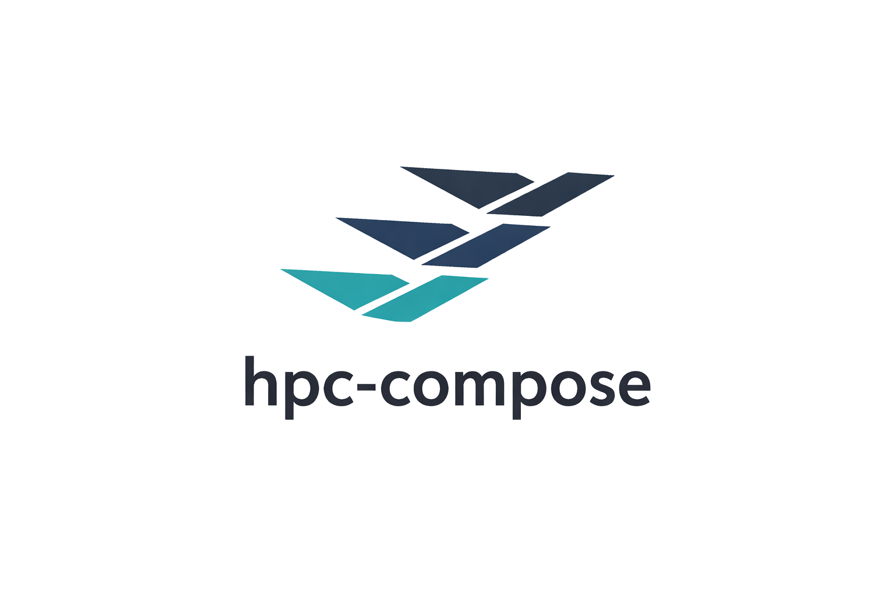

# hpc-compose

<div class="hpc-compose-hero">
  
  <p><code>hpc-compose</code> turns a Compose-like spec into a single Slurm job that runs one or more services through Enroot and Pyxis.</p>
  <div class="hpc-compose-links">
    <a href="quickstart.html">Quickstart</a>
    <a href="runbook.html">Runbook</a>
    <a href="spec-reference.html">Spec reference</a>
    <a href="examples.html">Examples</a>
  </div>
</div>

`hpc-compose` is intentionally **not** a full Docker Compose implementation. It focuses on the subset that maps cleanly to a single-node Slurm allocation with containerized services inside that allocation.

## What it is for

- One Slurm allocation per application
- One node per allocation in v1
- Multiple services started inside that allocation
- Remote images such as `redis:7` or existing local `.sqsh` images
- Optional image customization on the login node through `x-enroot.prepare`
- Shared cache management for imported and prepared images
- Readiness-gated startup across dependent services

## What it does not support

- Compose `build:`
- `ports`
- custom Docker networks / `network_mode`
- `restart` policies
- `deploy`
- multi-node service placement
- mixed string/array `entrypoint` + `command` combinations in ambiguous cases

If you need image customization, use `image:` plus `x-enroot.prepare`, not `build:`.

## Fast path

```yaml
name: hello

x-slurm:
  time: "00:10:00"
  mem: 4G

services:
  app:
    image: python:3.11-slim
    command: python -c "print('Hello from Slurm!')"
```

```bash
hpc-compose submit --watch -f compose.yaml
```

`submit --watch` is the normal path. Break out `inspect`, `preflight`, or `prepare` when you are validating a new spec for the first time or debugging a failure.

## Read next

- [Installation](installation.md) for release and source install paths
- [Quickstart](quickstart.md) for the shortest working flow
- [Runbook](runbook.md) for real-cluster setup and debugging
- [Spec Reference](spec-reference.md) for the supported Compose subset
- [Docker Compose Migration](docker-compose-migration.md) for feature mapping and conversion guidance
